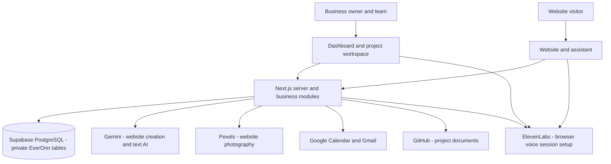

# Current architecture

[Project guide](README.md) | [Data flow](DATA_FLOW.md) | [Technology comparison](TECH_STACK.md) | [Delivery status](DELIVERY_STATUS.md)

## How the application is built

EverOnnAI currently uses one Next.js application containing the dashboard, website pages and server APIs. Its features are organised into separate business modules. Those modules share access rules and connect to the database and external providers.

The server authorises access before reading business data or creating provider sessions. Browser voice connects to ElevenLabs using the server-created session.

## Main parts and their responsibilities

| Part | Current responsibility |
| --- | --- |
| Dashboard | Business profile, knowledge, website review, assistant tests, enquiries, appointments, team and usage |
| Server APIs | Check the user's role/business, validate requests and coordinate workflows |
| Business database | Store separate business workspaces, profiles, services, knowledge, contacts, leads, conversations and appointments |
| AI runtime | Combine approved business facts with shared rules, service skills and capability instructions |
| Website Studio | Generate original page HTML/CSS, validate facts/code, manage drafts and publish approved releases |
| Assistant channels | Gemini text replies and ElevenLabs browser voice with lead capture and booking actions |
| Google integrations | Authorised calendar availability/event creation and Gmail owner summaries |
| Usage services | Record provider usage, recover pending records and reconcile through scheduled work/webhooks |
| Project Workspace | Browse a business's connected GitHub Markdown, diagrams and images with read-only access |

## Business separation and access

Each business has a workspace. The server selects that workspace from the authenticated account and checks its role. Business records and provider connections stay scoped to it. Private database tables and encrypted provider tokens support that separation.

The current roles are owner, manager, agent and viewer. Broader brand/operator identities and stronger account/security controls remain part of the requirement work.

## Website and assistant design

Gemini creates original page layouts and CSS within the platform's navigation, safety and interaction rules. The platform adds the working forms/chat/booking controls and validates generated content. Some older saved publications retain a compatibility renderer until an approved replacement is published.

The runtime loads approved Markdown instruction files from `ai/`: shared rules, capability skills and the HVAC domain pack. Website design preferences and recent approved change requests are saved per business/project. Full assistant memory and `MEMORY.md` are still planned.

## Architecture work still required

The documents propose additional queue/workflow, telephone/media, operator and infrastructure components. Their full implementations are not present in the current architecture. The database, hosting, identity, voice and website-renderer differences are explained in [the technology comparison](TECH_STACK.md).
