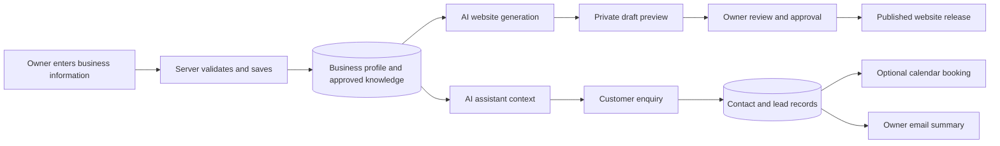

# Current data flow

[Project guide](README.md) | [Architecture](ARCHITECTURE.md) | [Technology comparison](TECH_STACK.md) | [Delivery status](DELIVERY_STATUS.md)

## The starting point: business information

The saved business profile, active services and approved knowledge provide the facts used by the website generator and assistant. Unapproved knowledge is excluded from assistant instructions. An owner's design preference can guide appearance; it cannot replace a business fact. Selected service skills, shared safety/memory rules and registered general reference notes are loaded explicitly by the server.

## 1. Business setup and knowledge

1. The owner signs in and edits their business profile, services or knowledge.
2. The server checks access and saves the records in that business's workspace.
3. The assistant reads the current approved facts when preparing a reply or new session.

Full draft/published knowledge and agent-version control remain required. Website release snapshots already exist, but they are a different feature.

## 2. Website generation and publishing

1. The owner provides a brief or approved website change request.
2. The server reads business facts, selected service skills, reference notes and saved design preferences.
3. Gemini produces content and original page HTML/CSS. Pexels supplies photography when requested.
4. The platform checks factual content, routes and safe code; bounded repairs/fallbacks handle some failures.
5. A successful result is saved as a private draft and displayed for review. Progress messages alone do not count as a saved website.
6. The owner selects and approves the design. Publishing saves a release; a newer draft does not replace it automatically.

The current workflow checks a verification state before publication. Independent ownership proof and complete preview protections remain to be added. Generation retries preserve pages during the current request; recovery after a process restart needs durable jobs.

Owners/managers can clear saved website preferences for the selected business or project scope. The server checks permission and the current revision; clearing preferences leaves the published release in place.

## 3. Customer chat, browser voice and lead capture

1. The visitor opens the assistant on the website.
2. The server resolves the website/business and prepares approved assistant context, including calendar/email availability from that business's actual connection permissions.
3. Gemini handles text replies; ElevenLabs handles the browser voice session.
4. Callback details and customer requests are validated and saved as a contact/lead.
5. The inbox shows saved enquiries and automation results.

Browser voice is the implemented channel. Business telephone lines, text messaging and a staffed operator desk have separate remaining requirements. Business transcript capture currently depends on the assistant interaction/client tools; usage webhooks store metering data rather than populating the inbox.

## 4. Booking and owner notifications

1. The customer supplies a valid service, date, time and contact details.
2. The server validates those details against the business timezone and service rules.
3. With an authorised Google connection, it checks calendar availability and creates or recovers the actual event.
4. The appointment becomes confirmed only after the provider result is verified. Missing details, busy slots or provider failures leave it pending for follow-up.
5. Gmail can send an owner summary. Duplicate protection and uncertain-delivery handling reduce repeated bookings/emails.

The lead stays saved when automation fails. More calendar providers, full opening-hour rules, SMS confirmations and reminder sequences remain planned.

## 5. Usage and project documents

**Usage:** provider attempts and reported charges feed a scoped ledger. Scheduled work and signed webhooks reconcile delayed records. Recorded charges and estimated costs have distinct labels; billing subscriptions are separate unfinished work.

**Project documents:** a permitted user connects a GitHub repository. The server reads an allowed document/image catalog, stores the connection and returns sanitised content to the viewer. Private tokens stay encrypted. Viewing a repository `SKILL.md` does not execute it or change the platform's AI instructions.

**AI checks:** service/capability `EVALS.md` files drive a separate check runner. They never enter customer prompts. Current deterministic checks cover selected safety, scope, memory and factual-content scenarios; larger model/audio datasets and release approval remain required.
