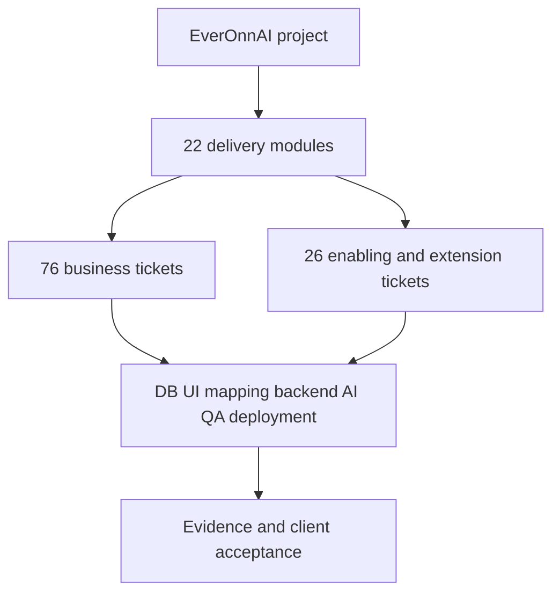

# EverOnnAI - client project delivery checklist

Prepared 6 October 2026 (Asia/Kolkata). Project > modules > tickets. **Markdown only**, ready to browse in GitHub or connect as a customer repository in EverOnnAI Project Management.

This pack answers: what exists today, what remains to build, what the client receives, how each business deliverable maps to DB/UI/backend/AI work, and how delivery will be tested, deployed and accepted. It reconciles both supplied requirement documents with the current application working tree.

**22 modules, 102 tickets, 76 business requirements, 60 acceptance scenarios and 746 tracked source/scaffolding records.** No full business requirement is marked client-accepted without sign-off evidence.

## Start here

1. Read [current project status and verification](CURRENT_STATE.md).
2. Review [the client business deliverables](BUSINESS_DELIVERABLES.md) and [the delivery sequence](DELIVERY_PLAN.md).
3. Resolve [architecture and product decisions](DECISIONS.md) and [launch blockers](RISKS.md).
4. Browse [all tickets](TICKET_INDEX.md) and approve scope, priorities, owners and the acceptance process.
5. Track implementation against [technical components](TECHNICAL_DELIVERABLES.md), [source traceability](TRACEABILITY.md) and [QA/UAT gates](ACCEPTANCE.md).

Additional guides: [source provenance](SOURCES.md) | [code snapshot](EVIDENCE.md) | [customer repository scope](SCOPE_EXTENSIONS.md) | [source alignment](SOURCE_ISSUES.md) | [documentation validation](VALIDATION.md) | [ticket maintenance](TICKET_TEMPLATE.md) | [full source records](requirements/README.md).

## Status rules

| Label | Meaning |
| --- | --- |
| Implemented | The named bounded slice has code/check evidence; hosted rollout and business acceptance are separate. |
| Partial | Related behaviour exists, but required business/technical criteria remain. |
| Planned | The required service or workflow has not been demonstrated. |
| Decision required | Architecture/scope choice must be recorded before committing implementation. |
| Client accepted | Used only after dated client sign-off against a specified released version; none recorded in this pack. |

Checked boxes describe inspected current slices only. Unchecked boxes describe remaining work or unverified completion gates. All estimates and named people remain to be agreed. Source phase labels are planning targets, not evidence of completion or promised dates.

## Important current findings

The application has working account/tenant controls, approved structured knowledge, Gemini-generated original website HTML/CSS, safe platform assistants/forms, publication snapshots, lead/booking workflows, provider usage metering and a customer GitHub documentation viewer. These are meaningful engineering foundations.

Full telephone answering, bilingual PSTN validation, the staffed Live Agent Desk, subscriptions/entitlements, independent business verification, custom domains, broad vertical packs, customer acquisition/migration, restaurant ordering and production recovery/security acceptance remain incomplete. Existing browser voice is not proof of a real inbound phone service.

The specification's RHEL/Podman/MariaDB baseline differs from the current Supabase/PostgreSQL/Amplify implementation. Its SiteSpec/component renderer also differs from the user's AI-authored HTML/CSS direction. Agree the recorded exceptions or migration plan; do not silently declare these differences compliant.

## Module checklist

| Module | Code | Tickets | Current engineering labels |
| --- | --- | --- | --- |
| [00 - Foundations, scope and architecture decisions](modules/00-foundations-governance/README.md) | FND | 1 | 1 Decision required |
| [01 - Onboarding, identity and tenant lifecycle](modules/01-onboarding-tenancy-identity/README.md) | ONB | 4 | 4 Partial |
| [02 - Knowledge, agent configuration and approved business memory](modules/02-knowledge-agent-configuration/README.md) | KNW | 5 | 5 Partial |
| [03 - AI runtime, skills, provider portability and evaluation](modules/03-ai-governance-evaluation/README.md) | AIQ | 6 | 6 Partial |
| [04 - Telephone numbers, voice service and bilingual calls](modules/04-telephone-voice-language/README.md) | VOX | 7 | 4 Planned; 3 Partial |
| [05 - Customer chat, external widget and SMS](modules/05-chat-widget-sms/README.md) | CHT | 3 | 2 Partial; 1 Planned |
| [06 - AI website generation, editing, publishing and domains](modules/06-website-generation-hosting/README.md) | WEB | 9 | 6 Partial; 3 Planned |
| [07 - Human escalation and the multi-client Live Agent Desk](modules/07-human-operations-live-agent-desk/README.md) | HIL | 12 | 3 Partial; 9 Planned |
| [08 - Unified inbox, contacts, booking and follow-up](modules/08-inbox-contacts-booking-followup/README.md) | INB | 6 | 4 Partial; 2 Planned |
| [09 - Plans, subscriptions, metering, budgets and margin](modules/09-plans-billing-usage-margin/README.md) | BIL | 6 | 4 Partial; 1 Planned; 1 Implemented |
| [10 - Vertical brands, packs, readiness and capability parity](modules/10-brands-vertical-packs/README.md) | VRT | 5 | 4 Planned; 1 Partial |
| [11 - Public API, webhooks and vertical connectors](modules/11-api-connectors-integrations/README.md) | INT | 2 | 2 Partial |
| [12 - Incumbent targets, prospects, outreach and savings evidence](modules/12-customer-acquisition-claims/README.md) | ACQ | 6 | 5 Planned; 1 Partial |
| [13 - Authorised migration, service continuity and offboarding](modules/13-customer-migration-offboarding/README.md) | MIG | 2 | 2 Planned |
| [14 - Restaurant menus, web/phone orders and kitchen delivery](modules/14-restaurant-ordering/README.md) | ORD | 4 | 4 Planned |
| [15 - Security, consent, privacy, legal terms and assurance](modules/15-security-privacy-compliance/README.md) | SEC | 8 | 3 Partial; 5 Planned |
| [16 - Customer value, funnel and acquisition analytics](modules/16-business-value-analytics/README.md) | ANL | 2 | 1 Partial; 1 Planned |
| [17 - Internal administration, support and incident operations](modules/17-admin-backoffice/README.md) | ADM | 1 | 1 Planned |
| [18 - Infrastructure, durable workflows, reliability and scale](modules/18-reliability-deployment-scale/README.md) | OPS | 7 | 5 Partial; 2 Planned |
| [19 - Testing, accessibility, UAT and release acceptance](modules/19-testing-client-acceptance/README.md) | QA | 2 | 2 Partial |
| [20 - Ownership, licensing, documentation and operational handover](modules/20-ownership-handover/README.md) | OWN | 2 | 2 Partial |
| [21 - Customer repositories and client project delivery documentation](modules/21-project-documentation-workbench/README.md) | PJM | 2 | 2 Implemented |

## Project hierarchy

## Add this repository to Project Management

Connect `tinitiateprime/everonnai-project-management`, branch `main`, with the folder left empty to include the complete pack. Start at `README.md`; use module folders and ticket filenames to navigate. GitHub renders the Markdown/Mermaid directly. The existing Project Workspace reads documents and task checklists; it does not execute repository SKILL.md files or create a separate ticket database from these documents.

The app's customer repository reader is implemented locally with a verified database migration. Its updated hosted application rollout and an authorised private-repository test remain separate tasks. This documentation publication does not deploy the application.

## Client review and maintenance

- [ ] Agree the pilot scope, launch vertical, geography and language obligations.
- [ ] Record architecture decisions and permissible exceptions.
- [ ] Assign named business/technical owners and dependencies.
- [ ] Agree effort, staffing, cost budgets and milestone dates.
- [ ] Approve acceptance criteria and evidence storage.
- [ ] Update affected tickets and source mappings with each reviewed release.
- [ ] Record client acceptance only against the demonstrated version.
