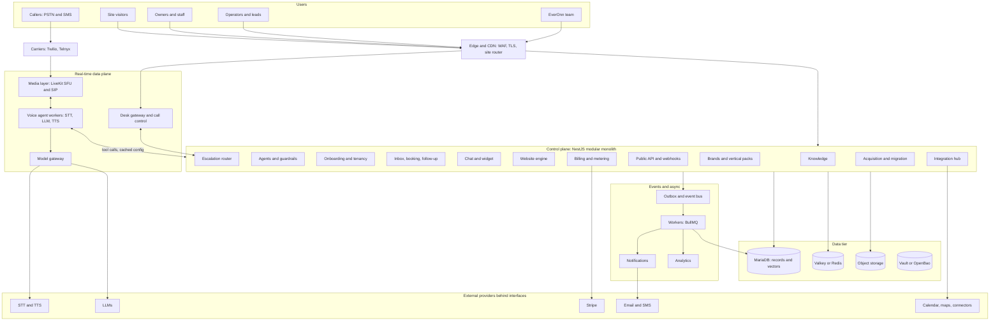

# EverOnn Platform: Recommended Architecture

Source: *EverOnn Platform BRD and Technical Specification* (§11 architecture, §16.7 Live Agent Desk, §20 stack, §21–23 data, security, scale).

---

## 1. Summary

EverOnn is a multi-tenant AI front-desk suite: AI voice, chat and SMS agents, generated websites, a human-in-the-loop Live Agent Desk, an inbox with booking and follow-up, and billing. It also includes acquisition and migration tooling.

**Recommended style: a modular monolith control plane plus separately deployed real-time data-plane services, organised in cells.**

- Fast iteration for a small team, with module boundaries that allow later extraction.
- The latency-critical voice path scales and fails independently.
- **A control-plane outage must never drop live calls or take sites down (AR-004).**

## 2. Guiding principles

1. One agent brain, many channels (voice, chat and SMS are adapters over one core).
2. Owner-approved knowledge only; the agent never improvises facts.
3. Human-in-the-loop is a first-class subsystem.
4. Provider abstraction everywhere (telephony, STT, TTS, LLM, SMS, email, payments).
5. Tenant isolation is a hard boundary, enforced structurally and tested.
6. Secure and compliant by construction (consent, recording rules, PII, audit).
7. Scale by cells, not heroics.
8. Measure everything that costs money or can hurt a customer.
9. Boring, RHEL-compatible components; novelty only in the voice and agent runtime.
10. Everything as code (infra, prompts, agent configs, evals, policies).

## 3. Logical architecture



**Cross-cutting:** Keycloak (identity, MFA), audit trail and consent ledger, OpenTelemetry with Prometheus, Grafana, Loki and Tempo (plus Sentry), RHEL with Podman and infrastructure as code.

## 4. Control plane vs data plane

| | Control plane | Data plane |
|---|---|---|
| Purpose | Config, business logic, dashboards, billing, admin | Live calls, chat streams, site serving |
| Latency | 100–500 ms tolerable | Latency-critical |
| Consistency | Strongly consistent (MariaDB) | Mostly stateless; reads a read-through config cache |
| Scales by | Replicas and cells | Workers by concurrent sessions, media nodes by participants |
| Failure rule | May degrade | Must keep answering calls with cached config and a fallback flow |

## 5. Component catalog

| Component | Responsibility | Default technology | Scales by |
|---|---|---|---|
| Edge and CDN | TLS, WAF, caching, site routing, rate limits | Cloudflare or Nginx/Caddy | Add edge nodes |
| Control-plane API | Tenants, agents, knowledge, inbox, booking, HITL, billing, sites, admin | TypeScript, NestJS on Fastify | Replicas, cells |
| Identity | Login, MFA, sessions, roles | Keycloak | Replicas |
| Voice agent runtime | STT → LLM → TTS loop, tools, guardrails | Python, LiveKit Agents (or Pipecat) | Workers by concurrent calls |
| Media layer | WebRTC and SIP, rooms, recording, operator audio | LiveKit server and SIP | Media nodes |
| Telephony adapters | Numbers, SIP trunks, SMS, porting | Twilio and Telnyx behind `TelephonyProvider` | Provider capacity |
| Model gateway | Routing, fallback, budgets, prompt caching, redaction, cost capture | In-house service | Replicas |
| Knowledge service | Ingestion, chunking, embedding, tenant-filtered retrieval | API module, workers, MariaDB vectors (Qdrant if needed) | Workers, shards |
| Escalation router | Operator selection, cascades, deadline timers | API module with durable timers | Replicas |
| Desk gateway | Operator WebSocket, presence, offers, commands | Node service, Redis presence | By connections |
| Context service | Builds the operator context payload | API module with cache | Replicas |
| Call control | Operator join, whisper, transfer, hand-back | Service calling the media layer | Replicas |
| Site generator and publisher | Business profile → Site Spec → static bundle → CDN | Astro or Next.js export, object storage, edge router | Workers, CDN |
| Widget service | Public chat and form endpoints | API module, edge-cached script | Replicas |
| Billing and metering | Usage events, entitlements, Stripe sync | API module, workers | Workers |
| Integration hub | Connector runtime, catalog, health | Service with connector SDK | Replicas |
| Event bus | Reliable domain events | MariaDB outbox, Redis Streams (later NATS or Kafka) | Consumers |
| Workers | Summaries, extraction, follow-up, generation, metering, QA | BullMQ on Valkey/Redis | Queue depth |
| Evaluation service | Text and audio simulations, red-team gates | Python | Runners |

## 6. Technology stack

| Layer | Choice |
|---|---|
| OS and containers | RHEL (SELinux enforcing), Podman with Quadlet; path to Kubernetes/OpenShift (AR-010) |
| Languages | TypeScript (control plane, web, widget) and Python 3.12+ (voice and agent runtime, evals) |
| Repo | Monorepo (pnpm workspaces plus Turborepo or Nx) |
| API | NestJS on Fastify, Zod validation, OpenAPI 3.1, REST `/v1`, cursor pagination, idempotency keys |
| DB access | Kysely or Drizzle (MySQL dialect), tenant-scoped repository layer (mandatory) |
| Web apps | Next.js (App Router), React, Tailwind, Radix/shadcn, TanStack Query; PWA for the inbox |
| Realtime | WebSocket or SSE; LiveKit client SDK for operator audio |
| Chat widget | Preact or Web Components in Shadow DOM, under 40 KB gzipped |
| Jobs and events | BullMQ; transactional outbox → Redis Streams (P1), NATS JetStream or Redpanda (P2/P3) |
| Database | MariaDB (current LTS) primary plus replicas; native VECTOR type for RAG |
| Cache and queues | Valkey or Redis |
| Object storage | S3-compatible (recordings, site bundles, exports, backups) |
| Identity and secrets | Keycloak; Vault or OpenBao (Transit envelope encryption, dynamic DB credentials) |
| Voice and AI | LiveKit, Twilio and Telnyx, Deepgram (STT), ElevenLabs/Cartesia (TTS), multi-vendor LLMs via the model gateway |
| Payments, email | Stripe (Billing, Tax); SES or Postmark |
| Observability | OpenTelemetry, Prometheus, Grafana, Loki, Tempo, Sentry |

**Provider interfaces (AR-002):** `TelephonyProvider`, `SttProvider`, `TtsProvider`, `LlmProvider`, `SmsProvider`, `EmailProvider`, `PaymentProvider`, `CalendarProvider`, `GeocodingProvider`. Telephony and LLM need a second implementation stubbed or contract-tested by the end of P1.

## 7. Key runtime flows

### 7.1 Inbound call handled by the AI
1. Caller dials the client number; the carrier sends SIP to the media layer.
2. A room is created and a voice worker is dispatched (`call.started`).
3. The worker resolves number → tenant, line, agent version, hours and consent regime from the config cache.
4. The worker plays the greeting and disclosures, then loops STT → LLM (with tools) → TTS with barge-in.
5. Tool calls go to the API: `lookup_knowledge`, `capture_request`, `check_availability`, `book_appointment`.
6. On end, workers store the transcript and recording, extract the request and write the summary.
7. Notifications text the owner within 30 s; metering and the quality sampler run.

### 7.2 AI → human hand-off (multi-client)
1. The `escalate` tool fires with a trigger and severity; the API creates the escalation with context.
2. The caller hears a branded hold message.
3. The routing engine selects an eligible operator (client grant, language, status, capacity).
4. The context service pushes the full payload; the desk gateway delivers the offer and the screen-pop.
5. Acceptance is an atomic compare-and-set; the first valid accept wins and the other offers are cancelled.
6. Call control joins the operator, plays a private announcement, bridges the caller; the AI steps down.
7. The operator wraps up with a disposition. If no one accepts: next operator → owner → message capture and callback.

### 7.3 Other flows
- **Chat takeover:** widget → chat agent → trigger → operator offer, with the AI drafting and the operator approving.
- **Claim, preview, publish:** prospect → draft profile → Site Spec → private preview → owner verifies → static bundle, certificates and hostname.
- **Missed-call text-back:** call abandoned → consent guard (fails closed) → SMS → chat agent continues.
- **Provider switch:** verify prospect → preview → written authorisation → import → parallel run → cut over (rollback on failure).

## 8. Data architecture

- **System of record:** MariaDB. Topology is one primary plus at least one replica in a separate failure domain with semi-synchronous replication, then Galera or cells at P2.
- **Backups:** nightly full plus continuous binlog shipping (RPO 5 min), encrypted and immutable; monthly restore test (RTO under 60 min per cell).
- **Time-partitioned tables:** `call_events`, `messages`, `usage_events`, `audit_log`; archive to Parquet or JSONL before drop.
- **Conventions:** tenant ID on every row, versioned and expand/contract migrations, no cross-module DB access.
- **Vectors:** MariaDB VECTOR at P1; move to Qdrant if p95 retrieval exceeds 80 ms or scale targets are missed.
- **Voice path:** no direct DB access except cached config and a small buffered write API.
- **Events:** state changes emit versioned domain events through the outbox, so events are never lost on commit. Consumers are idempotent and replayable.

## 9. Tenancy and cells

- Every request is tenant-scoped through the repository layer (TEN-001).
- A **cell** is a complete stack (API, workers, DB set, Redis, media and voice workers) serving a subset of tenants.
- `tenants.cell_id` and a routing map exist from P1 even with one cell. Adding a cell is scripted through IaC (AR-005).

## 10. Security and compliance

- Threat model in P0; pen test in P1; SOC 2 readiness and DR drills in P2.
- Consent ledger, recording rules, PII redaction hooks in the model gateway, audit log with object lock.
- OAuth2/OIDC for users; scoped hashed API keys and short-lived JWTs for integrations; widget keys scoped to origins.
- Webhooks use HMAC signatures, retries and dead-letter queues.
- Vault dynamic DB credentials, TLS to the database, envelope encryption.
- Firewalld zones per tier; RTP/UDP open only on the media tier; SSH via MFA bastion with short-lived certificates.
- Production data never appears in lower environments.

## 11. Scalability and reliability

| Scale point | Tenants | Peak concurrent calls | Design capacity (2× peak) |
|---|---|---|---|
| Pilot | 50 | 2 | 5 |
| P1 exit | 300 | 10 | 20 |
| P2 target | 1,000 | 35 | 70 |
| Growth | 10,000 | 350 | 700 |

Planning assumptions: 150 calls per tenant per month at 2.5 min, peak 4× average. Replace them with measured pilot data.

| SLO | Target |
|---|---|
| Call answered by AI or safe fallback | 99.9% monthly |
| Response gap | p50 < 1.0 s, p95 < 1.8 s |
| Owner summary delivered | 99% within 30 s |
| Dashboard API | p95 < 400 ms |
| Tenant site availability | 99.95% |
| Desk offer / audio connected | < 500 ms / < 1.5 s (p95) |

Reliability mechanisms:
- Voice workers drain gracefully for zero-drop deploys (AR-009).
- LLM first-token hard timeout of 1.2 s, then fallback.
- Carrier failover between Twilio and Telnyx.
- Chaos drills in P2.

## 12. Deployment topology (P1, RHEL)

```
Internet
  └─ Edge tier: Cloudflare / Nginx, TLS, WAF, site router
       ├─ App tier:        API, web apps, admin, console
       ├─ Worker tier:     BullMQ jobs
       └─ Media/voice tier: LiveKit + SIP, agent workers (RTP/UDP only here)
            └─ Data tier (private): MariaDB primary + replica, Valkey, Vault, object storage
Observability tier: Prometheus, Grafana, Loki, Tempo, uptime probes
```

Each tier is a set of Quadlet units, so it can sit on one host at pilot and move to separate hosts at P2 through configuration. Environments are local, CI, dev, staging (sandbox carrier numbers and staging Stripe) and prod.

## 13. Phasing

| Phase | Focus |
|---|---|
| P0 Foundations | ADRs, threat model, voice and audio spikes, schema and renderer spikes |
| P1 Pilot | Voice, chat, SMS, site generation, knowledge, inbox and booking, billing, small Desk pilot, public API |
| P2 Scale | Multi-carrier failover, supervisor wallboard, copilot, follow-up sequences, more verticals, ordering pilot, SOC 2 readiness |
| P3 Expansion | More channels and languages, white-label, partner marketplace, HIPAA mode |

## 14. Decisions to settle in P0 ADRs

| ID | Decision |
|---|---|
| D-2 | Exceptions to the RHEL/MariaDB baseline (Temporal, Langfuse, Qdrant, ClickHouse, Sentry self-hosted) |
| D-4 | MariaDB VECTOR vs Qdrant (validate recall and latency at 10M chunks) |
| D-5 | Keycloak vs Ory or SaaS identity |
| D-6 | Custom domains and TLS: Cloudflare for SaaS vs self-hosted ACME (Caddy) |
| D-15 | Operator audio topology: private briefing room then bridge (A) vs selective-subscription join (B) |
| AR-001 | Written ADR set covering every decision before P1 build |
| AR-008 | C4 model and a data-flow diagram per channel kept in the repo |

## 15. Rationale for this architecture

- **Modular monolith, not microservices:** a small team gets one deployable, with module seams ready for extraction.
- **LiveKit room model:** it fits warm transfer, whisper, operator join and takeover natively.
- **MariaDB plus Valkey plus S3 only at P1:** the minimum number of datastores, and RHEL-friendly.
- **Provider abstraction and the model gateway:** vendors can be swapped for cost, quality or outage reasons without touching business logic.
- **Outbox plus event bus:** decouples workers, analytics and webhooks without lost events.
- **Cells:** capacity grows by adding identical stacks rather than re-architecting.
