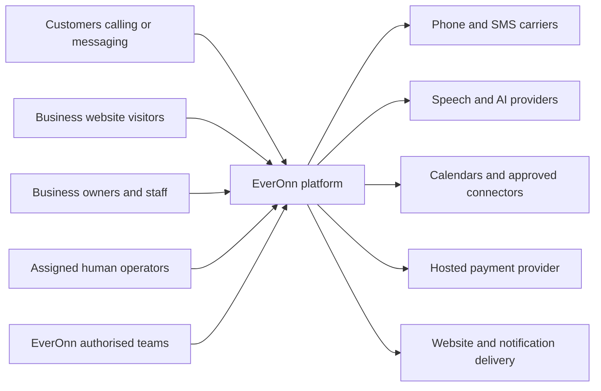
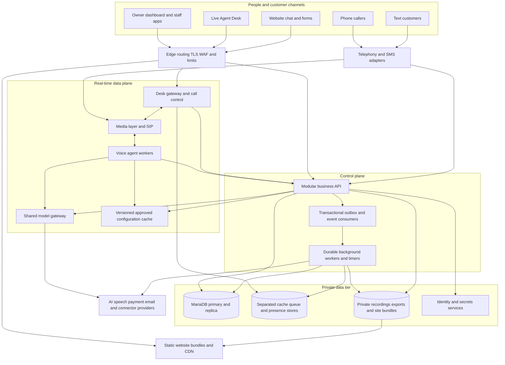
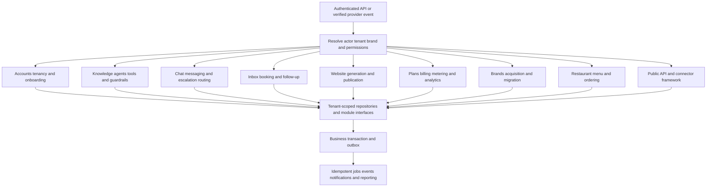

# EverOnn Platform Architecture

[Delivery Kanban](everonn-delivery-kanban.md) · [End-to-end data flow](everonn-dataflow.md)

**Basis:** EverOnn Business Requirements Document and EverOnn Platform BRD and Technical Specification, version 1.0, dated 26 September 2026. **Revision:** 7 October 2026. **Status:** Requirements-based target design; implementation and acceptance require separate evidence.

This guide explains the platform required by the two source documents. It is organised around business capabilities, their supporting services and the controls needed to launch them. Technology recommendations remain subject to the specification's decision and exception process.

## 1. The platform in plain language

EverOnn gives a business an always-available front desk. Customers can call, chat, text or submit a form. The assistant uses that business's approved information, captures the request and takes only permitted actions. A person can help when needed. The business sees the outcome in one inbox, with appropriate booking, notifications and follow-up.

The same platform also creates business websites, manages plans and usage, supports multiple industry brands, helps authorised customers switch from an incumbent provider and, in P2, handles restaurant pickup ordering. Regulated-industry launches follow their later readiness gates.

| Business capability | What the client receives | Main requirement groups |
| --- | --- | --- |
| Business setup | A private preview, ownership verification, approved settings and tested activation | ONB, TEN, ACC |
| Approved assistant | Owner-controlled facts, safe actions and versioned changes | KNW, AGT, POL |
| Phone front desk | Real calls, English/Spanish, confirmed details, booking and transfer | VOX |
| Chat and text | The same approved assistant with consent-aware messaging | CHT, COM |
| Human help | Correct client identification, routing, private briefing and an operator desk | HIL, DSK |
| Inbox and appointments | Requests, assignments, calendar bookings and permitted follow-up | INB, BKG, FUP |
| Business websites | Private preview, safe editing, approved publication and custom domains | WEB |
| Commercial operations | Plans, payments, usage, cost and value reporting | BIL, CST, ANL, ADM |
| Industry brands | One shared engine with separate brand identity and industry configuration | VRT |
| Customer acquisition and switching | Sourced prospects, truthful comparisons and authorised migration | ACQ, MIG |
| Restaurant pickup ordering | Real menus, confirmed orders, reliable kitchen receipt and hosted payments | ORD, INT |
| Security and quality | Isolated data, controlled access, recovery and evidenced release gates | SEC, COM, EVL, LT |

## 2. Business context

The business owner controls business facts and authority. EverOnn operates the platform, manages approved brands and providers, and supplies operator tools. Staffing and delivery of the client's own services remain the responsibilities defined in the BRD. Every customer-facing interaction must retain the correct business and brand identity.

**Source:** BRD §§5–9; specification §§2, 6, 10 and 11.

## 3. Architecture style and guiding rules

The control plane is a **modular monolith**: one business API with enforced module boundaries. The real-time data plane is deployed separately so calls, live conversations and published sites scale independently. A **cell** is a complete capacity group serving a defined set of businesses.

| Rule | Design consequence |
| --- | --- |
| One assistant across channels | Voice, chat and SMS share approved knowledge, tools and policies through channel adapters. |
| Owner-approved information only | Imported facts remain drafts; running sessions use published versions. Unknown answers create follow-up rather than invented facts. |
| Human help is part of the core design | Routing, offers, authority, call control and wrap-up are first-class components. |
| Providers can be replaced | Vendor SDKs remain behind internal provider contracts. Alternative telephony/LLM implementations are stubbed or contract-tested by P1; the other providers by P2. |
| Client and brand separation is structural | Request context, repositories, caches, files, jobs and operator grants enforce the same tenant/brand scope. |
| Safety rules are executable | Code validates tool calls and outputs; prompts cannot grant extra authority. |
| Live service survives a control-plane outage | Calls use approved cached configuration and safe fallback; published sites have independent static delivery. |
| Events survive committed changes | A transactional outbox and idempotent consumers prevent lost events and duplicate effects. |
| Capacity grows by cells | Routing records and `tenants.cell_id` exist from P1; another cell is provisioned through infrastructure as code. |
| One suite supports many industries | Versioned vertical packs and brand configuration change behaviour without separate software per industry. |
| Facts and claims carry evidence | Prospect facts, comparisons and generated claims retain sources and dates. Unknowns remain unknown. |

**Source:** specification §11.1–11.2, AR-001–010, TEN-001–007 and VRT-001–010.

## 4. Containers and deployment boundaries

The voice worker does not become a second business database. It reads versioned cached settings, calls authorised business tools and buffers/replays events during the specified outage scenarios. The real-time model gateway and approved configuration cache must remain available independently of the configuration API, with the specified provider/safe-flow fallback. The desk browser is also not authoritative: server-owned state and snapshots govern acceptance, connection and reconnect.

The static site path must remain available independently of the control plane. Preview access controls, domain verification, approved publication, cache invalidation and rollback are still enforced by the website module.

**Source:** specification §§11.3–11.7, 16.7, 18, 20.6 and 23.5.

## 5. Control-plane components and module responsibilities

| Module | Owns | Boundary and important controls |
| --- | --- | --- |
| ONB / TEN / ACC | Claim, account lifecycle, locations, invitations and access | Verification and approval precede go-live; every request resolves its actor and tenant. |
| KNW | Profiles, imported sources, chunks, indexes and approval | Tenant-filtered retrieval; source/version evidence; no unapproved knowledge. |
| AGT / POL | Agent versions, prompt layers, tools and policy | Typed inputs/outputs, plan permissions, owner approval and hard safety checks. |
| VOX adapters | Numbers, forwarding, carrier events and voice business tools | Real P1 carrier integrations, verified forwarding and stage-specific failover. |
| CHT | Widget sessions, SMS threads and chat delivery | Shared assistant policy; sender identity, consent and human takeover. |
| HIL / DSK | Escalations, offers, roster grants, presence and handling | Durable deadlines, one acceptance winner, client lock, authority matrix and audited commands. |
| INB / BKG / FUP | Contacts, requests, assignment, bookings and sequences | Verified merge keys, atomic booking, encrypted calendar grants and consent at send time. |
| WEB | Site Spec, renderer, versions, previews, publication and domains | Durable jobs, truthful claims, private previews, separate site domain and safe rollback. |
| BIL / CST | Plans, entitlements, usage, payments and service costs | Signed payment events, duplicate-safe metering, visible estimates and emergency-safe limits. |
| ANL / ADM | Outcome reports, internal operations and release controls | Restricted admin app, reasoned support access, safe flags and approval evidence. |
| VRT | Brands, vertical packs, defaults and readiness | Brand isolation; legal/sender identity; approved pack versions and launch gates. |
| ACQ | Targets, sourced prospects, pipeline, comparisons and outreach | Minimal data, licensed sources, dated claims and approved channels. |
| MIG | Asset inventory, authorisations, import, parallel run and cut-over | No unapproved changes; continuity, contract awareness, sign-off and rollback. |
| ORD | Versioned menu, carts/orders, staff acceptance and kitchen delivery | P2 pickup scope, full read-back, allergy handoff, reliable receipt and hosted payments. |
| INT / API | Provider/connector contracts, API keys, webhooks and catalog | Authorised provider access, minimised fields, idempotency and manual fallback. |
| COM / SEC | Consent, compliance profiles, rights, retention, audit and security | Cross-cutting controls applied at each boundary; regulated features stay gated. |

Modules communicate through internal interfaces and events. They do not query one another's tables directly. Connector availability must reflect actual provider approval; a business still has the required capture-and-notify fallback without a connector.

## 6. Required baseline and recommended technology

The **production baseline is RHEL, Podman/Quadlet and MariaDB**, with SELinux enforcing and firewalld. The specification allows reviewed equivalents and explicit exceptions; naming a default here does not record an approval. Versions are pinned at build time after compatibility checks.

| Layer | Specification default / recommendation | Decision or contract |
| --- | --- | --- |
| Production hosts and containers | RHEL; Podman with Quadlet; later Kubernetes/OpenShift path | D-2, D-8, AR-010 |
| Languages and repository | TypeScript/Node LTS; Python 3.12+; pnpm workspaces with Turborepo/Nx; locked Python dependencies | §20.2; AR-006 |
| Business API | NestJS on Fastify; reviewed Fastify module alternative; Zod, OpenAPI 3.1, REST `/v1` | §20.2; API-001 |
| Database access | Kysely/Drizzle; Prisma only after feature validation; mandatory tenant-scoped repository | TEN-001; §20.2–21.2 |
| Web applications | Next.js App Router, React, TypeScript, Tailwind, Radix/shadcn, TanStack Query | §20.2 |
| Identity | Keycloak default; reviewed alternatives | D-5; ACC; SEC-003 |
| Jobs, deadlines and events | BullMQ on Valkey/Redis; durable timers with reconciler; MariaDB outbox to Redis Streams | AR-003; §16.6, §20.2 |
| Database and search | MariaDB primary/replicas, FULLTEXT and VECTOR; alternative vector store only through decision/exception review | D-2, D-4; §20.5 |
| Files and secrets | S3-compatible storage; Vault/OpenBao for dynamic credentials and wrapped keys | SEC-005–006; §20.1–20.2 |
| Media and voice | LiveKit/SIP and LiveKit Agents or Pipecat behind EverOnn interfaces; managed pilot only with evidence and exit plan | D-7, D-15 |
| Telephone and SMS | Twilio and Telnyx default pair; both integrated by P1 | VOX-001; P2 automatic failover is VOX-036 |
| Speech and models | Benchmarked STT/TTS choices and task-based multi-vendor model gateway; choose by evaluation results | AR-002; CST-001; §20.3 |
| Website engine | Validated Site Spec, versioned component library, Astro/Next.js static output, durable generation and independent static delivery | WEB-001–018; §20.4 |
| Payments and communications | Stripe behind PaymentProvider; SES/Postmark behind EmailProvider; calendar/geocoding contracts | BIL-002; BKG-001; AR-002 |
| Monitoring | OpenTelemetry, Prometheus, Grafana, Loki, Tempo, approved Sentry option and external probes | §24.3; D-2 where applicable |

Required provider seams include `TelephonyProvider`, `SttProvider`, `TtsProvider`, `LlmProvider`, `SmsProvider`, `EmailProvider`, `PaymentProvider`, `CalendarProvider` and `GeocodingProvider`. The agent runtime, filesystem/storage choices and later field-service connectors must also retain the interfaces and phase constraints specified in their sections.

## 7. Data ownership and contracts

MariaDB is the system of record. Object storage holds recordings, static site bundles, exports and backups; the database holds scoped references, classification, retention and key versions. Cache/presence/session data is not the authoritative business record.

| Domain records | Important relationships and invariants |
| --- | --- |
| Tenant, brand, vertical pack, location, user and grant | Tenant carries brand/pack, cell, region, residency and tier. Role and client grant are checked on every request. |
| Business profile, source, knowledge, agent and policy versions | Draft and approved/published versions remain distinguishable; sessions record the versions they used. |
| Conversation, message, call, contact and Request | All channels create one validated Request contract; uncertain fields remain explicit. Permitted media references retain access and retention controls. |
| Escalation, offer, operator and handling | Offers have deadlines; acceptance is atomic; every handling transition retains tenant/line identity and an audit trail. |
| Appointment and follow-up | Business rules and conflict detection apply; consent is rechecked before each send. |
| Site Spec, site version, hostname and publication | Verification and owner approval precede public release; previous immutable versions support rollback. |
| Plan, entitlement, subscription and usage event | Dated plan data drives access; immutable source IDs make accounting duplicate-safe. |
| Target, prospect, claim, consent and migration | Source/date/evidence and customer authorisation travel with the record; detection is not proof of a paid incumbent relationship. |
| Menu, order, receipt and payment reference | Live menu version, confirmed line items and modifiers, staff acknowledgement and hosted payment state remain linked. |
| Audit, outbox, job and compliance profile | Versioned schemas, trace IDs, tenant scope, retention and replay rules govern every consumer. |

The full source Request schema is in specification Appendix D; the tool registry in Appendix B, event catalog in Appendix C, API catalog in Appendix I and desk protocol in Appendix J. These are build contracts, not optional examples to replace with incompatible shapes.

**Tenant guarantees:** tenant-first keys and indexes; all queries through the scoped repository; automated API/job isolation tests in CI and nightly; documented compensation for MariaDB's lack of native row-level security. Keys, queues, cache entries, object paths and search filters are namespaced by tenant. Brand isolation is tested alongside tenant isolation.

**Schema changes:** reviewed expand/contract migrations; compatibility with current and previous application versions; production-sized synthetic-data checks; encrypted connections and scoped service credentials. Append-heavy tables are partitioned and cold data is verified in the archive before deletion.

## 8. Human handoff and the Live Agent Desk

The AI first records the escalation reason, severity and captured context. Routing considers client grants, language, skills, presence and capacity. Every offer contains the correct client identity and full required screen-pop/context sections before the operator begins handling it.

| Stage | Required behaviour |
| --- | --- |
| Offer | Idempotent delivery, acknowledgement and expiry; a declined/expired offer continues the configured cascade. |
| Accept | Atomic compare-and-set: one valid winner, all other offers cancelled. |
| Connect | Private briefing and authorised media permissions; bridge failure returns the work to the appropriate queue and alerts the lead. |
| Handle | Client lock, authority matrix, masked fields, correct greeting/sender identity and audited commands. |
| Reconnect | Server snapshot restores authoritative state; the browser cannot invent or duplicate a handling session. |
| Wrap-up | Disposition, notes, next action and handling metrics are recorded. |
| No available person | Owner/next-pool cascade, detailed message and scheduled callback outcome; no caller is trapped. |

D-15 must prove the private-room-then-bridge or selective-subscription design on real calls. Monitoring, whisper, warm transfer and return to AI must respect the tested audio-permission model. Operator staffing and coverage defaults are resolved through D-9, D-16 and D-17.

**Desk targets:** escalation trigger to first offer under 1 second p95; offer-card rendering under 500 ms p95; accepted caller/operator audio connected under 1.5 seconds p95; reconnect/state restoration under 3 seconds; context payload under 100 KB; P2 design for 300 concurrent operators per cell.

## 9. Safety, access and compliance boundaries

| Boundary | Required control |
| --- | --- |
| Business activation | Verified ownership, accepted terms, approved knowledge/greeting, tested phone/chat and recorded approval version. |
| Incoming customer interaction | Resolve tenant/brand/line; apply consent, disclosure, hours, service area, language and published configuration. |
| AI action | Server-side permissions, typed tool arguments, plan access, safety rules and owner approval where required. |
| Human action | Current client grant and authority matrix, context lock and immutable intervention record. |
| Recording | Reviewed jurisdiction rules and refusal handling; store audio only when permitted. |
| Message or callback | Correct purpose, recorded consent/preferences, suppression and calling/quiet-hour rules; high-risk automated outreach remains gated. |
| Website publication | Owner approval, verified domains, sourced claims, separate site domain and safe content/embeds. |
| Payment | Hosted provider pages/links; no card numbers collected by AI or stored by EverOnn. |
| Connector/export | Verified authorisation, minimised data and the relevant compliance profile. |
| Regulated launch | Reviewed terms, appropriate agreements/provider chain, tested advice limits and pack readiness approval. |
| Retention/deletion | Approved class-based policy, legal holds and verified deletion/key erasure where required. |

Prompt injection protection applies to customer messages, imported pages and tool results. Secrets never enter customer responses or source control. The protected administration app, production data tier and key service have separate access/network boundaries. Security, privacy and recording decisions follow the source's named reviewers and counsel process.

## 10. Performance, capacity and recovery

Targets are acceptance/planning targets from the source, not measured production results.

| Service | Required target and phase context |
| --- | --- |
| Answered call or safe fallback | 99.9% monthly |
| Caller-perceived response gap | p50 under 1.0 s; p95 under 1.8 s |
| Chat first token | p50 under 1.5 s |
| Owner summary after call | 99% within 30 seconds |
| Dashboard API | p95 under 400 ms; 99.9% availability |
| Tenant website | 99.95% availability; required mobile Lighthouse/performance checks |
| Website preview | Under 2 minutes p50; P2 generation at 1,000/day sustained and 300/hour bursts |
| Desk | Separate offer-rendering, first-offer, audio-connection and reconnect targets in section 8 |
| Carrier automatic reroute | P2 within 60 seconds of detected degradation |
| External webhook | 99% first-attempt success within 60 seconds |

| Capacity illustration | Tenants | Projected peak concurrent calls | Design capacity |
| --- | --- | --- | --- |
| Pilot | 50 | 2 | 5 |
| P1 exit planning model | 300 | 10 | 20 |
| P2 target | 1,000 | 35 | 70 |
| Growth | 10,000 | 350 | 700 |
| Scale-out | 100,000 | 3,500 | 7,000 |

The source assumes 150 calls per tenant/month averaging 2.5 minutes, peak concurrency four times average and design headroom twice peak. Replace assumptions with pilot measurements and maintain the cost/capacity model. The P1 pilot cohort of 20–50 clients is distinct from the 300-tenant capacity illustration.

| Recovery phase | Maximum planned data loss (RPO) | Restore target (RTO) |
| --- | --- | --- |
| P1 | 15 minutes | 4 hours |
| P2, one cell | 5 minutes | 1 hour |

Backups are encrypted, access-separated and include an immutable copy. Nightly full backups and continuous binlog shipping support point-in-time recovery. Record monthly isolated full-restores and quarterly point-in-time recovery drills. Calls drain during releases; approved configurations roll back instantly; provider failures use the specified alternate or safe fallback; buffered events reconcile after recovery.

**Source clarification required:** §23.1 gives P2 peak/design concurrency as 35/70, while LT-002 calls for “3x projected P2 peak (about 200 concurrent calls).” Retain the complete LT-002 wording and agree the test concurrency during planning; this guide does not silently change it. LT-005 also requires P1 staging chaos tests, while the wider operational game-day programme is described for P2.

## 11. Delivery phases and launch gates

| Phase | Required result | Release gate |
| --- | --- | --- |
| P0 — Foundations | Applicable P0 decisions, threat/cost/capacity models, real voice and operator-audio spikes, tenant-isolation proof, environments and initial evaluations | Applicable P0 decisions ratified; measured voice result or accepted gap plan; proven operator audio and second-pack configuration; isolation checks pass. |
| P1 — Pilot | Voice core; approved onboarding/knowledge; small operator pool; chat/site/inbox/booking; two brands/packs; billing/admin/API; acquisition console and migration basics | Applicable source acceptance tests pass; 20+ pilot clients on real numbers for two weeks meeting service targets; specified security issues resolved; runbooks complete. |
| P2 — Scale | Expanded operator tools, sequences, acquisition/migration analytics, additional packs/connectors, restaurant pickup pilot, bulk generation, failover and second-cell rehearsal | Required load/soak, operator service-period, restaurant accuracy and recovery evidence; SOC 2 readiness assessment as specified. |
| P3 — Expansion | Separately scoped regulated packs, broader languages/integrations, resellers, enterprise and reviewed outbound features | Approved P3 scope, applicable agreements, compliance/readiness gates and phase acceptance. |

P1 increments remain the source sequence: **1 voice core → 2 knowledge/onboarding and pilot human desk → 3 chat/site/inbox and brand/migration basics → 4 commercial features, acquisition and hardening**. Security, consent, tenant isolation and evaluations are built throughout.

The source's week ranges are estimates for the studio to validate, not approved delivery dates. The [Kanban](everonn-delivery-kanban.md) preserves requirement phases, distinguishes derived supporting work and carries the business/acceptance traceability.

## 12. Required engineering and handover evidence

Every feature must meet its complete requirement and acceptance criteria, pass the relevant automated/manual checks, include telemetry and documentation, use compatible migrations, measure AI cost and update evaluation cases where applicable, be demonstrated on staging and be accepted by the product owner.

The delivery pipeline includes lint/type checks, unit/integration/contract/end-to-end tests, security and secret scanning, dependency/licence checks, signed scanned images and an SBOM. Build once, promote the same artifact, run post-deploy smoke/synthetic-call checks and retain rollback. Domain logic coverage and the complete test-level requirements remain those in §24.2.

Handover includes C4/decision records, API/data/event/tool contracts, prompt/policy catalog, pack authoring instructions, infrastructure, runbooks, on-call procedures and the specified knowledge-transfer/ownership deliverables. Source code, data, accounts and access follow §26.1; this document does not invent contractual approvals.

## 13. Decision register

The following is the complete source decision register. **No decision is marked approved by this documentation revision.** Defaults are the source's planning defaults; each decision still needs its named owner, evidence and recorded outcome. A scope or baseline exception is approved only through the required governance process.

### D-1

**Decision:** Final plan packaging and pricing (Website $19, Front Desk $79, Growth $149 vs the tiers in the August 3 marketing brief), included minutes, overage, outcome pricing

**Source owner:** EverOnn

**Needed by:** Before P1 Increment 4

**Source default:** Live-site tiers; 300 included minutes on Front Desk; overage per minute

**Status:** Awaiting a recorded decision; no approval asserted.

### D-2

**Decision:** RHEL/MariaDB exceptions (Temporal, Langfuse, Sentry self-host, Unleash, Qdrant, OpenSearch, ClickHouse)

**Source owner:** EverOnn + studio

**Needed by:** P0

**Source default:** No exceptions; use baseline-compatible alternatives or SaaS for non-core functions

**Status:** Awaiting a recorded decision; no approval asserted.

### D-3

**Decision:** Telecom/privacy counsel engagement; consent, recording, AI-disclosure wording

**Source owner:** EverOnn

**Needed by:** Before P1 pilot

**Source default:** Most conservative rules (all-party consent announcement; explicit SMS opt-in)

**Status:** Awaiting a recorded decision; no approval asserted.

### D-4

**Decision:** Vector store: MariaDB VECTOR vs Qdrant

**Source owner:** Studio recommends

**Needed by:** P0

**Source default:** MariaDB VECTOR at P1

**Status:** Awaiting a recorded decision; no approval asserted.

### D-5

**Decision:** Identity provider: Keycloak vs SaaS

**Source owner:** Studio recommends, EverOnn approves

**Needed by:** P0

**Source default:** Keycloak

**Status:** Awaiting a recorded decision; no approval asserted.

### D-6

**Decision:** Edge and custom-domain approach: Cloudflare for SaaS vs self-hosted ACME

**Source owner:** Studio recommends

**Needed by:** P0

**Source default:** Cloudflare in front, on-demand TLS for custom hostnames

**Status:** Awaiting a recorded decision; no approval asserted.

### D-7

**Decision:** Voice orchestration: build on LiveKit Agents/Pipecat vs managed platform for pilot

**Source owner:** Studio recommends with evidence

**Needed by:** P0

**Source default:** Build on LiveKit Agents behind AgentRuntime

**Status:** Awaiting a recorded decision; no approval asserted.

### D-8

**Decision:** Hosting model: EverOnn-owned RHEL servers/colo vs RHEL on cloud IaaS; failure-domain layout

**Source owner:** EverOnn

**Needed by:** P0

**Source default:** RHEL on IaaS in two failure domains, media tier separate

**Status:** Awaiting a recorded decision; no approval asserted.

### D-9

**Decision:** HITL workforce model: employees vs BPO partner, coverage hours, geographies, languages, pay model

**Source owner:** EverOnn

**Needed by:** Before P2

**Source default:** Mode A plus a small pilot pool of EverOnn operators (Mode B) at P1; design for employees and partner pools

**Status:** Awaiting a recorded decision; no approval asserted.

### D-10

**Decision:** Default call recording policy and retention (on/off, 90 days)

**Source owner:** EverOnn + counsel

**Needed by:** Before pilot

**Source default:** Recording on with announcement where required; 90-day retention

**Status:** Awaiting a recorded decision; no approval asserted.

### D-11

**Decision:** Launch geography (US only vs US and Canada) and language (EN/ES)

**Source owner:** EverOnn

**Needed by:** P0

**Source default:** US, English and Spanish

**Status:** Awaiting a recorded decision; no approval asserted.

### D-12

**Decision:** Tenant-site domain (everonn.site or other), registration and DNS ownership

**Source owner:** EverOnn

**Needed by:** P0

**Source default:** Register separate domain; wildcard DNS

**Status:** Awaiting a recorded decision; no approval asserted.

### D-13

**Decision:** Persona and voice branding for the default AI voice; owner voice cloning policy

**Source owner:** EverOnn

**Needed by:** P1

**Source default:** Curated voices; no cloning

**Status:** Awaiting a recorded decision; no approval asserted.

### D-14

**Decision:** Source of truth for business data import (Google Business Profile API vs scraping) and terms compliance

**Source owner:** Studio + counsel

**Needed by:** P0

**Source default:** Official APIs and owner-provided data only; no scraping of sites that prohibit it

**Status:** Awaiting a recorded decision; no approval asserted.

### D-15

**Decision:** Operator audio topology: private briefing room then bridge (Design A) vs restricted subscription in the caller's room (Design B); softphone approach and telephone fallback (§16.7.2)

**Source owner:** Studio recommends with spike evidence

**Needed by:** P0

**Source default:** Design A unless the spike shows a clear advantage for B

**Status:** Awaiting a recorded decision; no approval asserted.

### D-16

**Decision:** Default authority matrix for operators and the default greeting and announcement behavior, by vertical

**Source owner:** EverOnn operations lead

**Needed by:** Before the pilot

**Source default:** Conservative: no quotes, no time commitments, booking allowed, dispatch by owner approval; announcement on

**Status:** Awaiting a recorded decision; no approval asserted.

### D-17

**Decision:** Operator coverage model: hours, languages, location, employment model, and client coverage windows

**Source owner:** EverOnn operations lead

**Needed by:** Before the pilot

**Source default:** Pilot pool in one time zone with extended hours; Spanish-skilled operator on every shift; after-hours falls back to owner mode

**Status:** Awaiting a recorded decision; no approval asserted.

### D-18

**Decision:** Positioning of EverOnn-operated human operators against the published statement that EverOnn provides technology, not services (public site, terms, liability, regulatory classification of a staffed answering service)

**Source owner:** EverOnn owner + counsel

**Needed by:** Before the pilot

**Source default:** Offer operators only as a separately contracted managed service with its own terms; keep the technology-only statement for the core product

**Status:** Awaiting a recorded decision; no approval asserted.

### D-19

**Decision:** Launch verticals: the published site lists locksmith, roadside and towing, HVAC, plumbing, garage door and cleaning services; this document also names electricians and restoration

**Source owner:** EverOnn owner

**Needed by:** P0

**Source default:** Build playbooks for the six published verticals first; add electricians and restoration later

**Status:** Awaiting a recorded decision; no approval asserted.

### D-20

**Decision:** Plan entitlement mapping for capabilities not stated on the site: two-way texting and missed-call text-back, calendar booking, Spanish, follow-up sequences, review workflows, expanded reporting, local service pages

**Source owner:** EverOnn owner + product owner

**Needed by:** Before P1 billing

**Source default:** Mapping in the business requirements document (plan and phase matrix)

**Status:** Awaiting a recorded decision; no approval asserted.

### D-21

**Decision:** Private preview intake: instant self-service versus staff-prepared preview, and the fields collected on the form

**Source owner:** EverOnn product owner

**Needed by:** P0

**Source default:** Keep the two-minute target with staff review as a fallback; three fields on the first screen, remaining details after claim

**Status:** Awaiting a recorded decision; no approval asserted.

### D-22

**Decision:** Meaning of STOP: all non-essential messages from the number, or marketing messages only

**Source owner:** EverOnn owner + counsel

**Needed by:** Before the pilot

**Source default:** STOP ends all non-essential messages from that number; counsel to confirm and the published messaging-consent page to match

**Status:** Awaiting a recorded decision; no approval asserted.

### D-23

**Decision:** Public wording of the phone-number promise (keep your number): forwarding at P1, porting at P2

**Source owner:** EverOnn product owner

**Needed by:** Before P1 launch

**Source default:** Say forwarding is supported now and porting is planned

**Status:** Awaiting a recorded decision; no approval asserted.

### D-24

**Decision:** EverOnn's own legal documents: extend the privacy policy, terms and messaging consent to platform data (recordings, transcripts, AI processing, processor role); add a client agreement and data-processing terms

**Source owner:** EverOnn owner + counsel

**Needed by:** Before the pilot

**Source default:** Counsel-drafted set covering the platform, published before the first pilot client

**Status:** Awaiting a recorded decision; no approval asserted.

### D-25

**Decision:** Demonstration assets: live demo number and audio samples, including a locksmith sample

**Source owner:** EverOnn product owner

**Needed by:** P1

**Source default:** Add a locksmith sample; live demo number when the demo tenant is ready

**Status:** Awaiting a recorded decision; no approval asserted.

### D-26

**Decision:** First verticals and their order (waves): auto repair and home and urgent services in P1, accounting in P2, restaurants pilot in P2, regulated verticals in P3

**Source owner:** EverOnn owner

**Needed by:** P0

**Source default:** Waves as in §5.6

**Status:** Awaiting a recorded decision; no approval asserted.

### D-27

**Decision:** Vertical brand names, domains, how the brand and EverOnn are presented, and trademark clearance

**Source owner:** EverOnn owner + counsel

**Needed by:** Before each brand launches

**Source default:** EverOnn named as contracting entity on every brand; clearance before launch

**Status:** Awaiting a recorded decision; no approval asserted.

### D-28

**Decision:** First conquest targets per vertical, and written confirmation of each data source's license terms

**Source owner:** EverOnn owner

**Needed by:** P0

**Source default:** Repair Shop Websites and Autoshop Solutions (auto repair); Chinese Menu Online (restaurants); CPA Site Solutions (accounting); no use of technology-list phone numbers

**Status:** Awaiting a recorded decision; no approval asserted.

### D-29

**Decision:** Outreach channels and staffing

**Source owner:** EverOnn owner + counsel

**Needed by:** Before outreach begins

**Source default:** Email and manually dialed calls only; no AI-voice or automated-text outreach; registrations where required

**Status:** Awaiting a recorded decision; no approval asserted.

### D-30

**Decision:** Restaurant pilot design: order-receipt path, payment approach, accuracy thresholds, choice of three pilot restaurants

**Source owner:** EverOnn product owner

**Needed by:** Before the pilot

**Source default:** Staff-accept screen plus printer; pay at pickup or by payment link; thresholds set before the pilot

**Status:** Awaiting a recorded decision; no approval asserted.

### D-31

**Decision:** Health-care readiness: which providers sign business associate agreements, timing, and whether veterinary launches before HIPAA-covered practices

**Source owner:** EverOnn owner + counsel

**Needed by:** Before wave C

**Source default:** Veterinary first; health-care packs only after the agreement chain is proven

**Status:** Awaiting a recorded decision; no approval asserted.

### D-32

**Decision:** Migration policy: who performs and pays for migration, parallel-run period, treatment of early-termination fees

**Source owner:** EverOnn owner

**Needed by:** Before the first conversion

**Source default:** EverOnn performs migration at no charge; never pays or advises breach of a contract; fees are counted in the comparison

**Status:** Awaiting a recorded decision; no approval asserted.

### D-33

**Decision:** Per-vertical pricing and switching offers

**Source owner:** EverOnn owner

**Needed by:** Before each brand launches

**Source default:** Per-brand price books benchmarked to incumbents; offers only with substantiated comparisons

**Status:** Awaiting a recorded decision; no approval asserted.

### D-34

**Decision:** Accountants' client portal: connector first or a native portal

**Source owner:** EverOnn product owner

**Needed by:** Before the accounting pack

**Source default:** Connector first

**Status:** Awaiting a recorded decision; no approval asserted.

## 14. Source and maintenance

The source specifications govern the complete build contracts and acceptance. This architecture is a readable design guide, not a waiver of requirements. Update it with approved decisions and releases, alongside the channel data-flow guide and delivery Kanban.
