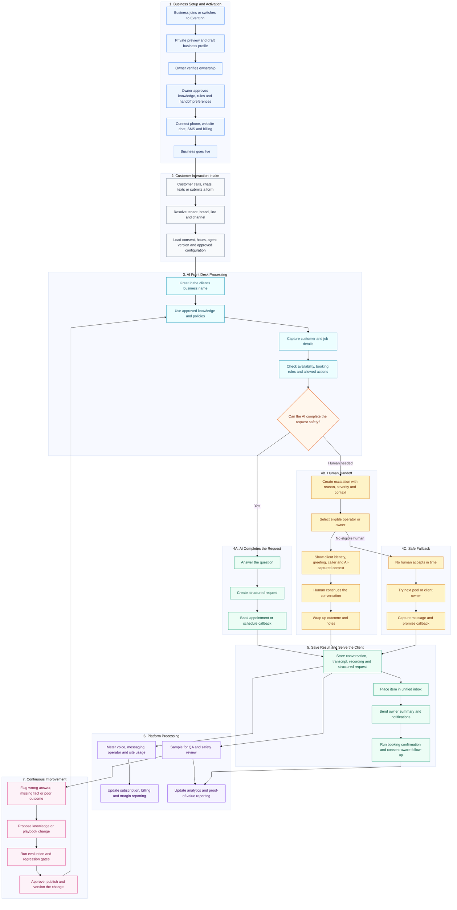

# EverOnn End-to-End Data Flow

**Document basis:** EverOnn Business Requirements and Technical Specification v1.0  
**Classification:** Confidential

## End-to-End Data Flow

This flow shows how a business moves from setup to live customer handling, human escalation, owner follow-up, billing, and continuous quality improvement.

## Data Flow Summary

1. **Business setup:** a prospect receives a private preview, verifies ownership, approves business knowledge and handoff rules, connects channels, and goes live.
2. **Customer intake:** every call, chat, SMS, or form is mapped to the correct tenant, brand, line, configuration, and consent state.
3. **AI handling:** the AI answers in the client's name, uses only approved knowledge, captures structured details, and performs only permitted actions.
4. **Human handoff when required:** an eligible owner or EverOnn operator receives the correct client identity and conversation context before taking over.
5. **Safe fallback:** if nobody accepts in time, the platform continues the escalation cascade and ultimately captures a message with a callback promise.
6. **Unified result:** conversation data, transcript, recording, summary, and structured request are stored and surfaced in one inbox.
7. **Notifications and follow-up:** the owner is informed quickly; booking confirmations and consent-aware follow-up continue automatically.
8. **Metering and billing:** billable usage is recorded and feeds subscription, allowance, cost, and margin reporting.
9. **Quality improvement:** selected interactions are reviewed; wrong answers and missing facts become proposed knowledge or playbook changes that must pass evaluation before release.
