# EverOnn End-to-End Data Flow

[Architecture](everonn-architecture.md) · [Delivery Kanban](everonn-delivery-kanban.md)

**Basis:** Both EverOnn requirements documents, version 1.0, dated 26 September 2026. **Revision:** 7 October 2026. **Status:** Required target workflows; diagrams do not establish implementation or client acceptance.

Read sections 1–2 for the business journey. Sections 3–13 explain the channel, human, website, commercial, migration and later restaurant workflows. Section 14 records the shared data and failure rules.

“Business” means the subscribing client; “customer” means that business's caller or visitor. A tenant is the system's isolated record of a business. Delivery phases P0–P3 are different from escalation severities S1–S4; the source calls the severity values p1–p4.

## 1. Business setup and safe activation — P1

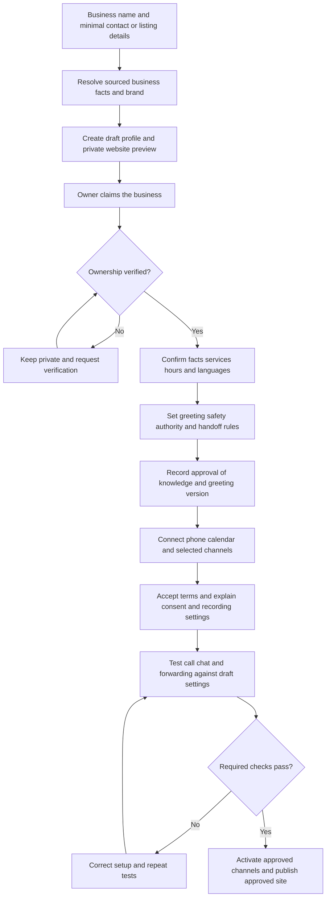

The first intake screen has at most three fields. Private preview/draft creation targets under two minutes. Unverified previews are non-indexable, unguessable and do not expose real business phone/address details. Draft/test mode does not bill or notify customers. A site and a phone channel each require their own applicable verification and activation checks; a calendar connection is required when calendar booking is enabled.

For a switching customer, the prospect's source is retained, the new account is linked and a migration project opens. Domain and incumbent-service changes follow section 8 before cut-over.

**Trace:** ONB-001–012, VOX-030–031, KNW-005, WEB-001–004, COM-006; AT-01–02/45. Source BP-3.

## 2. The customer journey — core P1 flow

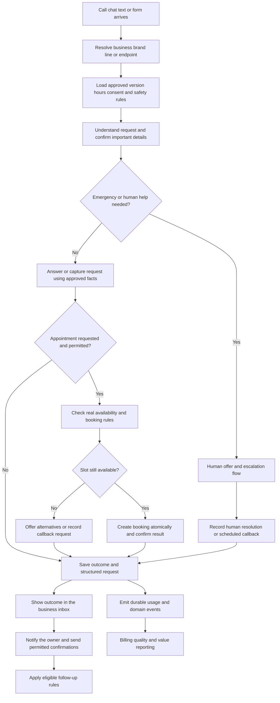

An information-only question does not automatically create an appointment. Unavailable calendars, unknown facts and disallowed actions lead to an honest alternative or follow-up. An appointment is confirmed only after the real booking succeeds. A request for a person always leads to live help or the required callback outcome.

**Trace:** POL-001–006, AGT-007–008, VOX-007/017/020–023, HIL-003, BKG-001–004, INB-001–007.

## 3. Voice channel — P1, with P2 automatic carrier failover

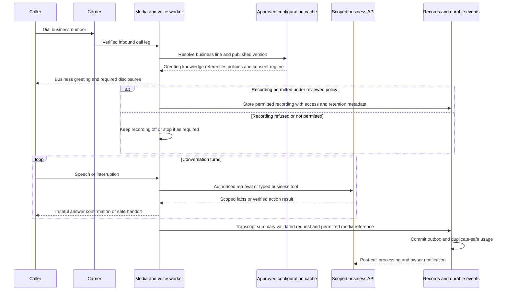

Speech recognition → AI reasoning → speech output use the shared provider interfaces and safety layer. Important details are read back. Returning-caller recognition remains tenant-scoped. Owner summaries target delivery within 30 seconds of call end. Audio exists only where the recording regime permits it; redaction and data-class retention still apply to transcripts and secondary uses.

P1 includes two working carriers. VOX-036 adds P2 health-based automatic reroute within 60 seconds; it is not the same milestone as the P1 carrier adapters. Ring-owner-first, unanswered calls and consent-aware missed-call text-back follow VOX-032–033. The general automated sequence engine is FUP-001 at P2.

**Trace:** VOX-001–044 as applicable, COM-001–005/007–008, AR-002/004, BIL-004. Source BP-1; AT-12–20.

## 4. Chat, SMS and forms — P1

### Website chat

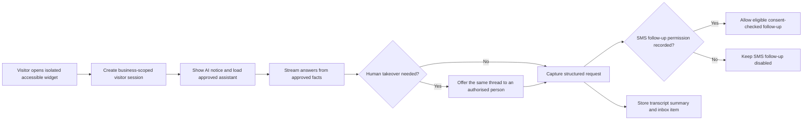

Chat shares the voice assistant's knowledge, playbook and tools. Photo uploads and location capture use the required permissions and file checks. Human takeover pauses the AI's customer-facing replies until the thread is released.

### SMS

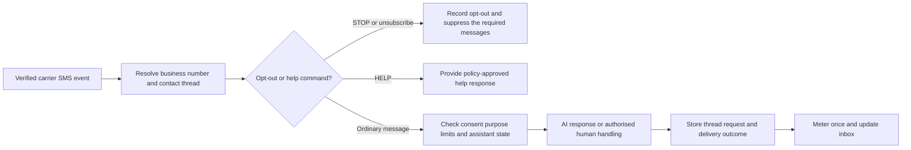

Consent and suppression are checked when sending, not only when a thread begins. A retried carrier event must not send or charge twice. The exact STOP scope follows D-22 and the approved messaging policy.

### Website form

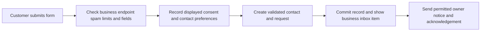

A form can create a structured request directly; it does not need to simulate an AI conversation. Forms do not make an appointment merely by collecting a preferred time.

**Trace:** CHT-001–013, WEB-007, AGT-008, COM-001–003, INB-001/003/007, API-003/006. AT-15/19/20/52.

## 5. Human offer, acceptance and fallback — P1/P2

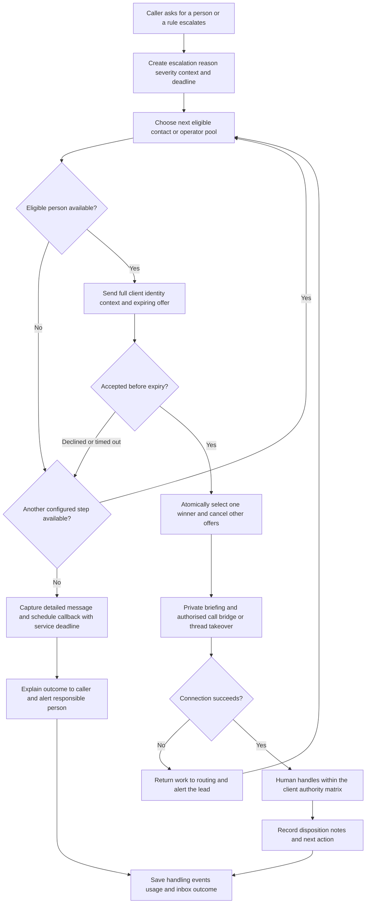

The caller remains informed while waiting. No human selection is treated as an acceptance. No failed audio connection is treated as a completed handoff. Supervisory access, private audio, caller identity, authority and masking apply throughout.

| Severity label in this guide | Source value | Source meaning and configurable response default |
| --- | --- | --- |
| S1 | p1 | Safety/emergency, VIP or live caller waiting: immediate transfer; priority cascade and repeated two-minute alerts until acknowledgement. |
| S2 | p2 | Human requested/high-value job: under 60 seconds; owner → eligible operator → callback task. |
| S3 | p3 | Unresolved question/knowledge gap: under 15 minutes during business hours. |
| S4 | p4 | Quality review/improvement: under 24 hours. |

The values above are HIL-002 defaults, not delivery-phase labels. Client coverage, operator Mode A/B/C, routing and emergency authority follow the approved configuration and D-9/D-16/D-17. The complete screen-pop/context lists and severity table are preserved in the Kanban's exact requirements.

**Trace:** HIL-001–017, DSK-001–026 as applicable, ACC-001, SEC-009. Source BP-2/BP-4; AT-28–39.

## 6. Saving the outcome, booking and follow-up

| Output | Required handling |
| --- | --- |
| Contact and request | Verified identity matching; schema-validated fields, urgency, uncertainty and conversation evidence; duplicate-safe updates. |
| Conversation package | Transcript, summary, tools and version references; audio only where permitted. |
| Booking | Real availability, business rules, atomic conflict checks and verified provider result; owner-approved changes where policy requires. |
| Owner notification | Correct client identity, selected channels and severity preferences; emergency exceptions follow policy. |
| Customer confirmation | Only an eligible, consent-checked message; a failed booking/order is never described as confirmed. |
| Follow-up | P1 specific text-back/reminder requirements remain distinct from P2 sequences; quiet hours, suppression, exit conditions and opt-outs apply at send time. |
| Usage and events | Stable source IDs, durable outbox, tenant/trace/version metadata and idempotent consumers. |

Review solicitation is subject to FUP-002's explicit platform-policy review. The proposed sentiment-based gating is not treated as approved simply because it appears in a backlog card.

**Trace:** AGT-008; INB; BKG; FUP; BIL-004; COM-001–002/007–009. Source BP-6 and specification Appendices C–D.

## 7. Website generation, approval and publication — P1/P2

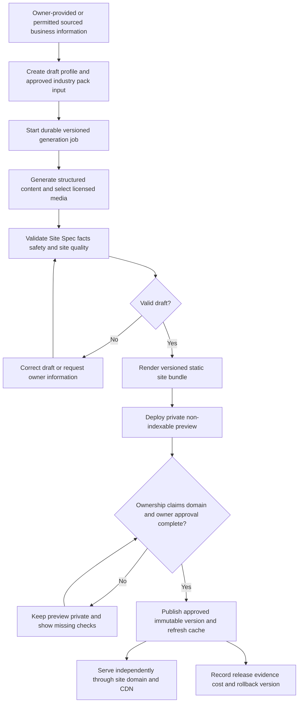

The owner editor changes permitted fields and publishes new versions; P1 does not accept arbitrary tenant HTML/scripts. Custom-domain verification, TLS, privacy/terms pages, contact actions, spam controls and search/performance checks form the publication gate. Bulk generation and controlled multi-site updates are P2. A control-plane outage can delay generation/publication but must not take already-published sites down.

**Trace:** WEB-001–018, ONB-002/005, VRT-003/005, POL-003, SEC-007, LT-003. AT-01–05. Source BP-3.

## 8. Prospect acquisition and authorised migration — P1/P2

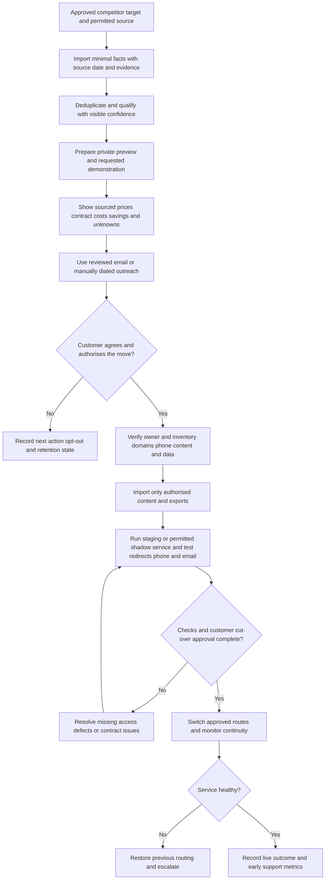

A technology-list detection is not proof that a prospect is a paying incumbent customer. Claims and savings require dated evidence; fees, notice periods and unknowns remain visible. No sensitive exports, DNS/number changes or contract cancellation occur without customer authority. Email and number continuity, redirect maps and rollback are part of the move.

D-29's P1/P2 default permits email and manually dialed calls; AI-voice or automated-text acquisition outreach is excluded. Later automation needs its separately approved scope and compliance review. Forwarding supports P1 continuity; porting follows its P2 requirements. Source and connector terms continue to control data use.

**Trace:** ACQ-001–013, MIG-001–010, ONB-012, COM-001/012, INT-004; D-28/29/32/33. Source BP-8; AT-21–27.

## 9. Restaurant pickup ordering — P2

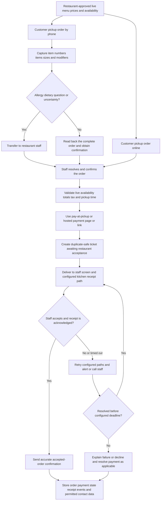

An order submitted to the platform is distinct from a restaurant-accepted order. Staff can decline with a reason; customer wording must reflect the actual state. Payment status is a separate fact and cannot prove kitchen acceptance. No AI agent takes full card details. POS connectors require the restaurant's authorisation and provider approval; a staff-screen/manual receipt path remains available.

This is pickup ordering, beginning with the source's American Chinese takeout pilot. Pilot accuracy thresholds, receipt/payment choices and three pilot restaurants are agreed through D-30 before launch. Delivery logistics and consumer-marketplace demand are excluded.

**Trace:** ORD-001–010, INT-001–005, BIL-010, COM-017, VRT-005; D-30. AT-40–43.

## 10. Plans, metering and payments — P1/P2

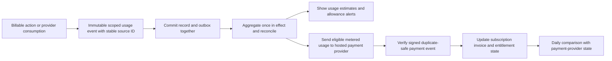

Plans and brand prices are dated data. Entitlements determine permitted features and limits. Customer-facing estimates are distinguishable from provider-reported charges. Limits follow the approved overage/soft-cap/hard-cap rules and never block emergency handling. Payment failure follows dunning and grace-period policy before suspension. P2 outcome, order and operator-minute components retain their approved definitions.

**Trace:** BIL-001–010, CST-001–007, API-001, ADM-004. Source BP-6; AT-48/55/56 and the applicable phase tests.

## 11. Quality improvement and safe AI changes — P0/P1/P2

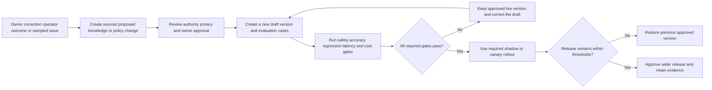

Feedback never becomes live knowledge merely because it was submitted. Privacy/consent and anonymisation govern dataset use. The product owner accepts the feature and the owner's approval governs business knowledge. Critical safety failures block release; the complete EVL-005 rules include regression, latency, cost and attached change-record evidence.

**Trace:** KNW-005, AGT-004, HIL-008–010, EVL-001–010, ADM-003, COM-007. Source BP-5; BR-076.

## 12. Client offboarding — P1

```mermaid
flowchart LR
    REQUEST[Verified cancellation or unpaid-account policy] --> NOTICE[Apply notices grace period and agreed terms]
    NOTICE --> FALLBACK[Move channels to the required safe fallback]
    FALLBACK --> SUSPEND[Suspend service and revoke operator and integration access]
    SUSPEND --> NUMBERS[Release or transfer phone and domain assets under policy]
    NUMBERS --> EXPORT[Provide authorised machine-readable data export]
    EXPORT --> RETAIN[Apply retention schedules and lawful holds]
    RETAIN --> DELETE[Delete eligible data and erase applicable tenant keys]
    DELETE --> AUDIT[Record the offboarding outcome and deletion evidence]
```

Number/domain rights and the timing of retention/deletion follow the approved policy and customer agreement. Offboarding is distinct from an individual customer's privacy-rights request, which COM-009 handles through its verified workflow. Export/deletion jobs remain tenant-scoped and auditable.

**Trace:** TEN-006, COM-008–009, BIL-002, ADM-001/005, DSK-002. Source BP-7; AT-46.

## 13. Industry-pack launch — P0/P1/P2/P3

An industry pack supplies website sections, knowledge, intake fields, playbooks, safe advice limits, operator instructions, plans, connectors and evaluation cases. A responsible vertical manager assembles it; the readiness console records evidence and approvers. Missing terms, permitted providers, safety evaluations, operator preparation or required parity features block launch.

P1 proves at least two brands and two packs. The source's wave proposal puts auto repair and home/urgent services first, accounting and the restaurant pilot in P2, and regulated/health-care packs behind P3 compliance readiness. D-19/D-26 still require agreement on the exact initial trades and launch order; this guide does not silently resolve that decision.

**Trace:** VRT-001–010, EVL-010, COM-014–018, INT-002–005, ADM-009. Source BP-9; AT-06–11.

## 14. Shared data contracts, boundaries and failure rules

| Record / event | Required data and controls |
| --- | --- |
| Interaction context | Tenant, brand, line/endpoint, contact/session, channel, language, approved agent/knowledge/policy versions and trace ID. |
| Structured Request | Source Appendix D contract: conversation links, status, urgency/reason, service, summary, contact, location, details, optional appointment, outcome, confidence/evidence, guardrail events and cost. |
| Escalation / offer | Source HIL-001 and desk protocol: trigger, severity, due time, recipient/mode, context snapshot, authoritative state, expiry and idempotent commands. |
| Recording / upload | Private object reference, classification, permitted purpose, retention, key version and scoped access; no unconditional recording. |
| Usage / domain event | Stable event/source identity, tenant, quantity/unit or payload schema version, timestamps, trace and replay state. |
| Prospect / migration | Source/date/evidence, confidence, permission, target, contract/asset inventory, sign-off and continuity/rollback checks. |
| Order | Tenant/menu version, confirmed items/modifiers, totals/currency, pickup, staff acknowledgement, receipt retries and distinct payment state. |

| Failure or retry | Required outcome |
| --- | --- |
| Unknown or conflicting fact | State uncertainty, request clarification or record follow-up; no invented fact. |
| Booking conflict or revoked calendar grant | Offer alternatives or callback; do not promise an uncreated appointment. |
| No human accepts / bridge fails | Continue the configured cascade or safe callback outcome; record the service breach and alert as required. |
| Duplicate provider event / competing acceptance | Stable idempotency and atomic state prevent duplicate messages, bookings, handling or charging. |
| Control plane or database outage | Real-time paths use approved cached configuration, buffered/replayed events and safe fallback; published sites keep serving independently. |
| Speech/model failure | Apply the specified alternative or permitted safe capture/DTMF flow; inform the caller appropriately. |
| Order receipt failure | Retry/escalate under restaurant policy; never report kitchen acceptance without evidence. |
| Unsafe draft / failed evaluation | Keep the previous approved version; record the failure and correct or roll back. |
| Data export / deletion request | Verify authority, apply the policy and retain completion evidence without crossing business boundaries. |

External input remains untrusted at the edge, in imported content and in tool responses. Scoped API/repository checks enforce permissions; provider integrations use only the allowed fields. Jobs, offers and service deadlines must survive restarts. See the architecture for phase-specific recovery targets and the Kanban for complete requirements and official acceptance criteria.
