# EverOnn Project Kanban

[Architecture](everonn-architecture.md) · [Data flow](everonn-dataflow.md)

**Source:** EverOnn Business Requirements Document and Platform BRD / Technical Specification, v1.0, 26 September 2026. Original module layout, titles and bold card labels retained.

**Workflow:** Pending → In Progress → Ready for Deploy → Ready for Test → Done

> All modules and tickets are initially placed under **Pending** until actual project execution status is updated.

## Overall Project Board

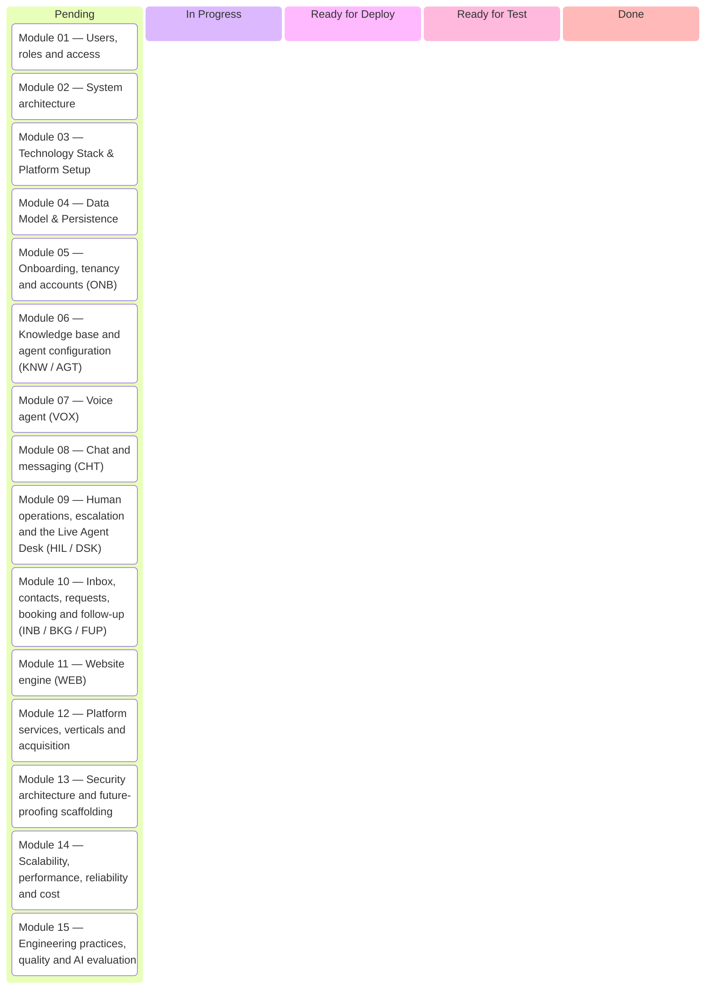

## Project Summary

- **Major Modules:** 15
- **Submodules / Workstreams:** 77
- **Detailed Tickets:** 369
- **Delivery Phases:** P0 Foundations · P1 Pilot · P2 Scale · P3 Expansion
- **Added Supporting Tickets:** 9 (DEL-001–009), derived from specification §§24 and 26. These are planning IDs, not new source requirement IDs.

**Delivery guidance:** “Delivered To” names the recipient roles; “Delivery Owner” suggests the team responsible. Named people and dates are assigned during planning. Supporting-ticket phases are planning guidance. “Ready for Deploy” means staging; non-code deliverables move to owner review. Production release and acceptance require their own evidence.

# Module 01 — Users, roles and access

- **Deliverable Type:** Business + Technical
- **Delivered To:** Business owners, authorised staff and EverOnn operators
- **Delivery Owner (Role):** Identity and access engineering lead
- **𝗗𝗲𝘀𝗰𝗿𝗶𝗽𝘁𝗶𝗼𝗻:** Identity, roles, authorization, API keys and controlled staff/operator access.
- **Business Outcome:** Secure role-based access for clients, EverOnn staff and operators.
- **Primary Tech Stack:** Keycloak / NestJS/Fastify / MariaDB / Vault/OpenBao / Next.js
- **Phase Coverage:** P1 / P2
- **Requirement Coverage:** MUST: 5 · SHOULD: 1
- **Total Tickets:** 6

## 01.01 — Access requirements

- **Ticket Count:** 6
- **Phase Coverage:** P1 / P2
- **Requirement Coverage:** MUST: 5 · SHOULD: 1

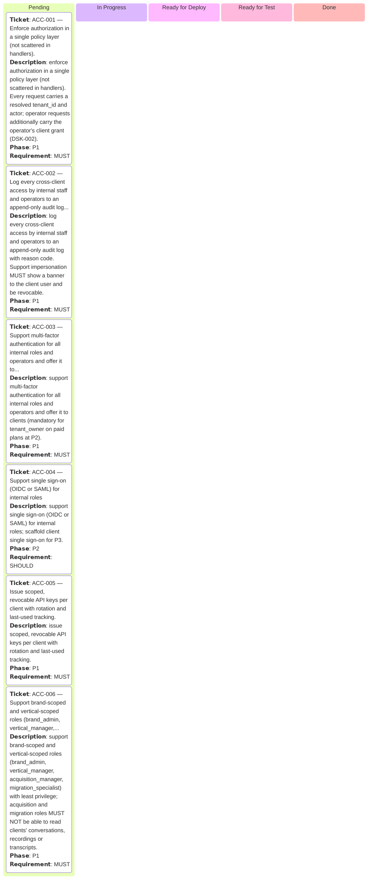

# Module 02 — System architecture

- **Deliverable Type:** Technical
- **Delivered To:** EverOnn product owner and architecture / engineering teams
- **Delivery Owner (Role):** Technical architect
- **𝗗𝗲𝘀𝗰𝗿𝗶𝗽𝘁𝗶𝗼𝗻:** Architecture decisions, provider abstraction, eventing, resilience, cell scaling and deployment evolution.
- **Business Outcome:** Establish a resilient, scalable and vendor-replaceable platform foundation.
- **Primary Tech Stack:** RHEL / Podman/Quadlet / NestJS/Fastify / MariaDB / Redis/Valkey / OpenTofu/Ansible
- **Phase Coverage:** P0 / P1 / P2
- **Requirement Coverage:** MUST: 8 · SHOULD: 2
- **Total Tickets:** 10

## 02.01 — Architecture requirements

- **Ticket Count:** 10
- **Phase Coverage:** P0 / P1 / P2
- **Requirement Coverage:** MUST: 8 · SHOULD: 2

```mermaid
kanban
  pending[Pending]
    km02s1AR001["𝗧𝗶𝗰𝗸𝗲𝘁: AR-001 — Deliver a written architecture decision record (ADR) set covering every 'Decision' in this...
𝗗𝗲𝘀𝗰𝗿𝗶𝗽𝘁𝗶𝗼𝗻: deliver a written architecture decision record (ADR) set covering every #quot;Decision#quot; in this document, before P1 build starts.
𝗣𝗵𝗮𝘀𝗲: P0
𝗥𝗲𝗾𝘂𝗶𝗿𝗲𝗺𝗲𝗻𝘁: MUST"]
    km02s1AR002["𝗧𝗶𝗰𝗸𝗲𝘁: AR-002 — Expose every external vendor behind an internal interface
𝗗𝗲𝘀𝗰𝗿𝗶𝗽𝘁𝗶𝗼𝗻: expose every external vendor behind an internal interface: TelephonyProvider, SttProvider, TtsProvider, LlmProvider, SmsProvider, EmailProvider, PaymentProvider, CalendarProvider, GeocodingProvider. Each MUST have at least one alternative implementation stubbed or contract-tested by end of P1 for telephony and LLM, by P2 for the rest.
𝗣𝗵𝗮𝘀𝗲: P0
𝗥𝗲𝗾𝘂𝗶𝗿𝗲𝗺𝗲𝗻𝘁: MUST"]
    km02s1AR003["𝗧𝗶𝗰𝗸𝗲𝘁: AR-003 — Use an event-driven backbone
𝗗𝗲𝘀𝗰𝗿𝗶𝗽𝘁𝗶𝗼𝗻: use an event-driven backbone: state changes emit versioned domain events (Appendix C) via an outbox table, so that workers, analytics, webhooks and future services consume them without coupling. The outbox pattern MUST be used so events are never lost on commit.
𝗣𝗵𝗮𝘀𝗲: P0
𝗥𝗲𝗾𝘂𝗶𝗿𝗲𝗺𝗲𝗻𝘁: MUST"]
    km02s1AR004["𝗧𝗶𝗰𝗸𝗲𝘁: AR-004 — Ensure the voice path degrades gracefully
𝗗𝗲𝘀𝗰𝗿𝗶𝗽𝘁𝗶𝗼𝗻: ensure the voice path degrades gracefully: if the control plane, database or a primary vendor is down, calls still get answered with cached configuration and a fallback provider or a safe fallback flow (take a message, text the owner). Test with chaos drills in P2.
𝗣𝗵𝗮𝘀𝗲: P1
𝗥𝗲𝗾𝘂𝗶𝗿𝗲𝗺𝗲𝗻𝘁: MUST"]
    km02s1AR005["𝗧𝗶𝗰𝗸𝗲𝘁: AR-005 — Be cell-ready: a 'cell' is a complete stack (API, workers, DB schema set, Redis,...
𝗗𝗲𝘀𝗰𝗿𝗶𝗽𝘁𝗶𝗼𝗻: be cell-ready: a #quot;cell#quot; is a complete stack (API, workers, DB schema set, Redis, media/voice workers) serving a subset of tenants. tenants.cell_id and a routing map MUST exist from P1 even if only one cell runs. Adding a cell MUST be scriptable (infra as code).
𝗣𝗵𝗮𝘀𝗲: P1
𝗥𝗲𝗾𝘂𝗶𝗿𝗲𝗺𝗲𝗻𝘁: MUST"]
    km02s1AR006["𝗧𝗶𝗰𝗸𝗲𝘁: AR-006 — Make every service stateless where possible, with 12-factor configuration
𝗗𝗲𝘀𝗰𝗿𝗶𝗽𝘁𝗶𝗼𝗻: make every service stateless where possible, with 12-factor configuration; state lives in MariaDB, Redis or object storage.
𝗣𝗵𝗮𝘀𝗲: P1
𝗥𝗲𝗾𝘂𝗶𝗿𝗲𝗺𝗲𝗻𝘁: MUST"]
    km02s1AR007["𝗧𝗶𝗰𝗸𝗲𝘁: AR-007 — Version all external APIs (/v1), all events, all agent configuration schemas, and all...
𝗗𝗲𝘀𝗰𝗿𝗶𝗽𝘁𝗶𝗼𝗻: version all external APIs (/v1), all events, all agent configuration schemas, and all prompt templates.
𝗣𝗵𝗮𝘀𝗲: P1
𝗥𝗲𝗾𝘂𝗶𝗿𝗲𝗺𝗲𝗻𝘁: MUST"]
    km02s1AR008["𝗧𝗶𝗰𝗸𝗲𝘁: AR-008 — Produce a C4 model (context, container, component) and a data-flow diagram per channel,...
𝗗𝗲𝘀𝗰𝗿𝗶𝗽𝘁𝗶𝗼𝗻: produce a C4 model (context, container, component) and a data-flow diagram per channel, kept in the repo and updated per release.
𝗣𝗵𝗮𝘀𝗲: P0
𝗥𝗲𝗾𝘂𝗶𝗿𝗲𝗺𝗲𝗻𝘁: SHOULD"]
    km02s1AR009["𝗧𝗶𝗰𝗸𝗲𝘁: AR-009 — Support blue/green or rolling deploys with zero dropped calls
𝗗𝗲𝘀𝗰𝗿𝗶𝗽𝘁𝗶𝗼𝗻: support blue/green or rolling deploys with zero dropped calls: voice workers drain (finish active calls, accept none) before termination.
𝗣𝗵𝗮𝘀𝗲: P1
𝗥𝗲𝗾𝘂𝗶𝗿𝗲𝗺𝗲𝗻𝘁: MUST"]
    km02s1AR010["𝗧𝗶𝗰𝗸𝗲𝘁: AR-010 — Provide a path to Kubernetes/OpenShift (manifests or Helm charts and a documented migration...
𝗗𝗲𝘀𝗰𝗿𝗶𝗽𝘁𝗶𝗼𝗻: provide a path to Kubernetes/OpenShift (manifests or Helm charts and a documented migration plan) while running on Podman/Quadlet at P1.
𝗣𝗵𝗮𝘀𝗲: P2
𝗥𝗲𝗾𝘂𝗶𝗿𝗲𝗺𝗲𝗻𝘁: SHOULD"]
  inprogress[In Progress]
  readydeploy[Ready for Deploy]
  readytest[Ready for Test]
  done[Done]
```

# Module 03 — Technology Stack & Platform Setup

- **Deliverable Type:** Technical
- **Delivered To:** Platform engineering and operations teams
- **Delivery Owner (Role):** Platform / infrastructure lead
- **𝗗𝗲𝘀𝗰𝗿𝗶𝗽𝘁𝗶𝗼𝗻:** Core runtime, frameworks, infrastructure, environments and provider technology baseline.
- **Business Outcome:** Provide repeatable environments and an approved production-ready technology baseline.
- **Primary Tech Stack:** BullMQ / Redis/Valkey / MariaDB timers / Valkey/Redis / Streams / Preact/Web Components
- **Phase Coverage:** P0 / P1
- **Requirement Coverage:** Implementation: 25
- **Total Tickets:** 25

## 03.01 — Background Jobs

- **Ticket Count:** 1
- **Phase Coverage:** P0
- **Requirement Coverage:** Implementation: 1

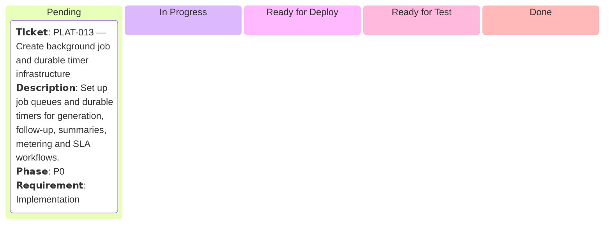

## 03.02 — Cache & Queues

- **Ticket Count:** 1
- **Phase Coverage:** P0
- **Requirement Coverage:** Implementation: 1

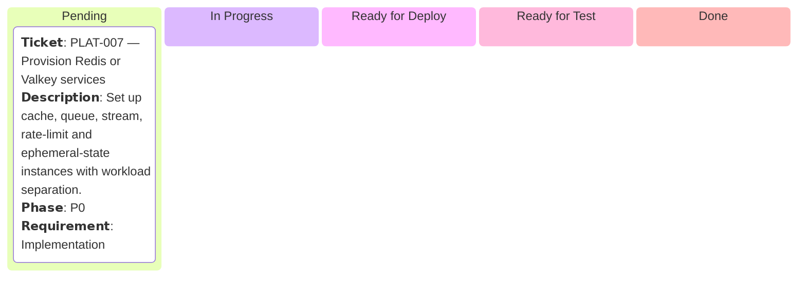

## 03.03 — Chat Widget

- **Ticket Count:** 1
- **Phase Coverage:** P0
- **Requirement Coverage:** Implementation: 1

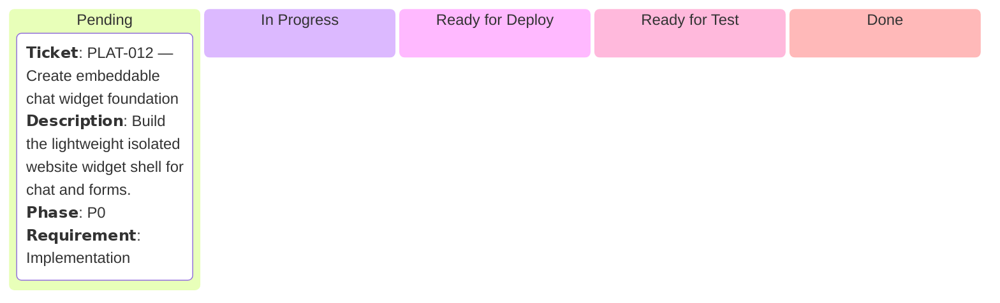

## 03.04 — Container Runtime

- **Ticket Count:** 1
- **Phase Coverage:** P0
- **Requirement Coverage:** Implementation: 1

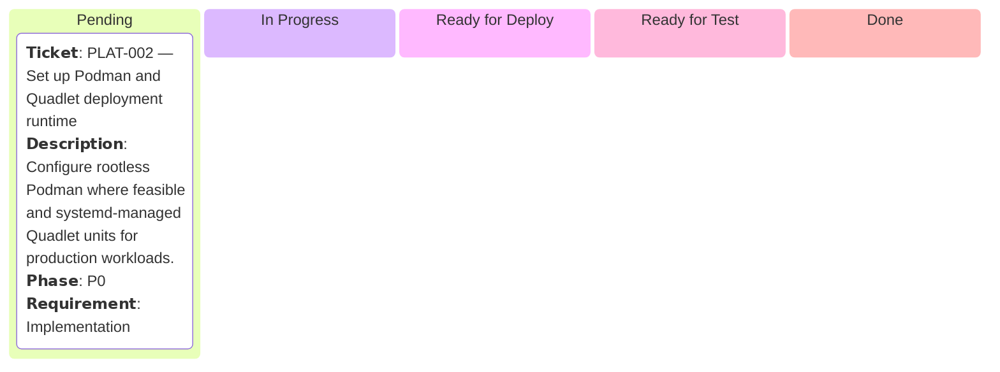

## 03.05 — Control Plane

- **Ticket Count:** 1
- **Phase Coverage:** P0
- **Requirement Coverage:** Implementation: 1


## 03.06 — Database Platform

- **Ticket Count:** 1
- **Phase Coverage:** P0
- **Requirement Coverage:** Implementation: 1

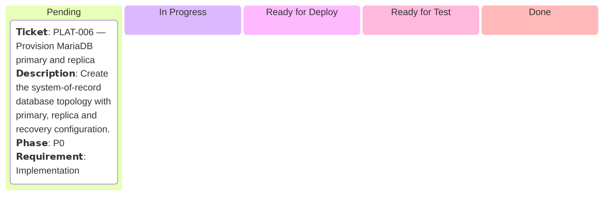

## 03.07 — Deployment Topology

- **Ticket Count:** 1
- **Phase Coverage:** P0
- **Requirement Coverage:** Implementation: 1

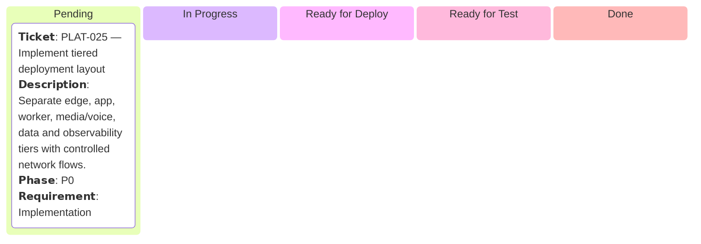

## 03.08 — Edge Tier

- **Ticket Count:** 1
- **Phase Coverage:** P0
- **Requirement Coverage:** Implementation: 1

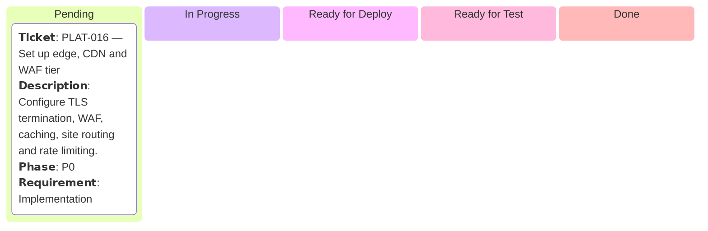

## 03.09 — Email

- **Ticket Count:** 1
- **Phase Coverage:** P1
- **Requirement Coverage:** Implementation: 1

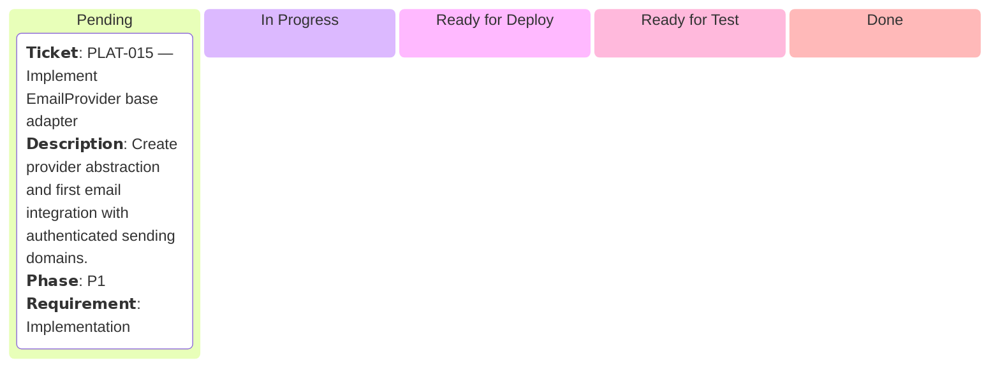

## 03.10 — Embeddings & Vector Search

- **Ticket Count:** 1
- **Phase Coverage:** P0
- **Requirement Coverage:** Implementation: 1

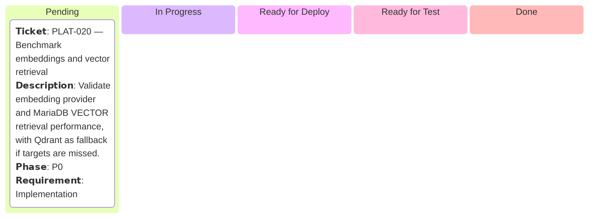

## 03.11 — Environments

- **Ticket Count:** 1
- **Phase Coverage:** P0
- **Requirement Coverage:** Implementation: 1

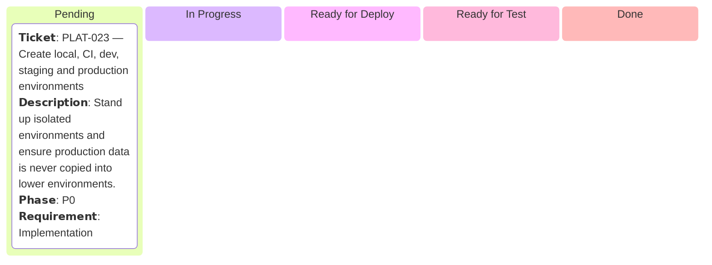

## 03.12 — Identity Platform

- **Ticket Count:** 1
- **Phase Coverage:** P0
- **Requirement Coverage:** Implementation: 1

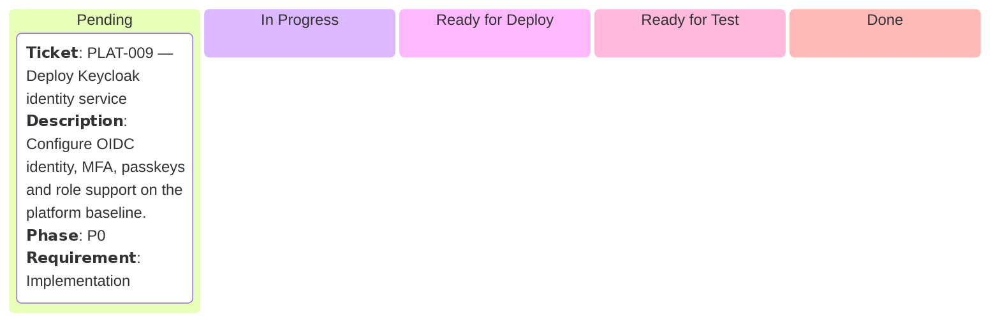

## 03.13 — Image Pipeline

- **Ticket Count:** 1
- **Phase Coverage:** P1
- **Requirement Coverage:** Implementation: 1

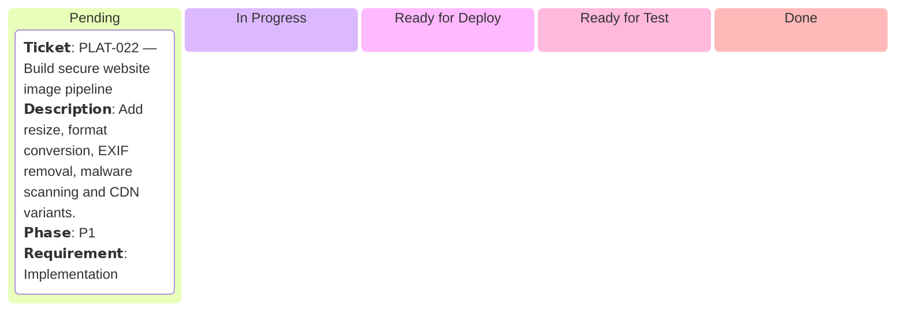

## 03.14 — Infrastructure as Code

- **Ticket Count:** 1
- **Phase Coverage:** P0
- **Requirement Coverage:** Implementation: 1

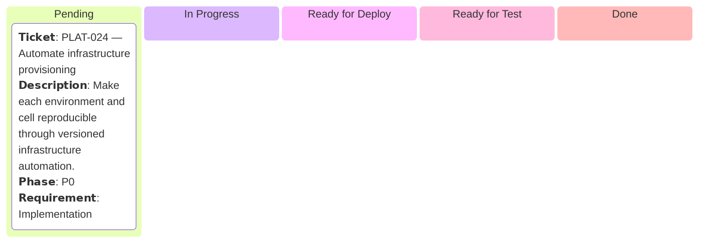

## 03.15 — Media Tier

- **Ticket Count:** 1
- **Phase Coverage:** P0
- **Requirement Coverage:** Implementation: 1

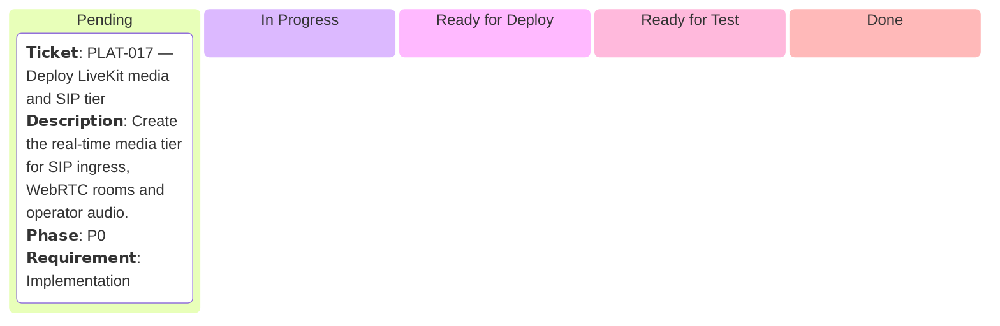

## 03.16 — Model Gateway

- **Ticket Count:** 1
- **Phase Coverage:** P0
- **Requirement Coverage:** Implementation: 1

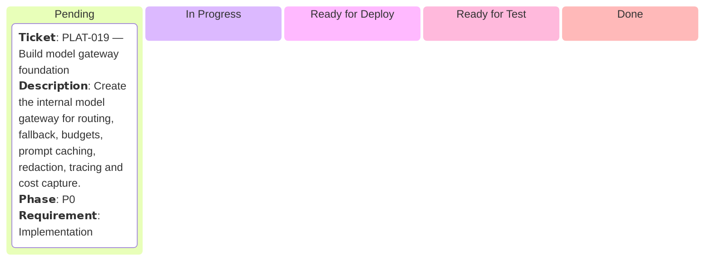

## 03.17 — Object Storage

- **Ticket Count:** 1
- **Phase Coverage:** P0
- **Requirement Coverage:** Implementation: 1

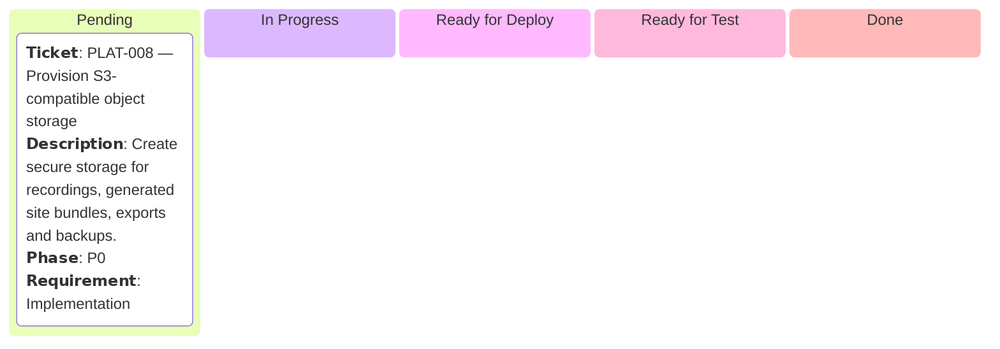

## 03.18 — Observability

- **Ticket Count:** 1
- **Phase Coverage:** P0
- **Requirement Coverage:** Implementation: 1

```mermaid
kanban
  pending[Pending]
    km03s18PLAT014["𝗧𝗶𝗰𝗸𝗲𝘁: PLAT-014 — Deploy observability stack
𝗗𝗲𝘀𝗰𝗿𝗶𝗽𝘁𝗶𝗼𝗻: Set up platform-wide tracing, metrics, logs and dashboards before pilot development.
𝗣𝗵𝗮𝘀𝗲: P0
𝗥𝗲𝗾𝘂𝗶𝗿𝗲𝗺𝗲𝗻𝘁: Implementation"]
  inprogress[In Progress]
  readydeploy[Ready for Deploy]
  readytest[Ready for Test]
  done[Done]
```

## 03.19 — Production OS

- **Ticket Count:** 1
- **Phase Coverage:** P0
- **Requirement Coverage:** Implementation: 1

```mermaid
kanban
  pending[Pending]
    km03s19PLAT001["𝗧𝗶𝗰𝗸𝗲𝘁: PLAT-001 — Establish RHEL production baseline
𝗗𝗲𝘀𝗰𝗿𝗶𝗽𝘁𝗶𝗼𝗻: Prepare RHEL hosts with SELinux enforcing, firewalld and automated patching baseline.
𝗣𝗵𝗮𝘀𝗲: P0
𝗥𝗲𝗾𝘂𝗶𝗿𝗲𝗺𝗲𝗻𝘁: Implementation"]
  inprogress[In Progress]
  readydeploy[Ready for Deploy]
  readytest[Ready for Test]
  done[Done]
```

## 03.20 — Python Services

- **Ticket Count:** 1
- **Phase Coverage:** P0
- **Requirement Coverage:** Implementation: 1

```mermaid
kanban
  pending[Pending]
    km03s20PLAT005["𝗧𝗶𝗰𝗸𝗲𝘁: PLAT-005 — Scaffold Python service runtime
𝗗𝗲𝘀𝗰𝗿𝗶𝗽𝘁𝗶𝗼𝗻: Create the Python service foundation for voice agents, evaluation and ML tooling with reproducible dependency locking.
𝗣𝗵𝗮𝘀𝗲: P0
𝗥𝗲𝗾𝘂𝗶𝗿𝗲𝗺𝗲𝗻𝘁: Implementation"]
  inprogress[In Progress]
  readydeploy[Ready for Deploy]
  readytest[Ready for Test]
  done[Done]
```

## 03.21 — Repository

- **Ticket Count:** 1
- **Phase Coverage:** P0
- **Requirement Coverage:** Implementation: 1

```mermaid
kanban
  pending[Pending]
    km03s21PLAT003["𝗧𝗶𝗰𝗸𝗲𝘁: PLAT-003 — Create monorepo and package structure
𝗗𝗲𝘀𝗰𝗿𝗶𝗽𝘁𝗶𝗼𝗻: Create apps/, services/, packages/, infra/, evals/ and docs/ with locked TypeScript and Python dependencies.
𝗣𝗵𝗮𝘀𝗲: P0
𝗥𝗲𝗾𝘂𝗶𝗿𝗲𝗺𝗲𝗻𝘁: Implementation"]
  inprogress[In Progress]
  readydeploy[Ready for Deploy]
  readytest[Ready for Test]
  done[Done]
```

## 03.22 — Secrets & Keys

- **Ticket Count:** 1
- **Phase Coverage:** P0
- **Requirement Coverage:** Implementation: 1

```mermaid
kanban
  pending[Pending]
    km03s22PLAT010["𝗧𝗶𝗰𝗸𝗲𝘁: PLAT-010 — Deploy secrets and key-management service
𝗗𝗲𝘀𝗰𝗿𝗶𝗽𝘁𝗶𝗼𝗻: Configure Vault/OpenBao for dynamic credentials, Transit envelope encryption and rotation.
𝗣𝗵𝗮𝘀𝗲: P0
𝗥𝗲𝗾𝘂𝗶𝗿𝗲𝗺𝗲𝗻𝘁: Implementation"]
  inprogress[In Progress]
  readydeploy[Ready for Deploy]
  readytest[Ready for Test]
  done[Done]
```

## 03.23 — Telephony Providers

- **Ticket Count:** 1
- **Phase Coverage:** P1
- **Requirement Coverage:** Implementation: 1

```mermaid
kanban
  pending[Pending]
    km03s23PLAT018["𝗧𝗶𝗰𝗸𝗲𝘁: PLAT-018 — Integrate primary and secondary carriers
𝗗𝗲𝘀𝗰𝗿𝗶𝗽𝘁𝗶𝗼𝗻: Implement Twilio and Telnyx carrier adapters to support failover, numbers and SMS.
𝗣𝗵𝗮𝘀𝗲: P1
𝗥𝗲𝗾𝘂𝗶𝗿𝗲𝗺𝗲𝗻𝘁: Implementation"]
  inprogress[In Progress]
  readydeploy[Ready for Deploy]
  readytest[Ready for Test]
  done[Done]
```

## 03.24 — Web Application

- **Ticket Count:** 1
- **Phase Coverage:** P0
- **Requirement Coverage:** Implementation: 1

```mermaid
kanban
  pending[Pending]
    km03s24PLAT011["𝗧𝗶𝗰𝗸𝗲𝘁: PLAT-011 — Create client and admin web foundations
𝗗𝗲𝘀𝗰𝗿𝗶𝗽𝘁𝗶𝗼𝗻: Set up shared Next.js/React frontend foundation for dashboard, inbox, admin and internal consoles.
𝗣𝗵𝗮𝘀𝗲: P0
𝗥𝗲𝗾𝘂𝗶𝗿𝗲𝗺𝗲𝗻𝘁: Implementation"]
  inprogress[In Progress]
  readydeploy[Ready for Deploy]
  readytest[Ready for Test]
  done[Done]
```

## 03.25 — Website Renderer

- **Ticket Count:** 1
- **Phase Coverage:** P0
- **Requirement Coverage:** Implementation: 1

```mermaid
kanban
  pending[Pending]
    km03s25PLAT021["𝗧𝗶𝗰𝗸𝗲𝘁: PLAT-021 — Build Site Spec renderer foundation
𝗗𝗲𝘀𝗰𝗿𝗶𝗽𝘁𝗶𝗼𝗻: Create schema-driven static site rendering with a versioned component library.
𝗣𝗵𝗮𝘀𝗲: P0
𝗥𝗲𝗾𝘂𝗶𝗿𝗲𝗺𝗲𝗻𝘁: Implementation"]
  inprogress[In Progress]
  readydeploy[Ready for Deploy]
  readytest[Ready for Test]
  done[Done]
```

# Module 04 — Data Model & Persistence

- **Deliverable Type:** Technical
- **Delivered To:** Data, backend and platform operations teams
- **Delivery Owner (Role):** Data / backend lead
- **𝗗𝗲𝘀𝗰𝗿𝗶𝗽𝘁𝗶𝗼𝗻:** Core schemas, tenant-safe persistence, search indexes, backups, retention and recovery.
- **Business Outcome:** Provide a reliable tenant-scoped system of record for platform data.
- **Primary Tech Stack:** MariaDB / binlogs / S3-compatible storage / Vault dynamic credentials / repository layer / Redis Streams
- **Phase Coverage:** P0 / P1
- **Requirement Coverage:** Implementation: 10
- **Total Tickets:** 10

## 04.01 — Backup & Recovery

- **Ticket Count:** 1
- **Phase Coverage:** P1
- **Requirement Coverage:** Implementation: 1

```mermaid
kanban
  pending[Pending]
    km04s1DATA004["𝗧𝗶𝗰𝗸𝗲𝘁: DATA-004 — Implement backup and PITR workflow
𝗗𝗲𝘀𝗰𝗿𝗶𝗽𝘁𝗶𝗼𝗻: Configure nightly full backups, continuous binlog shipping, immutable copies and restore testing.
𝗣𝗵𝗮𝘀𝗲: P1
𝗥𝗲𝗾𝘂𝗶𝗿𝗲𝗺𝗲𝗻𝘁: Implementation"]
  inprogress[In Progress]
  readydeploy[Ready for Deploy]
  readytest[Ready for Test]
  done[Done]
```

## 04.02 — Database Access

- **Ticket Count:** 1
- **Phase Coverage:** P1
- **Requirement Coverage:** Implementation: 1

```mermaid
kanban
  pending[Pending]
    km04s2DATA005["𝗧𝗶𝗰𝗸𝗲𝘁: DATA-005 — Configure pooling and read/write routing
𝗗𝗲𝘀𝗰𝗿𝗶𝗽𝘁𝗶𝗼𝗻: Use pooled TLS database connections, per-service credentials and replica-aware access patterns.
𝗣𝗵𝗮𝘀𝗲: P1
𝗥𝗲𝗾𝘂𝗶𝗿𝗲𝗺𝗲𝗻𝘁: Implementation"]
  inprogress[In Progress]
  readydeploy[Ready for Deploy]
  readytest[Ready for Test]
  done[Done]
```

## 04.03 — Event & Usage Data

- **Ticket Count:** 1
- **Phase Coverage:** P1
- **Requirement Coverage:** Implementation: 1

```mermaid
kanban
  pending[Pending]
    km04s3DATA007["𝗧𝗶𝗰𝗸𝗲𝘁: DATA-007 — Create outbox, usage and audit persistence
𝗗𝗲𝘀𝗰𝗿𝗶𝗽𝘁𝗶𝗼𝗻: Create durable event, metering and audit data structures with idempotency and trace metadata.
𝗣𝗵𝗮𝘀𝗲: P1
𝗥𝗲𝗾𝘂𝗶𝗿𝗲𝗺𝗲𝗻𝘁: Implementation"]
  inprogress[In Progress]
  readydeploy[Ready for Deploy]
  readytest[Ready for Test]
  done[Done]
```

## 04.04 — High-Volume Tables

- **Ticket Count:** 1
- **Phase Coverage:** P1
- **Requirement Coverage:** Implementation: 1

```mermaid
kanban
  pending[Pending]
    km04s4DATA003["𝗧𝗶𝗰𝗸𝗲𝘁: DATA-003 — Partition high-volume append tables
𝗗𝗲𝘀𝗰𝗿𝗶𝗽𝘁𝗶𝗼𝗻: Partition calls, messages, usage and audit/event data by time for scale and retention.
𝗣𝗵𝗮𝘀𝗲: P1
𝗥𝗲𝗾𝘂𝗶𝗿𝗲𝗺𝗲𝗻𝘁: Implementation"]
  inprogress[In Progress]
  readydeploy[Ready for Deploy]
  readytest[Ready for Test]
  done[Done]
```

## 04.05 — Object Metadata

- **Ticket Count:** 1
- **Phase Coverage:** P1
- **Requirement Coverage:** Implementation: 1

```mermaid
kanban
  pending[Pending]
    km04s5DATA008["𝗧𝗶𝗰𝗸𝗲𝘁: DATA-008 — Model recordings and file metadata securely
𝗗𝗲𝘀𝗰𝗿𝗶𝗽𝘁𝗶𝗼𝗻: Store object references, classifications, retention and encryption-key versions without public bucket exposure.
𝗣𝗵𝗮𝘀𝗲: P1
𝗥𝗲𝗾𝘂𝗶𝗿𝗲𝗺𝗲𝗻𝘁: Implementation"]
  inprogress[In Progress]
  readydeploy[Ready for Deploy]
  readytest[Ready for Test]
  done[Done]
```

## 04.06 — Retention & Archive

- **Ticket Count:** 1
- **Phase Coverage:** P1
- **Requirement Coverage:** Implementation: 1

```mermaid
kanban
  pending[Pending]
    km04s6DATA010["𝗧𝗶𝗰𝗸𝗲𝘁: DATA-010 — Implement retention and archival jobs
𝗗𝗲𝘀𝗰𝗿𝗶𝗽𝘁𝗶𝗼𝗻: Archive required cold data to object storage before partition drop and apply tenant/compliance retention policies.
𝗣𝗵𝗮𝘀𝗲: P1
𝗥𝗲𝗾𝘂𝗶𝗿𝗲𝗺𝗲𝗻𝘁: Implementation"]
  inprogress[In Progress]
  readydeploy[Ready for Deploy]
  readytest[Ready for Test]
  done[Done]
```

## 04.07 — Schema Migrations

- **Ticket Count:** 1
- **Phase Coverage:** P0
- **Requirement Coverage:** Implementation: 1

```mermaid
kanban
  pending[Pending]
    km04s7DATA002["𝗧𝗶𝗰𝗸𝗲𝘁: DATA-002 — Create controlled schema migration pipeline
𝗗𝗲𝘀𝗰𝗿𝗶𝗽𝘁𝗶𝗼𝗻: Use reviewed, backward-compatible expand/contract migrations with dry-runs and rollback plans.
𝗣𝗵𝗮𝘀𝗲: P0
𝗥𝗲𝗾𝘂𝗶𝗿𝗲𝗺𝗲𝗻𝘁: Implementation"]
  inprogress[In Progress]
  readydeploy[Ready for Deploy]
  readytest[Ready for Test]
  done[Done]
```

## 04.08 — Search Indexes

- **Ticket Count:** 1
- **Phase Coverage:** P1
- **Requirement Coverage:** Implementation: 1

```mermaid
kanban
  pending[Pending]
    km04s8DATA009["𝗧𝗶𝗰𝗸𝗲𝘁: DATA-009 — Create text and vector search indexes
𝗗𝗲𝘀𝗰𝗿𝗶𝗽𝘁𝗶𝗼𝗻: Add MariaDB FULLTEXT and tenant-filtered VECTOR indexes needed by inbox and knowledge retrieval.
𝗣𝗵𝗮𝘀𝗲: P1
𝗥𝗲𝗾𝘂𝗶𝗿𝗲𝗺𝗲𝗻𝘁: Implementation"]
  inprogress[In Progress]
  readydeploy[Ready for Deploy]
  readytest[Ready for Test]
  done[Done]
```

## 04.09 — Tenant Conventions

- **Ticket Count:** 1
- **Phase Coverage:** P0
- **Requirement Coverage:** Implementation: 1

```mermaid
kanban
  pending[Pending]
    km04s9DATA001["𝗧𝗶𝗰𝗸𝗲𝘁: DATA-001 — Implement tenant-first key and repository conventions
𝗗𝗲𝘀𝗰𝗿𝗶𝗽𝘁𝗶𝗼𝗻: Apply tenant_id-first keys and tenant-scoped repository access across tenant-owned data.
𝗣𝗵𝗮𝘀𝗲: P0
𝗥𝗲𝗾𝘂𝗶𝗿𝗲𝗺𝗲𝗻𝘁: Implementation"]
  inprogress[In Progress]
  readydeploy[Ready for Deploy]
  readytest[Ready for Test]
  done[Done]
```

## 04.10 — Versioned Artifacts

- **Ticket Count:** 1
- **Phase Coverage:** P1
- **Requirement Coverage:** Implementation: 1

```mermaid
kanban
  pending[Pending]
    km04s10DATA006["𝗧𝗶𝗰𝗸𝗲𝘁: DATA-006 — Model immutable published versions
𝗗𝗲𝘀𝗰𝗿𝗶𝗽𝘁𝗶𝗼𝗻: Store agent, profile, knowledge, policy, prompt and vertical-pack published versions immutably.
𝗣𝗵𝗮𝘀𝗲: P1
𝗥𝗲𝗾𝘂𝗶𝗿𝗲𝗺𝗲𝗻𝘁: Implementation"]
  inprogress[In Progress]
  readydeploy[Ready for Deploy]
  readytest[Ready for Test]
  done[Done]
```

# Module 05 — Onboarding, tenancy and accounts (ONB)

- **Deliverable Type:** Business + Technical
- **Delivered To:** Business owners and their authorised team members
- **Delivery Owner (Role):** Onboarding engineering lead
- **𝗗𝗲𝘀𝗰𝗿𝗶𝗽𝘁𝗶𝗼𝗻:** Client claim, verification, guided setup, go-live, accounts and tenant isolation.
- **Business Outcome:** Move a prospect from preview to verified, configured and live client quickly.
- **Primary Tech Stack:** Next.js / NestJS/Fastify / MariaDB / Redis/Valkey / Keycloak / BullMQ
- **Phase Coverage:** P0 / P1 / P2
- **Requirement Coverage:** MUST: 16 · SHOULD: 3
- **Total Tickets:** 19

## 05.01 — Requirements

- **Ticket Count:** 12
- **Phase Coverage:** P1 / P2
- **Requirement Coverage:** MUST: 10 · SHOULD: 2

```mermaid
kanban
  pending[Pending]
    km05s1ONB001["𝗧𝗶𝗰𝗸𝗲𝘁: ONB-001 — Implement the claim flow
𝗗𝗲𝘀𝗰𝗿𝗶𝗽𝘁𝗶𝗼𝗻: implement the claim flow: input business name plus phone or website or Google listing link; system resolves the business, generates a private preview site (WEB-001) and a draft business profile within 2 minutes (target), then captures email or SMS to claim. Mobile thumb-friendly; at most 3 fields on the first screen.
𝗣𝗵𝗮𝘀𝗲: P1
𝗥𝗲𝗾𝘂𝗶𝗿𝗲𝗺𝗲𝗻𝘁: MUST"]
    km05s1ONB002["𝗧𝗶𝗰𝗸𝗲𝘁: ONB-002 — Prevent impersonation
𝗗𝗲𝘀𝗰𝗿𝗶𝗽𝘁𝗶𝗼𝗻: prevent impersonation: a preview MUST NOT go public, receive real calls, or display the business's real phone number until ownership is verified (phone OTP to the number on the listing, or Google Business Profile ownership, or a document/manual review path handled by support). Verification method and result are stored.
𝗣𝗵𝗮𝘀𝗲: P1
𝗥𝗲𝗾𝘂𝗶𝗿𝗲𝗺𝗲𝗻𝘁: MUST"]
    km05s1ONB003["𝗧𝗶𝗰𝗸𝗲𝘁: ONB-003 — Guide a 5-step setup wizard
𝗗𝗲𝘀𝗰𝗿𝗶𝗽𝘁𝗶𝗼𝗻: guide a 5-step setup wizard: (1) confirm business facts, (2) approve or edit services and hours, (3) set escalation and handoff rules, (4) choose how calls reach EverOnn (forward, port, or new number, VOX-030 to VOX-034), (5) test call and test chat, then go live. Progress is saved; the owner can resume from any device.
𝗣𝗵𝗮𝘀𝗲: P1
𝗥𝗲𝗾𝘂𝗶𝗿𝗲𝗺𝗲𝗻𝘁: MUST"]
    km05s1ONB004["𝗧𝗶𝗰𝗸𝗲𝘁: ONB-004 — Provide a test mode: a sandbox number and chat widget that run the real agent against the...
𝗗𝗲𝘀𝗰𝗿𝗶𝗽𝘁𝗶𝗼𝗻: provide a test mode: a sandbox number and chat widget that run the real agent against the draft configuration without billing or notifying customers, with full transcript and #quot;why did it say that#quot; explanations (KNW-009).
𝗣𝗵𝗮𝘀𝗲: P1
𝗥𝗲𝗾𝘂𝗶𝗿𝗲𝗺𝗲𝗻𝘁: MUST"]
    km05s1ONB005["𝗧𝗶𝗰𝗸𝗲𝘁: ONB-005 — Require the owner to explicitly approve the AI's knowledge and greeting before go-live (a...
𝗗𝗲𝘀𝗰𝗿𝗶𝗽𝘁𝗶𝗼𝗻: require the owner to explicitly approve the AI's knowledge and greeting before go-live (a recorded approval event with the approved version id).
𝗣𝗵𝗮𝘀𝗲: P1
𝗥𝗲𝗾𝘂𝗶𝗿𝗲𝗺𝗲𝗻𝘁: MUST"]
    km05s1ONB006["𝗧𝗶𝗰𝗸𝗲𝘁: ONB-006 — Capture business-hours, time zone, service area, languages, emergency policy, and preferred...
𝗗𝗲𝘀𝗰𝗿𝗶𝗽𝘁𝗶𝗼𝗻: capture business-hours, time zone, service area, languages, emergency policy, and preferred notification channels at onboarding.
𝗣𝗵𝗮𝘀𝗲: P1
𝗥𝗲𝗾𝘂𝗶𝗿𝗲𝗺𝗲𝗻𝘁: MUST"]
    km05s1ONB007["𝗧𝗶𝗰𝗸𝗲𝘁: ONB-007 — Auto-import from Google Business Profile (name, hours, categories, reviews summary, photos)...
𝗗𝗲𝘀𝗰𝗿𝗶𝗽𝘁𝗶𝗼𝗻: auto-import from Google Business Profile (name, hours, categories, reviews summary, photos) and from the existing website (services, FAQs) via the public web with respect for robots.txt and terms; failures MUST degrade to manual entry.
𝗣𝗵𝗮𝘀𝗲: P1
𝗥𝗲𝗾𝘂𝗶𝗿𝗲𝗺𝗲𝗻𝘁: SHOULD"]
    km05s1ONB008["𝗧𝗶𝗰𝗸𝗲𝘁: ONB-008 — Support multi-location tenants (one tenant, many locations, each with its own number, hours...
𝗗𝗲𝘀𝗰𝗿𝗶𝗽𝘁𝗶𝗼𝗻: support multi-location tenants (one tenant, many locations, each with its own number, hours and agent variant).
𝗣𝗵𝗮𝘀𝗲: P2
𝗥𝗲𝗾𝘂𝗶𝗿𝗲𝗺𝗲𝗻𝘁: SHOULD"]
    km05s1ONB009["𝗧𝗶𝗰𝗸𝗲𝘁: ONB-009 — Support team invitations with roles from §10.2 and per-user notification preferences.
𝗗𝗲𝘀𝗰𝗿𝗶𝗽𝘁𝗶𝗼𝗻: support team invitations with roles from §10.2 and per-user notification preferences.
𝗣𝗵𝗮𝘀𝗲: P1
𝗥𝗲𝗾𝘂𝗶𝗿𝗲𝗺𝗲𝗻𝘁: MUST"]
    km05s1ONB010["𝗧𝗶𝗰𝗸𝗲𝘁: ONB-010 — Be resumable and idempotent
𝗗𝗲𝘀𝗰𝗿𝗶𝗽𝘁𝗶𝗼𝗻: be resumable and idempotent: repeated claim submissions for the same business MUST NOT create duplicate tenants (dedupe on normalized phone, domain and Place ID).
𝗣𝗵𝗮𝘀𝗲: P1
𝗥𝗲𝗾𝘂𝗶𝗿𝗲𝗺𝗲𝗻𝘁: MUST"]
    km05s1ONB011["𝗧𝗶𝗰𝗸𝗲𝘁: ONB-011 — Make the claim flow brand-aware
𝗗𝗲𝘀𝗰𝗿𝗶𝗽𝘁𝗶𝗼𝗻: make the claim flow brand-aware: each brand has its own landing and claim pages, forms, emails and consent texts, and creates the tenant under that brand and its vertical pack.
𝗣𝗵𝗮𝘀𝗲: P1
𝗥𝗲𝗾𝘂𝗶𝗿𝗲𝗺𝗲𝗻𝘁: MUST"]
    km05s1ONB012["𝗧𝗶𝗰𝗸𝗲𝘁: ONB-012 — Support a switching claim
𝗗𝗲𝘀𝗰𝗿𝗶𝗽𝘁𝗶𝗼𝗻: support a switching claim: when a preview originates from an acquisition prospect, it is pre-populated from the prospect's public data with the source recorded, the prospect and tenant are linked, and a migration project (MIG-001) is opened as soon as the incumbent is known.
𝗣𝗵𝗮𝘀𝗲: P1
𝗥𝗲𝗾𝘂𝗶𝗿𝗲𝗺𝗲𝗻𝘁: MUST"]
  inprogress[In Progress]
  readydeploy[Ready for Deploy]
  readytest[Ready for Test]
  done[Done]
```

## 05.02 — Tenancy model requirements

- **Ticket Count:** 7
- **Phase Coverage:** P0 / P1 / P2
- **Requirement Coverage:** MUST: 6 · SHOULD: 1

```mermaid
kanban
  pending[Pending]
    km05s2TEN001["𝗧𝗶𝗰𝗸𝗲𝘁: TEN-001 — Use a shared-schema, tenant_id-keyed model in MariaDB for P1 and P2, with these guarantees:
𝗗𝗲𝘀𝗰𝗿𝗶𝗽𝘁𝗶𝗼𝗻: use a shared-schema, tenant_id-keyed model in MariaDB for P1 and P2, with these guarantees:
1. every tenant-owned table has tenant_id as the leading column of its primary key or of a unique key, and as the leading column of every tenant-scoped index;
2. all data access goes through a tenant-scoped repository layer that injects tenant_id from the request context; raw queries outside this layer are forbidden by lint rules and code review;
3. automated cross-tenant isolation tests run in CI and nightly (attempt to read/write tenant B's rows as tenant A through every API route and worker job);
4. MariaDB has no native row-level security, so the above compensates; the studio MUST document this trade-off in an ADR.
𝗣𝗵𝗮𝘀𝗲: P0
𝗥𝗲𝗾𝘂𝗶𝗿𝗲𝗺𝗲𝗻𝘁: MUST"]
    km05s2TEN002["𝗧𝗶𝗰𝗸𝗲𝘁: TEN-002 — Include tenants.cell_id, tenants.region, tenants.data_residency and tenants.tier columns...
𝗗𝗲𝘀𝗰𝗿𝗶𝗽𝘁𝗶𝗼𝗻: include tenants.cell_id, tenants.region, tenants.data_residency and tenants.tier columns and a routing map from day one (scaffolding for cells, regional residency and dedicated-schema enterprise tenants).
𝗣𝗵𝗮𝘀𝗲: P1
𝗥𝗲𝗾𝘂𝗶𝗿𝗲𝗺𝗲𝗻𝘁: MUST"]
    km05s2TEN003["𝗧𝗶𝗰𝗸𝗲𝘁: TEN-003 — Support schema-per-tenant or database-per-tenant placement for large or regulated tenants...
𝗗𝗲𝘀𝗰𝗿𝗶𝗽𝘁𝗶𝗼𝗻: support schema-per-tenant or database-per-tenant placement for large or regulated tenants without code changes (the repository layer resolves the connection from the routing map).
𝗣𝗵𝗮𝘀𝗲: P2
𝗥𝗲𝗾𝘂𝗶𝗿𝗲𝗺𝗲𝗻𝘁: SHOULD"]
    km05s2TEN004["𝗧𝗶𝗰𝗸𝗲𝘁: TEN-004 — Namespace all cache keys, queue names, object-storage paths and search indexes by tenant...
𝗗𝗲𝘀𝗰𝗿𝗶𝗽𝘁𝗶𝗼𝗻: namespace all cache keys, queue names, object-storage paths and search indexes by tenant (t/{tenant_id}/...). Recordings and exports MUST be encrypted with keys derived per tenant (envelope encryption, SEC-005).
𝗣𝗵𝗮𝘀𝗲: P1
𝗥𝗲𝗾𝘂𝗶𝗿𝗲𝗺𝗲𝗻𝘁: MUST"]
    km05s2TEN005["𝗧𝗶𝗰𝗸𝗲𝘁: TEN-005 — Enforce per-tenant quotas and rate limits (API, calls per minute, concurrent calls, SMS per...
𝗗𝗲𝘀𝗰𝗿𝗶𝗽𝘁𝗶𝗼𝗻: enforce per-tenant quotas and rate limits (API, calls per minute, concurrent calls, SMS per hour, generation jobs) with a noisy-neighbor policy: one tenant MUST NOT be able to starve others (fair queuing in workers).
𝗣𝗵𝗮𝘀𝗲: P1
𝗥𝗲𝗾𝘂𝗶𝗿𝗲𝗺𝗲𝗻𝘁: MUST"]
    km05s2TEN006["𝗧𝗶𝗰𝗸𝗲𝘁: TEN-006 — Support tenant data export (full, machine-readable) and deletion (hard delete plus...
𝗗𝗲𝘀𝗰𝗿𝗶𝗽𝘁𝗶𝗼𝗻: support tenant data export (full, machine-readable) and deletion (hard delete plus cryptographic erasure of keys) on request within statutory timelines.
𝗣𝗵𝗮𝘀𝗲: P1
𝗥𝗲𝗾𝘂𝗶𝗿𝗲𝗺𝗲𝗻𝘁: MUST"]
    km05s2TEN007["𝗧𝗶𝗰𝗸𝗲𝘁: TEN-007 — Record brand_id and vertical_pack_id on every tenant, and run brand isolation tests...
𝗗𝗲𝘀𝗰𝗿𝗶𝗽𝘁𝗶𝗼𝗻: record brand_id and vertical_pack_id on every tenant, and run brand isolation tests alongside the tenant isolation tests (TEN-001): users, APIs, emails and pages of one brand MUST NOT expose another brand's data.
𝗣𝗵𝗮𝘀𝗲: P1
𝗥𝗲𝗾𝘂𝗶𝗿𝗲𝗺𝗲𝗻𝘁: MUST"]
  inprogress[In Progress]
  readydeploy[Ready for Deploy]
  readytest[Ready for Test]
  done[Done]
```

# Module 06 — Knowledge base and agent configuration (KNW / AGT)

- **Deliverable Type:** Business + Technical
- **Delivered To:** Business owners, AI reviewers and knowledge administrators
- **Delivery Owner (Role):** AI / knowledge engineering lead
- **𝗗𝗲𝘀𝗰𝗿𝗶𝗽𝘁𝗶𝗼𝗻:** Approved business knowledge, retrieval, agent configuration, policies and guardrails.
- **Business Outcome:** Ensure AI behavior is driven by approved, versioned knowledge and rules.
- **Primary Tech Stack:** TypeScript / NestJS/Fastify / Model Gateway / MariaDB / JSON Schema/Zod / MariaDB VECTOR/FULLTEXT
- **Phase Coverage:** P1 / P2
- **Requirement Coverage:** MUST: 20 · SHOULD: 3
- **Total Tickets:** 23

## 06.01 — Agent configuration

- **Ticket Count:** 8
- **Phase Coverage:** P1 / P2
- **Requirement Coverage:** MUST: 7 · SHOULD: 1

```mermaid
kanban
  pending[Pending]
    km06s1AGT001["𝗧𝗶𝗰𝗸𝗲𝘁: AGT-001 — Model an agent as: {id, tenant_id, channel_set, persona, language_set, profile_version,...
𝗗𝗲𝘀𝗰𝗿𝗶𝗽𝘁𝗶𝗼𝗻: model an agent as: {id, tenant_id, channel_set, persona, language_set, profile_version, kb_version, policy_set_version, tool_set, escalation_rules, business_hours_mode, voice_config, model_routing, created/updated, status}. A tenant has at least one agent; multi-location or multi-line tenants MAY have several.
𝗣𝗵𝗮𝘀𝗲: P1
𝗥𝗲𝗾𝘂𝗶𝗿𝗲𝗺𝗲𝗻𝘁: MUST"]
    km06s1AGT002["𝗧𝗶𝗰𝗸𝗲𝘁: AGT-002 — Implement layered prompt assembly (highest to lowest authority
𝗗𝗲𝘀𝗰𝗿𝗶𝗽𝘁𝗶𝗼𝗻: implement layered prompt assembly (highest to lowest authority; lower layers cannot override higher ones):
1. 1.  Platform policy (EverOnn-owned; safety, legal, disclosure, prompt-injection defense, tool-use rules)
2. 2.  Vertical playbook (trade-specific intake and triage logic)
3. 3.  Tenant configuration (profile, tone, rules, escalation preferences)
4. 4.  Retrieved knowledge (RAG chunks, clearly delimited as untrusted reference data)
5. 5.  Conversation and caller context (caller ID, prior history, time, open jobs)
6. All layers are versioned templates; the final assembled prompt for every turn is stored (redacted per COM-007) for debugging and eval replay.
𝗣𝗵𝗮𝘀𝗲: P1
𝗥𝗲𝗾𝘂𝗶𝗿𝗲𝗺𝗲𝗻𝘁: MUST"]
    km06s1AGT003["𝗧𝗶𝗰𝗸𝗲𝘁: AGT-003 — Give owners no-code controls
𝗗𝗲𝘀𝗰𝗿𝗶𝗽𝘁𝗶𝗼𝗻: give owners no-code controls: greeting text, tone slider, #quot;what to say when you can't answer#quot;, escalation preferences (who to call, when, in what order), hours-based behavior (business hours vs after hours), pricing policy, #quot;never say#quot; list, transfer numbers, spam-call handling.
𝗣𝗵𝗮𝘀𝗲: P1
𝗥𝗲𝗾𝘂𝗶𝗿𝗲𝗺𝗲𝗻𝘁: MUST"]
    km06s1AGT004["𝗧𝗶𝗰𝗸𝗲𝘁: AGT-004 — Support draft → test → publish → rollback for every agent configuration change with a...
𝗗𝗲𝘀𝗰𝗿𝗶𝗽𝘁𝗶𝗼𝗻: support draft → test → publish → rollback for every agent configuration change with a version history and one-click rollback.
𝗣𝗵𝗮𝘀𝗲: P1
𝗥𝗲𝗾𝘂𝗶𝗿𝗲𝗺𝗲𝗻𝘁: MUST"]
    km06s1AGT005["𝗧𝗶𝗰𝗸𝗲𝘁: AGT-005 — Support A/B variants (greeting, script) with outcome metrics, run per tenant with the...
𝗗𝗲𝘀𝗰𝗿𝗶𝗽𝘁𝗶𝗼𝗻: support A/B variants (greeting, script) with outcome metrics, run per tenant with the owner's consent.
𝗣𝗵𝗮𝘀𝗲: P2
𝗥𝗲𝗾𝘂𝗶𝗿𝗲𝗺𝗲𝗻𝘁: SHOULD"]
    km06s1AGT006["𝗧𝗶𝗰𝗸𝗲𝘁: AGT-006 — Include model routing configuration per agent and per task (voice turn, chat turn,...
𝗗𝗲𝘀𝗰𝗿𝗶𝗽𝘁𝗶𝗼𝗻: include model routing configuration per agent and per task (voice turn, chat turn, summarization, extraction, QA judge) resolved through the model gateway (§20.3); tenants never choose raw model names, only quality tiers.
𝗣𝗵𝗮𝘀𝗲: P1
𝗥𝗲𝗾𝘂𝗶𝗿𝗲𝗺𝗲𝗻𝘁: MUST"]
    km06s1AGT007["𝗧𝗶𝗰𝗸𝗲𝘁: AGT-007 — Define a tool registry (Appendix B).
𝗗𝗲𝘀𝗰𝗿𝗶𝗽𝘁𝗶𝗼𝗻: define a tool registry (Appendix B). Tools have JSON-Schema-typed inputs and outputs, per-tenant enablement, per-plan entitlement, timeouts, retries and idempotency keys. Tool results are treated as untrusted data by the model.
𝗣𝗵𝗮𝘀𝗲: P1
𝗥𝗲𝗾𝘂𝗶𝗿𝗲𝗺𝗲𝗻𝘁: MUST"]
    km06s1AGT008["𝗧𝗶𝗰𝗸𝗲𝘁: AGT-008 — Implement structured extraction
𝗗𝗲𝘀𝗰𝗿𝗶𝗽𝘁𝗶𝗼𝗻: implement structured extraction: at the end of every conversation, produce a schema-validated Request object (Appendix D) from the transcript and tool results, with per-field confidence and evidence spans. Downstream systems consume the structured object, never free text.
𝗣𝗵𝗮𝘀𝗲: P1
𝗥𝗲𝗾𝘂𝗶𝗿𝗲𝗺𝗲𝗻𝘁: MUST"]
  inprogress[In Progress]
  readydeploy[Ready for Deploy]
  readytest[Ready for Test]
  done[Done]
```

## 06.02 — Business profile (structured facts)

- **Ticket Count:** 2
- **Phase Coverage:** P1
- **Requirement Coverage:** MUST: 2

```mermaid
kanban
  pending[Pending]
    km06s2KNW001["𝗧𝗶𝗰𝗸𝗲𝘁: KNW-001 — Store the profile as a versioned, schema-validated JSON document (JSON Schema published in...
𝗗𝗲𝘀𝗰𝗿𝗶𝗽𝘁𝗶𝗼𝗻: store the profile as a versioned, schema-validated JSON document (JSON Schema published in the repo) plus normalized tables for query. Each save creates an immutable version; agents run against a published version, never a draft.
𝗣𝗵𝗮𝘀𝗲: P1
𝗥𝗲𝗾𝘂𝗶𝗿𝗲𝗺𝗲𝗻𝘁: MUST"]
    km06s2KNW002["𝗧𝗶𝗰𝗸𝗲𝘁: KNW-002 — Support a vertical template per trade (Appendix E) that seeds the profile, intake slots,...
𝗗𝗲𝘀𝗰𝗿𝗶𝗽𝘁𝗶𝗼𝗻: support a vertical template per trade (Appendix E) that seeds the profile, intake slots, triage rules, sample FAQs and guardrails. Templates are data, editable by EverOnn staff without deploys.
𝗣𝗵𝗮𝘀𝗲: P1
𝗥𝗲𝗾𝘂𝗶𝗿𝗲𝗺𝗲𝗻𝘁: MUST"]
  inprogress[In Progress]
  readydeploy[Ready for Deploy]
  readytest[Ready for Test]
  done[Done]
```

## 06.03 — Guardrails and policy engine

- **Ticket Count:** 6
- **Phase Coverage:** P1
- **Requirement Coverage:** MUST: 6

```mermaid
kanban
  pending[Pending]
    km06s3POL001["𝗧𝗶𝗰𝗸𝗲𝘁: POL-001 — Enforce guardrails in two places
𝗗𝗲𝘀𝗰𝗿𝗶𝗽𝘁𝗶𝗼𝗻: enforce guardrails in two places: in the prompt (soft) and in code (hard): output filters and tool-call validators the model cannot bypass. Hard rules include: no price quote unless the pricing policy and KB explicitly allow it; no promise of arrival time unless dispatch data supports it; no medical/legal/financial advice; no collection of full card numbers or SSNs; no disclosure of other customers' information; no impersonating a human when sincerely asked whether it is an AI (COM-003).
𝗣𝗵𝗮𝘀𝗲: P1
𝗥𝗲𝗾𝘂𝗶𝗿𝗲𝗺𝗲𝗻𝘁: MUST"]
    km06s3POL002["𝗧𝗶𝗰𝗸𝗲𝘁: POL-002 — Implement emergency and safety triage per vertical
𝗗𝗲𝘀𝗰𝗿𝗶𝗽𝘁𝗶𝗼𝗻: implement emergency and safety triage per vertical: gas smell, fire, carbon monoxide, medical emergency, child locked in car, and threats. The agent MUST advise contacting emergency services where appropriate, and immediately escalate (HIL-002) to the owner or operator with highest priority. The trigger phrases and actions are configured in vertical templates and covered by the eval set.
𝗣𝗵𝗮𝘀𝗲: P1
𝗥𝗲𝗾𝘂𝗶𝗿𝗲𝗺𝗲𝗻𝘁: MUST"]
    km06s3POL003["𝗧𝗶𝗰𝗸𝗲𝘁: POL-003 — Defend against prompt injection and jailbreaks from callers, website visitors, ingested web...
𝗗𝗲𝘀𝗰𝗿𝗶𝗽𝘁𝗶𝗼𝗻: defend against prompt injection and jailbreaks from callers, website visitors, ingested web content and tool results: separate system and untrusted content channels, strip or neutralize instructions in retrieved/ingested text, restrict tools by allow-list, validate tool arguments server-side, and never let model output execute arbitrary code or URLs. Include an adversarial test suite in CI (§24.5).
𝗣𝗵𝗮𝘀𝗲: P1
𝗥𝗲𝗾𝘂𝗶𝗿𝗲𝗺𝗲𝗻𝘁: MUST"]
    km06s3POL004["𝗧𝗶𝗰𝗸𝗲𝘁: POL-004 — Detect and handle abuse, harassment, threats, and spam or robocalls (configurable
𝗗𝗲𝘀𝗰𝗿𝗶𝗽𝘁𝗶𝗼𝗻: detect and handle abuse, harassment, threats, and spam or robocalls (configurable: hang up politely, take message, block number). Repeated abusive numbers go to a tenant-scoped, then platform-scoped, block list.
𝗣𝗵𝗮𝘀𝗲: P1
𝗥𝗲𝗾𝘂𝗶𝗿𝗲𝗺𝗲𝗻𝘁: MUST"]
    km06s3POL005["𝗧𝗶𝗰𝗸𝗲𝘁: POL-005 — Apply PII minimization
𝗗𝗲𝘀𝗰𝗿𝗶𝗽𝘁𝗶𝗼𝗻: apply PII minimization: collect only what the playbook requires; mask sensitive tokens (card, SSN, DOB) in transcripts and logs; refuse to store payment card data (route to a payment link instead).
𝗣𝗵𝗮𝘀𝗲: P1
𝗥𝗲𝗾𝘂𝗶𝗿𝗲𝗺𝗲𝗻𝘁: MUST"]
    km06s3POL006["𝗧𝗶𝗰𝗸𝗲𝘁: POL-006 — Log every guardrail intervention with a code, so quality dashboards and QA sampling can...
𝗗𝗲𝘀𝗰𝗿𝗶𝗽𝘁𝗶𝗼𝗻: log every guardrail intervention with a code, so quality dashboards and QA sampling can target them.
𝗣𝗵𝗮𝘀𝗲: P1
𝗥𝗲𝗾𝘂𝗶𝗿𝗲𝗺𝗲𝗻𝘁: MUST"]
  inprogress[In Progress]
  readydeploy[Ready for Deploy]
  readytest[Ready for Test]
  done[Done]
```

## 06.04 — Unstructured knowledge (RAG)

- **Ticket Count:** 7
- **Phase Coverage:** P1 / P2
- **Requirement Coverage:** MUST: 5 · SHOULD: 2

```mermaid
kanban
  pending[Pending]
    km06s4KNW003["𝗧𝗶𝗰𝗸𝗲𝘁: KNW-003 — Ingest: pasted FAQs, uploaded PDFs/DOCX/TXT, the tenant's website pages, and structured...
𝗗𝗲𝘀𝗰𝗿𝗶𝗽𝘁𝗶𝗼𝗻: ingest: pasted FAQs, uploaded PDFs/DOCX/TXT, the tenant's website pages, and structured #quot;custom Q#38;A#quot; pairs. Each source has status, last-ingested time, and owner approval state.
𝗣𝗵𝗮𝘀𝗲: P1
𝗥𝗲𝗾𝘂𝗶𝗿𝗲𝗺𝗲𝗻𝘁: MUST"]
    km06s4KNW004["𝗧𝗶𝗰𝗸𝗲𝘁: KNW-004 — Chunk, embed and index knowledge per tenant with metadata (source, version, section, language).
𝗗𝗲𝘀𝗰𝗿𝗶𝗽𝘁𝗶𝗼𝗻: chunk, embed and index knowledge per tenant with metadata (source, version, section, language). Retrieval MUST be tenant-filtered at the query layer, top-k limited, with a relevance threshold: below threshold the agent MUST treat the answer as unknown (KNW-007).
𝗣𝗵𝗮𝘀𝗲: P1
𝗥𝗲𝗾𝘂𝗶𝗿𝗲𝗺𝗲𝗻𝘁: MUST"]
    km06s4KNW005["𝗧𝗶𝗰𝗸𝗲𝘁: KNW-005 — Support owner approval of every KB item before it becomes agent-visible, with diff view on...
𝗗𝗲𝘀𝗰𝗿𝗶𝗽𝘁𝗶𝗼𝗻: support owner approval of every KB item before it becomes agent-visible, with diff view on edits. Auto-imported content enters as pending.
𝗣𝗵𝗮𝘀𝗲: P1
𝗥𝗲𝗾𝘂𝗶𝗿𝗲𝗺𝗲𝗻𝘁: MUST"]
    km06s4KNW006["𝗧𝗶𝗰𝗸𝗲𝘁: KNW-006 — Detect stale or conflicting content (for example two different hours) and prompt the owner...
𝗗𝗲𝘀𝗰𝗿𝗶𝗽𝘁𝗶𝗼𝗻: detect stale or conflicting content (for example two different hours) and prompt the owner to resolve.
𝗣𝗵𝗮𝘀𝗲: P1
𝗥𝗲𝗾𝘂𝗶𝗿𝗲𝗺𝗲𝗻𝘁: SHOULD"]
    km06s4KNW007["𝗧𝗶𝗰𝗸𝗲𝘁: KNW-007 — Implement the 'I don't know' contract
𝗗𝗲𝘀𝗰𝗿𝗶𝗽𝘁𝗶𝗼𝗻: implement the #quot;I don't know#quot; contract: when retrieval fails or confidence is low, the agent states it will have someone follow up, captures the question and contact details, and creates a knowledge_gap item shown to the owner (#quot;Your AI was asked this and didn't know. Add an answer?#quot;). Answering it updates the KB after approval.
𝗣𝗵𝗮𝘀𝗲: P1
𝗥𝗲𝗾𝘂𝗶𝗿𝗲𝗺𝗲𝗻𝘁: MUST"]
    km06s4KNW008["𝗧𝗶𝗰𝗸𝗲𝘁: KNW-008 — Support a hybrid retrieval strategy (vector plus keyword/BM25) with reranking, and...
𝗗𝗲𝘀𝗰𝗿𝗶𝗽𝘁𝗶𝗼𝗻: support a hybrid retrieval strategy (vector plus keyword/BM25) with reranking, and per-tenant retrieval evaluation.
𝗣𝗵𝗮𝘀𝗲: P2
𝗥𝗲𝗾𝘂𝗶𝗿𝗲𝗺𝗲𝗻𝘁: SHOULD"]
    km06s4KNW009["𝗧𝗶𝗰𝗸𝗲𝘁: KNW-009 — Provide explainability
𝗗𝗲𝘀𝗰𝗿𝗶𝗽𝘁𝗶𝗼𝗻: provide explainability: for any AI message, the dashboard shows which profile fields and KB chunks were used, which tools were called, and which policy rules fired.
𝗣𝗵𝗮𝘀𝗲: P1
𝗥𝗲𝗾𝘂𝗶𝗿𝗲𝗺𝗲𝗻𝘁: MUST"]
  inprogress[In Progress]
  readydeploy[Ready for Deploy]
  readytest[Ready for Test]
  done[Done]
```

# Module 07 — Voice agent (VOX)

- **Deliverable Type:** Business + Technical
- **Delivered To:** Business owners, callers and voice operations teams
- **Delivery Owner (Role):** Voice engineering lead
- **𝗗𝗲𝘀𝗰𝗿𝗶𝗽𝘁𝗶𝗼𝗻:** Inbound telephony, real-time AI voice, numbers, call behavior, safety and runtime resilience.
- **Business Outcome:** Answer inbound calls, capture jobs, book or transfer, and escalate safely.
- **Primary Tech Stack:** Python 3.12+ / LiveKit Agents/Pipecat / LiveKit SIP/WebRTC / Twilio/Telnyx / Deepgram / TTS providers
- **Phase Coverage:** P0 / P1 / P2
- **Requirement Coverage:** MUST: 35 · SHOULD: 5
- **Total Tickets:** 40

## 07.01 — Requirements: business behavior

- **Ticket Count:** 11
- **Phase Coverage:** P1 / P2
- **Requirement Coverage:** MUST: 10 · SHOULD: 1

```mermaid
kanban
  pending[Pending]
    km07s1VOX016["𝗧𝗶𝗰𝗸𝗲𝘁: VOX-016 — Execute the vertical playbook
𝗗𝗲𝘀𝗰𝗿𝗶𝗽𝘁𝗶𝗼𝗻: execute the vertical playbook: required slots (for example locksmith: lockout type, vehicle or property, address, safety status, ID-at-arrival note; HVAC: system type, symptom, urgency, occupants at risk). The agent asks one question at a time, adapts to volunteered information, and never re-asks for known data.
𝗣𝗵𝗮𝘀𝗲: P1
𝗥𝗲𝗾𝘂𝗶𝗿𝗲𝗺𝗲𝗻𝘁: MUST"]
    km07s1VOX017["𝗧𝗶𝗰𝗸𝗲𝘁: VOX-017 — Support urgency triage producing urgency ∈ {emergency, urgent, standard, info} with reason,...
𝗗𝗲𝘀𝗰𝗿𝗶𝗽𝘁𝗶𝗼𝗻: support urgency triage producing urgency ∈ {emergency, urgent, standard, info} with reason, and route accordingly (immediate owner transfer or text with priority flag).
𝗣𝗵𝗮𝘀𝗲: P1
𝗥𝗲𝗾𝘂𝗶𝗿𝗲𝗺𝗲𝗻𝘁: MUST"]
    km07s1VOX018["𝗧𝗶𝗰𝗸𝗲𝘁: VOX-018 — Check service area using geocoding of the captured address and politely decline or route...
𝗗𝗲𝘀𝗰𝗿𝗶𝗽𝘁𝗶𝗼𝗻: check service area using geocoding of the captured address and politely decline or route out-of-area requests per tenant policy.
𝗣𝗵𝗮𝘀𝗲: P1
𝗥𝗲𝗾𝘂𝗶𝗿𝗲𝗺𝗲𝗻𝘁: MUST"]
    km07s1VOX019["𝗧𝗶𝗰𝗸𝗲𝘁: VOX-019 — Support live transfer
𝗗𝗲𝘀𝗰𝗿𝗶𝗽𝘁𝗶𝗼𝗻: support live transfer: warm transfer with a whispered context summary to the receiving party (#quot;Caller Maria, lockout at 12 Oak St, urgent#quot;), cold transfer, and transfer failure fallback (no answer → return to AI → capture message and schedule callback). Transfer targets and priority order are configured per hours mode. Targets are the client's own contacts and, in operator mode, EverOnn operators on the Live Agent Desk (§16.4).
𝗣𝗵𝗮𝘀𝗲: P1
𝗥𝗲𝗾𝘂𝗶𝗿𝗲𝗺𝗲𝗻𝘁: MUST"]
    km07s1VOX020["𝗧𝗶𝗰𝗸𝗲𝘁: VOX-020 — Allow the AI to book appointments through the CalendarProvider (Google, Microsoft, Cal.com...
𝗗𝗲𝘀𝗰𝗿𝗶𝗽𝘁𝗶𝗼𝗻: allow the AI to book appointments through the CalendarProvider (Google, Microsoft, Cal.com at P1; scheduling software integrations at P3) respecting buffers, service durations and territory, with confirmation SMS.
𝗣𝗵𝗮𝘀𝗲: P1
𝗥𝗲𝗾𝘂𝗶𝗿𝗲𝗺𝗲𝗻𝘁: MUST"]
    km07s1VOX021["𝗧𝗶𝗰𝗸𝗲𝘁: VOX-021 — Send the owner summary within 30 seconds of call end via the tenant's preferred channels...
𝗗𝗲𝘀𝗰𝗿𝗶𝗽𝘁𝗶𝗼𝗻: send the owner summary within 30 seconds of call end via the tenant's preferred channels (SMS, push, email): who, what, where, urgency, next action, link to transcript and audio.
𝗣𝗵𝗮𝘀𝗲: P1
𝗥𝗲𝗾𝘂𝗶𝗿𝗲𝗺𝗲𝗻𝘁: MUST"]
    km07s1VOX022["𝗧𝗶𝗰𝗸𝗲𝘁: VOX-022 — Send an optional customer confirmation SMS (subject to consent, COM-002).
𝗗𝗲𝘀𝗰𝗿𝗶𝗽𝘁𝗶𝗼𝗻: send an optional customer confirmation SMS (subject to consent, COM-002).
𝗣𝗵𝗮𝘀𝗲: P1
𝗥𝗲𝗾𝘂𝗶𝗿𝗲𝗺𝗲𝗻𝘁: MUST"]
    km07s1VOX023["𝗧𝗶𝗰𝗸𝗲𝘁: VOX-023 — Produce the post-call package
𝗗𝗲𝘀𝗰𝗿𝗶𝗽𝘁𝗶𝗼𝗻: produce the post-call package: transcript with timestamps and speaker labels, audio recording (if permitted), summary, structured Request, sentiment, outcome code, tool-call log, cost breakdown, guardrail events, latency per turn.
𝗣𝗵𝗮𝘀𝗲: P1
𝗥𝗲𝗾𝘂𝗶𝗿𝗲𝗺𝗲𝗻𝘁: MUST"]
    km07s1VOX024["𝗧𝗶𝗰𝗸𝗲𝘁: VOX-024 — Support returning-caller recognition (matched by verified phone number and tenant contacts)...
𝗗𝗲𝘀𝗰𝗿𝗶𝗽𝘁𝗶𝗼𝗻: support returning-caller recognition (matched by verified phone number and tenant contacts) to personalize (#quot;Welcome back, Maria#quot;) without exposing history to unverified callers beyond what policy allows.
𝗣𝗵𝗮𝘀𝗲: P1
𝗥𝗲𝗾𝘂𝗶𝗿𝗲𝗺𝗲𝗻𝘁: MUST"]
    km07s1VOX025["𝗧𝗶𝗰𝗸𝗲𝘁: VOX-025 — Support outbound callbacks initiated by operators or by rules for a tenant's own inbound...
𝗗𝗲𝘀𝗰𝗿𝗶𝗽𝘁𝗶𝗼𝗻: support outbound callbacks initiated by operators or by rules for a tenant's own inbound leads, within TCPA and consent limits (COM-012).
𝗣𝗵𝗮𝘀𝗲: P2
𝗥𝗲𝗾𝘂𝗶𝗿𝗲𝗺𝗲𝗻𝘁: SHOULD"]
    km07s1VOX026["𝗧𝗶𝗰𝗸𝗲𝘁: VOX-026 — Support per-call and per-day cost circuit breakers (for example a call exceeding 15 minutes...
𝗗𝗲𝘀𝗰𝗿𝗶𝗽𝘁𝗶𝗼𝗻: support per-call and per-day cost circuit breakers (for example a call exceeding 15 minutes triggers a graceful wrap-up or human transfer).
𝗣𝗵𝗮𝘀𝗲: P1
𝗥𝗲𝗾𝘂𝗶𝗿𝗲𝗺𝗲𝗻𝘁: MUST"]
  inprogress[In Progress]
  readydeploy[Ready for Deploy]
  readytest[Ready for Test]
  done[Done]
```

## 07.02 — Requirements: real-time conversation quality

- **Ticket Count:** 14
- **Phase Coverage:** P0 / P1 / P2
- **Requirement Coverage:** MUST: 12 · SHOULD: 2

```mermaid
kanban
  pending[Pending]
    km07s2VOX002["𝗧𝗶𝗰𝗸𝗲𝘁: VOX-002 — Implement a cascaded real-time pipeline (streaming STT → LLM → streaming TTS) behind...
𝗗𝗲𝘀𝗰𝗿𝗶𝗽𝘁𝗶𝗼𝗻: implement a cascaded real-time pipeline (streaming STT → LLM → streaming TTS) behind provider interfaces, with the ability to swap in a speech-to-speech model as an alternative implementation later. P0 spike compares at least: two STT vendors, two TTS vendors, two LLM tiers, on real PSTN audio (8 kHz, noisy, accents) and reports latency, accuracy and cost.
𝗣𝗵𝗮𝘀𝗲: P0
𝗥𝗲𝗾𝘂𝗶𝗿𝗲𝗺𝗲𝗻𝘁: MUST"]
    km07s2VOX003["𝗧𝗶𝗰𝗸𝗲𝘁: VOX-003 — Meet the latency budget (planning targets, measured end-to-end as caller-perceived silence...
𝗗𝗲𝘀𝗰𝗿𝗶𝗽𝘁𝗶𝗼𝗻: meet the latency budget (planning targets, measured end-to-end as caller-perceived silence between end of caller speech and first agent audio):
1. Tool-calling turns MAY exceed this but MUST use fillers (#quot;One moment while I check that#quot;) when a tool is expected to take more than 1.2 s.
Stage: Telephony and media transport (one way); p50 target: 60 ms; p95 target: 120 ms
Stage: Endpointing / end-of-turn detection; p50 target: 250 ms; p95 target: 450 ms
Stage: STT final transcript (streaming, after endpoint); p50 target: 80 ms; p95 target: 200 ms
Stage: LLM time-to-first-token (voice tier, with tool-free turn); p50 target: 300 ms; p95 target: 700 ms
Stage: TTS time-to-first-audio; p50 target: 150 ms; p95 target: 300 ms
Stage: Total perceived gap; p50 target: under 1.0 s; p95 target: under 1.8 s
𝗣𝗵𝗮𝘀𝗲: P0
𝗥𝗲𝗾𝘂𝗶𝗿𝗲𝗺𝗲𝗻𝘁: MUST"]
    km07s2VOX004["𝗧𝗶𝗰𝗸𝗲𝘁: VOX-004 — Support barge-in: the caller can interrupt
𝗗𝗲𝘀𝗰𝗿𝗶𝗽𝘁𝗶𝗼𝗻: support barge-in: the caller can interrupt; TTS stops within 200 ms; the agent resumes from the interrupted context and does not repeat itself.
𝗣𝗵𝗮𝘀𝗲: P1
𝗥𝗲𝗾𝘂𝗶𝗿𝗲𝗺𝗲𝗻𝘁: MUST"]
    km07s2VOX005["𝗧𝗶𝗰𝗸𝗲𝘁: VOX-005 — Implement robust turn-taking
𝗗𝗲𝘀𝗰𝗿𝗶𝗽𝘁𝗶𝗼𝗻: implement robust turn-taking: semantic end-of-turn detection (not silence alone), tolerance for #quot;um/uh#quot;, handling of caller thinking pauses, and detection of the caller reading back numbers or addresses (longer pauses).
𝗣𝗵𝗮𝘀𝗲: P1
𝗥𝗲𝗾𝘂𝗶𝗿𝗲𝗺𝗲𝗻𝘁: MUST"]
    km07s2VOX006["𝗧𝗶𝗰𝗸𝗲𝘁: VOX-006 — Handle noisy and degraded audio (car, wind, speakerphone)
𝗗𝗲𝘀𝗰𝗿𝗶𝗽𝘁𝗶𝗼𝗻: handle noisy and degraded audio (car, wind, speakerphone): request repetition politely, confirm critical slots by read-back (phone number, address, name spelling), and fall back to SMS link capture (#quot;I'll text you a link to share your location#quot;) when audio fails repeatedly.
𝗣𝗵𝗮𝘀𝗲: P1
𝗥𝗲𝗾𝘂𝗶𝗿𝗲𝗺𝗲𝗻𝘁: MUST"]
    km07s2VOX007["𝗧𝗶𝗰𝗸𝗲𝘁: VOX-007 — Implement read-back confirmation for high-value slots
𝗗𝗲𝘀𝗰𝗿𝗶𝗽𝘁𝗶𝗼𝗻: implement read-back confirmation for high-value slots: callback number, service address, name, appointment time.
𝗣𝗵𝗮𝘀𝗲: P1
𝗥𝗲𝗾𝘂𝗶𝗿𝗲𝗺𝗲𝗻𝘁: MUST"]
    km07s2VOX008["𝗧𝗶𝗰𝗸𝗲𝘁: VOX-008 — Support English and Spanish at P1 (auto-detect and switch mid-call
𝗗𝗲𝘀𝗰𝗿𝗶𝗽𝘁𝗶𝗼𝗻: support English and Spanish at P1 (auto-detect and switch mid-call; caller-preferred language stored), with an extensible language framework (P3: more languages).
𝗣𝗵𝗮𝘀𝗲: P1
𝗥𝗲𝗾𝘂𝗶𝗿𝗲𝗺𝗲𝗻𝘁: MUST"]
    km07s2VOX009["𝗧𝗶𝗰𝗸𝗲𝘁: VOX-009 — Support DTMF input and output (for example 'press 1 to speak to a person') and a universal...
𝗗𝗲𝘀𝗰𝗿𝗶𝗽𝘁𝗶𝗼𝗻: support DTMF input and output (for example #quot;press 1 to speak to a person#quot;) and a universal #quot;I want a person#quot; intent that triggers HIL-003 within one turn.
𝗣𝗵𝗮𝘀𝗲: P1
𝗥𝗲𝗾𝘂𝗶𝗿𝗲𝗺𝗲𝗻𝘁: MUST"]
    km07s2VOX010["𝗧𝗶𝗰𝗸𝗲𝘁: VOX-010 — Detect voicemail/answering-machine and IVR situations on any outbound leg (transfers,...
𝗗𝗲𝘀𝗰𝗿𝗶𝗽𝘁𝗶𝗼𝗻: detect voicemail/answering-machine and IVR situations on any outbound leg (transfers, callbacks) and behave appropriately (leave message or abort).
𝗣𝗵𝗮𝘀𝗲: P1
𝗥𝗲𝗾𝘂𝗶𝗿𝗲𝗺𝗲𝗻𝘁: MUST"]
    km07s2VOX011["𝗧𝗶𝗰𝗸𝗲𝘁: VOX-011 — Manage silence, hold and dropped calls
𝗗𝗲𝘀𝗰𝗿𝗶𝗽𝘁𝗶𝗼𝗻: manage silence, hold and dropped calls: prompts after configurable silence, hang-up after N prompts, graceful handling of caller hang-up mid-turn, and full post-call processing even on abrupt termination.
𝗣𝗵𝗮𝘀𝗲: P1
𝗥𝗲𝗾𝘂𝗶𝗿𝗲𝗺𝗲𝗻𝘁: MUST"]
    km07s2VOX012["𝗧𝗶𝗰𝗸𝗲𝘁: VOX-012 — Provide voice selection
𝗗𝗲𝘀𝗰𝗿𝗶𝗽𝘁𝗶𝗼𝗻: provide voice selection: a curated set of natural voices per language (with cloning of the owner's voice explicitly out of scope for P1, and only with documented consent in P3). Pronunciation dictionaries per tenant (business names, streets, terms).
𝗣𝗵𝗮𝘀𝗲: P1
𝗥𝗲𝗾𝘂𝗶𝗿𝗲𝗺𝗲𝗻𝘁: MUST"]
    km07s2VOX013["𝗧𝗶𝗰𝗸𝗲𝘁: VOX-013 — Support background-noise-safe barge-in (do not let TV/wind trigger interruption)
𝗗𝗲𝘀𝗰𝗿𝗶𝗽𝘁𝗶𝗼𝗻: support background-noise-safe barge-in (do not let TV/wind trigger interruption): use VAD tuned per carrier codec and echo cancellation.
𝗣𝗵𝗮𝘀𝗲: P1
𝗥𝗲𝗾𝘂𝗶𝗿𝗲𝗺𝗲𝗻𝘁: MUST"]
    km07s2VOX014["𝗧𝗶𝗰𝗸𝗲𝘁: VOX-014 — Provide prosody controls (pace, warmth) and backchanneling ('mm-hm') with per-tenant toggles.
𝗗𝗲𝘀𝗰𝗿𝗶𝗽𝘁𝗶𝗼𝗻: provide prosody controls (pace, warmth) and backchanneling (#quot;mm-hm#quot;) with per-tenant toggles.
𝗣𝗵𝗮𝘀𝗲: P2
𝗥𝗲𝗾𝘂𝗶𝗿𝗲𝗺𝗲𝗻𝘁: SHOULD"]
    km07s2VOX015["𝗧𝗶𝗰𝗸𝗲𝘁: VOX-015 — Support multi-party awareness (speakerphone with two speakers) heuristics and safe behavior...
𝗗𝗲𝘀𝗰𝗿𝗶𝗽𝘁𝗶𝗼𝗻: support multi-party awareness (speakerphone with two speakers) heuristics and safe behavior (confirm who the account holder is before sharing anything).
𝗣𝗵𝗮𝘀𝗲: P2
𝗥𝗲𝗾𝘂𝗶𝗿𝗲𝗺𝗲𝗻𝘁: SHOULD"]
  inprogress[In Progress]
  readydeploy[Ready for Deploy]
  readytest[Ready for Test]
  done[Done]
```

## 07.03 — Requirements: telephony and numbers

- **Ticket Count:** 10
- **Phase Coverage:** P1 / P2
- **Requirement Coverage:** MUST: 9 · SHOULD: 1

```mermaid
kanban
  pending[Pending]
    km07s3VOX001["𝗧𝗶𝗰𝗸𝗲𝘁: VOX-001 — Answer inbound PSTN calls via a SIP/PSTN carrier through the TelephonyProvider interface.
𝗗𝗲𝘀𝗰𝗿𝗶𝗽𝘁𝗶𝗼𝗻: answer inbound PSTN calls via a SIP/PSTN carrier through the TelephonyProvider interface. P1 MUST support two carriers (Twilio and Telnyx) with automatic failover routing at the number or trunk level (VOX-036).
𝗣𝗵𝗮𝘀𝗲: P1
𝗥𝗲𝗾𝘂𝗶𝗿𝗲𝗺𝗲𝗻𝘁: MUST"]
    km07s3VOX030["𝗧𝗶𝗰𝗸𝗲𝘁: VOX-030 — Support three ways to put EverOnn in front of a business's calls:
𝗗𝗲𝘀𝗰𝗿𝗶𝗽𝘁𝗶𝗼𝗻: support three ways to put EverOnn in front of a business's calls:
1. 1.  Provisioned local/toll-free number (new number shown on the site);
2. 2.  Forwarding from the business's existing number (all calls, no-answer, busy, or after-hours; generate carrier-specific setup instructions and verify with a test call);
3. 3.  Number porting into EverOnn (P2, with a guided LOA workflow and status tracking).
𝗣𝗵𝗮𝘀𝗲: P1
𝗥𝗲𝗾𝘂𝗶𝗿𝗲𝗺𝗲𝗻𝘁: MUST"]
    km07s3VOX031["𝗧𝗶𝗰𝗸𝗲𝘁: VOX-031 — Verify that forwarding is actually working (automated test call and confirmation) before...
𝗗𝗲𝘀𝗰𝗿𝗶𝗽𝘁𝗶𝗼𝗻: verify that forwarding is actually working (automated test call and confirmation) before marking the channel live.
𝗣𝗵𝗮𝘀𝗲: P1
𝗥𝗲𝗾𝘂𝗶𝗿𝗲𝗺𝗲𝗻𝘁: MUST"]
    km07s3VOX032["𝗧𝗶𝗰𝗸𝗲𝘁: VOX-032 — Provide a ring-owner-first option
𝗗𝗲𝘀𝗰𝗿𝗶𝗽𝘁𝗶𝗼𝗻: provide a ring-owner-first option: ring the owner's phone (and staff numbers) for N seconds (default 15, configurable), then AI answers. Whisper: when the owner answers a forwarded call, no AI disclosure is played.
𝗣𝗵𝗮𝘀𝗲: P1
𝗥𝗲𝗾𝘂𝗶𝗿𝗲𝗺𝗲𝗻𝘁: MUST"]
    km07s3VOX033["𝗧𝗶𝗰𝗸𝗲𝘁: VOX-033 — Support missed-call text-back as a fallback and supplement
𝗗𝗲𝘀𝗰𝗿𝗶𝗽𝘁𝗶𝗼𝗻: support missed-call text-back as a fallback and supplement: if a call ends unanswered (or was answered by AI but the caller dropped), send an SMS (subject to consent rules) inviting them to continue by text (handled by the chat agent).
𝗣𝗵𝗮𝘀𝗲: P1
𝗥𝗲𝗾𝘂𝗶𝗿𝗲𝗺𝗲𝗻𝘁: MUST"]
    km07s3VOX034["𝗧𝗶𝗰𝗸𝗲𝘁: VOX-034 — Support caller ID handling
𝗗𝗲𝘀𝗰𝗿𝗶𝗽𝘁𝗶𝗼𝗻: support caller ID handling: pass caller ID into context; treat as untrusted; never assume identity from caller ID.
𝗣𝗵𝗮𝘀𝗲: P1
𝗥𝗲𝗾𝘂𝗶𝗿𝗲𝗺𝗲𝗻𝘁: MUST"]
    km07s3VOX035["𝗧𝗶𝗰𝗸𝗲𝘁: VOX-035 — Handle A2P 10DLC registration (brand and campaign) and toll-free verification for SMS as a...
𝗗𝗲𝘀𝗰𝗿𝗶𝗽𝘁𝗶𝗼𝗻: handle A2P 10DLC registration (brand and campaign) and toll-free verification for SMS as a managed background workflow with status visible to support (COM-005).
𝗣𝗵𝗮𝘀𝗲: P1
𝗥𝗲𝗾𝘂𝗶𝗿𝗲𝗺𝗲𝗻𝘁: MUST"]
    km07s3VOX036["𝗧𝗶𝗰𝗸𝗲𝘁: VOX-036 — Support multi-carrier failover with health checks and automatic reroute within 60 seconds...
𝗗𝗲𝘀𝗰𝗿𝗶𝗽𝘁𝗶𝗼𝗻: support multi-carrier failover with health checks and automatic reroute within 60 seconds of detected carrier degradation.
𝗣𝗵𝗮𝘀𝗲: P2
𝗥𝗲𝗾𝘂𝗶𝗿𝗲𝗺𝗲𝗻𝘁: MUST"]
    km07s3VOX037["𝗧𝗶𝗰𝗸𝗲𝘁: VOX-037 — Implement toll-fraud and traffic-pumping defenses
𝗗𝗲𝘀𝗰𝗿𝗶𝗽𝘁𝗶𝗼𝗻: implement toll-fraud and traffic-pumping defenses: per-tenant concurrent-call and daily-minute caps, geographic permission lists (default US/Canada), premium-rate and high-cost destination blocks for transfers, alerts on anomalies, and an emergency #quot;kill switch#quot; per tenant and per number.
𝗣𝗵𝗮𝘀𝗲: P1
𝗥𝗲𝗾𝘂𝗶𝗿𝗲𝗺𝗲𝗻𝘁: MUST"]
    km07s3VOX038["𝗧𝗶𝗰𝗸𝗲𝘁: VOX-038 — Support STIR/SHAKEN attestation awareness and reputation monitoring of provisioned numbers...
𝗗𝗲𝘀𝗰𝗿𝗶𝗽𝘁𝗶𝗼𝗻: support STIR/SHAKEN attestation awareness and reputation monitoring of provisioned numbers (spam-label detection; P2 for automated remediation).
𝗣𝗵𝗮𝘀𝗲: P1
𝗥𝗲𝗾𝘂𝗶𝗿𝗲𝗺𝗲𝗻𝘁: SHOULD"]
  inprogress[In Progress]
  readydeploy[Ready for Deploy]
  readytest[Ready for Test]
  done[Done]
```

## 07.04 — Voice runtime deployment requirements

- **Ticket Count:** 5
- **Phase Coverage:** P1 / P2
- **Requirement Coverage:** MUST: 4 · SHOULD: 1

```mermaid
kanban
  pending[Pending]
    km07s4VOX040["𝗧𝗶𝗰𝗸𝗲𝘁: VOX-040 — Run voice workers as horizontally scalable, stateless containers that pull tenant...
𝗗𝗲𝘀𝗰𝗿𝗶𝗽𝘁𝗶𝗼𝗻: run voice workers as horizontally scalable, stateless containers that pull tenant configuration from a cache keyed by version, with graceful draining (AR-009).
𝗣𝗵𝗮𝘀𝗲: P1
𝗥𝗲𝗾𝘂𝗶𝗿𝗲𝗺𝗲𝗻𝘁: MUST"]
    km07s4VOX041["𝗧𝗶𝗰𝗸𝗲𝘁: VOX-041 — Be latency-aware in placement
𝗗𝗲𝘀𝗰𝗿𝗶𝗽𝘁𝗶𝗼𝗻: be latency-aware in placement: media and voice workers deployed in the same region as the carrier edge; multi-region capable by config (P2).
𝗣𝗵𝗮𝘀𝗲: P1
𝗥𝗲𝗾𝘂𝗶𝗿𝗲𝗺𝗲𝗻𝘁: MUST"]
    km07s4VOX042["𝗧𝗶𝗰𝗸𝗲𝘁: VOX-042 — Emit per-turn traces (OpenTelemetry) covering endpointing, STT, retrieval, LLM, tool, TTS...
𝗗𝗲𝘀𝗰𝗿𝗶𝗽𝘁𝗶𝗼𝗻: emit per-turn traces (OpenTelemetry) covering endpointing, STT, retrieval, LLM, tool, TTS spans, plus per-call cost attribution.
𝗣𝗵𝗮𝘀𝗲: P1
𝗥𝗲𝗾𝘂𝗶𝗿𝗲𝗺𝗲𝗻𝘁: MUST"]
    km07s4VOX043["𝗧𝗶𝗰𝗸𝗲𝘁: VOX-043 — Support call replay in staging from recorded audio and transcripts for debugging and...
𝗗𝗲𝘀𝗰𝗿𝗶𝗽𝘁𝗶𝗼𝗻: support call replay in staging from recorded audio and transcripts for debugging and regression (with redaction, COM-007).
𝗣𝗵𝗮𝘀𝗲: P1
𝗥𝗲𝗾𝘂𝗶𝗿𝗲𝗺𝗲𝗻𝘁: MUST"]
    km07s4VOX044["𝗧𝗶𝗰𝗸𝗲𝘁: VOX-044 — Support warm pools of pre-initialized agent sessions for common tenants to cut first-turn...
𝗗𝗲𝘀𝗰𝗿𝗶𝗽𝘁𝗶𝗼𝗻: support warm pools of pre-initialized agent sessions for common tenants to cut first-turn latency.
𝗣𝗵𝗮𝘀𝗲: P2
𝗥𝗲𝗾𝘂𝗶𝗿𝗲𝗺𝗲𝗻𝘁: SHOULD"]
  inprogress[In Progress]
  readydeploy[Ready for Deploy]
  readytest[Ready for Test]
  done[Done]
```

# Module 08 — Chat and messaging (CHT)

- **Deliverable Type:** Business + Technical
- **Delivered To:** Business owners, website visitors and messaging operators
- **Delivery Owner (Role):** Chat / messaging engineering lead
- **𝗗𝗲𝘀𝗰𝗿𝗶𝗽𝘁𝗶𝗼𝗻:** Website chat, SMS, missed-call text-back and shared multi-channel AI behavior.
- **Business Outcome:** Provide the same AI front desk experience through website chat and SMS.
- **Primary Tech Stack:** TypeScript / NestJS/Fastify / Preact/Web Components / WebSocket/SSE / Twilio/Telnyx SMS / Redis/Valkey
- **Phase Coverage:** P1 / P2
- **Requirement Coverage:** MUST: 11 · SHOULD: 2
- **Total Tickets:** 13

## 08.01 — Requirements

- **Ticket Count:** 13
- **Phase Coverage:** P1 / P2
- **Requirement Coverage:** MUST: 11 · SHOULD: 2

```mermaid
kanban
  pending[Pending]
    km08s1CHT001["𝗧𝗶𝗰𝗸𝗲𝘁: CHT-001 — Ship an embeddable widget (single script, under 40 KB gzipped, no third-party cookies,...
𝗗𝗲𝘀𝗰𝗿𝗶𝗽𝘁𝗶𝗼𝗻: ship an embeddable widget (single script, under 40 KB gzipped, no third-party cookies, accessible WCAG 2.1 AA, keyboard and screen-reader friendly) with theming from the tenant's brand, mobile-first layout, and lazy loading so it never harms Core Web Vitals.
𝗣𝗵𝗮𝘀𝗲: P1
𝗥𝗲𝗾𝘂𝗶𝗿𝗲𝗺𝗲𝗻𝘁: MUST"]
    km08s1CHT002["𝗧𝗶𝗰𝗸𝗲𝘁: CHT-002 — Stream responses over SSE or WebSocket; first token within 1.5 s p50.
𝗗𝗲𝘀𝗰𝗿𝗶𝗽𝘁𝗶𝗼𝗻: stream responses over SSE or WebSocket; first token within 1.5 s p50.
𝗣𝗵𝗮𝘀𝗲: P1
𝗥𝗲𝗾𝘂𝗶𝗿𝗲𝗺𝗲𝗻𝘁: MUST"]
    km08s1CHT003["𝗧𝗶𝗰𝗸𝗲𝘁: CHT-003 — Use the same agent brain, KB, playbook, tools and guardrails as voice (AGT-001), with...
𝗗𝗲𝘀𝗰𝗿𝗶𝗽𝘁𝗶𝗼𝗻: use the same agent brain, KB, playbook, tools and guardrails as voice (AGT-001), with channel-specific style (shorter, links, buttons).
𝗣𝗵𝗮𝘀𝗲: P1
𝗥𝗲𝗾𝘂𝗶𝗿𝗲𝗺𝗲𝗻𝘁: MUST"]
    km08s1CHT004["𝗧𝗶𝗰𝗸𝗲𝘁: CHT-004 — Support rich responses
𝗗𝗲𝘀𝗰𝗿𝗶𝗽𝘁𝗶𝗼𝗻: support rich responses: quick-reply buttons, #quot;Call us#quot;, #quot;Text me#quot;, location capture (with permission), photo upload (for example a photo of a lock or a leak; virus-scanned, size-limited, stored per tenant), and a contact card.
𝗣𝗵𝗮𝘀𝗲: P1
𝗥𝗲𝗾𝘂𝗶𝗿𝗲𝗺𝗲𝗻𝘁: MUST"]
    km08s1CHT005["𝗧𝗶𝗰𝗸𝗲𝘁: CHT-005 — Capture consent for SMS follow-up in-widget with logged consent text, timestamp, IP and...
𝗗𝗲𝘀𝗰𝗿𝗶𝗽𝘁𝗶𝗼𝗻: capture consent for SMS follow-up in-widget with logged consent text, timestamp, IP and page (COM-002).
𝗣𝗵𝗮𝘀𝗲: P1
𝗥𝗲𝗾𝘂𝗶𝗿𝗲𝗺𝗲𝗻𝘁: MUST"]
    km08s1CHT006["𝗧𝗶𝗰𝗸𝗲𝘁: CHT-006 — Support visitor identity continuity
𝗗𝗲𝘀𝗰𝗿𝗶𝗽𝘁𝗶𝗼𝗻: support visitor identity continuity: anonymous session ID, upgraded to a contact on lead capture; the same person across voice, chat and SMS resolves to one Contact via verified identifiers (phone, email) with merge rules and merge audit.
𝗣𝗵𝗮𝘀𝗲: P1
𝗥𝗲𝗾𝘂𝗶𝗿𝗲𝗺𝗲𝗻𝘁: MUST"]
    km08s1CHT007["𝗧𝗶𝗰𝗸𝗲𝘁: CHT-007 — Provide bot protection on the widget (Turnstile/hCaptcha or equivalent risk scoring), rate...
𝗗𝗲𝘀𝗰𝗿𝗶𝗽𝘁𝗶𝗼𝗻: provide bot protection on the widget (Turnstile/hCaptcha or equivalent risk scoring), rate limits per IP and per session, and origin allow-listing per tenant (widget keys are public and MUST be scoped to allowed origins).
𝗣𝗵𝗮𝘀𝗲: P1
𝗥𝗲𝗾𝘂𝗶𝗿𝗲𝗺𝗲𝗻𝘁: MUST"]
    km08s1CHT008["𝗧𝗶𝗰𝗸𝗲𝘁: CHT-008 — Support human takeover in chat (HIL-004)
𝗗𝗲𝘀𝗰𝗿𝗶𝗽𝘁𝗶𝗼𝗻: support human takeover in chat (HIL-004): the operator or owner joins the same thread; the widget shows a subtle #quot;a team member has joined#quot; state.
𝗣𝗵𝗮𝘀𝗲: P1
𝗥𝗲𝗾𝘂𝗶𝗿𝗲𝗺𝗲𝗻𝘁: MUST"]
    km08s1CHT009["𝗧𝗶𝗰𝗸𝗲𝘁: CHT-009 — Support SMS threading (one thread per contact per business number), opt-out keywords...
𝗗𝗲𝘀𝗰𝗿𝗶𝗽𝘁𝗶𝗼𝗻: support SMS threading (one thread per contact per business number), opt-out keywords (STOP/UNSUBSCRIBE/HELP) handling at the platform level, quiet hours (default 9 pm to 8 am recipient local time unless the message is a direct reply), and delivery-status tracking.
𝗣𝗵𝗮𝘀𝗲: P1
𝗥𝗲𝗾𝘂𝗶𝗿𝗲𝗺𝗲𝗻𝘁: MUST"]
    km08s1CHT010["𝗧𝗶𝗰𝗸𝗲𝘁: CHT-010 — Support proactive chat triggers (for example, after 20 seconds on the emergency service...
𝗗𝗲𝘀𝗰𝗿𝗶𝗽𝘁𝗶𝗼𝗻: support proactive chat triggers (for example, after 20 seconds on the emergency service page) configured per tenant.
𝗣𝗵𝗮𝘀𝗲: P2
𝗥𝗲𝗾𝘂𝗶𝗿𝗲𝗺𝗲𝗻𝘁: SHOULD"]
    km08s1CHT011["𝗧𝗶𝗰𝗸𝗲𝘁: CHT-011 — Provide transcript and summary delivery with the same structured Request output as voice...
𝗗𝗲𝘀𝗰𝗿𝗶𝗽𝘁𝗶𝗼𝗻: provide transcript and summary delivery with the same structured Request output as voice (AGT-008).
𝗣𝗵𝗮𝘀𝗲: P1
𝗥𝗲𝗾𝘂𝗶𝗿𝗲𝗺𝗲𝗻𝘁: MUST"]
    km08s1CHT012["𝗧𝗶𝗰𝗸𝗲𝘁: CHT-012 — Support multilingual chat with automatic language detection.
𝗗𝗲𝘀𝗰𝗿𝗶𝗽𝘁𝗶𝗼𝗻: support multilingual chat with automatic language detection.
𝗣𝗵𝗮𝘀𝗲: P2
𝗥𝗲𝗾𝘂𝗶𝗿𝗲𝗺𝗲𝗻𝘁: SHOULD"]
    km08s1CHT013["𝗧𝗶𝗰𝗸𝗲𝘁: CHT-013 — Implement an AI disclosure in chat ('You're chatting with the business's AI assistant')...
𝗗𝗲𝘀𝗰𝗿𝗶𝗽𝘁𝗶𝗼𝗻: implement an AI disclosure in chat (#quot;You're chatting with the business's AI assistant#quot;) that is visible at the start of the conversation.
𝗣𝗵𝗮𝘀𝗲: P1
𝗥𝗲𝗾𝘂𝗶𝗿𝗲𝗺𝗲𝗻𝘁: MUST"]
  inprogress[In Progress]
  readydeploy[Ready for Deploy]
  readytest[Ready for Test]
  done[Done]
```

# Module 09 — Human operations, escalation and the Live Agent Desk (HIL / DSK)

- **Deliverable Type:** Business + Technical
- **Delivered To:** Assigned operators, supervisors and business owners
- **Delivery Owner (Role):** Live Agent Desk engineering lead with operations lead
- **𝗗𝗲𝘀𝗰𝗿𝗶𝗽𝘁𝗶𝗼𝗻:** Human escalation, routing, live takeover, multi-client desk, operator controls and quality.
- **Business Outcome:** Enable safe AI-to-human handoff with the correct client context.
- **Primary Tech Stack:** Next.js/React / TypeScript / LiveKit Client SDK / WebSocket / NestJS/Fastify / Redis presence
- **Phase Coverage:** P1 / P2
- **Requirement Coverage:** MUST: 39 · SHOULD: 4
- **Total Tickets:** 43

## 09.01 — Client context and authority

- **Ticket Count:** 4
- **Phase Coverage:** P1
- **Requirement Coverage:** MUST: 4

```mermaid
kanban
  pending[Pending]
    km09s1DSK007["𝗧𝗶𝗰𝗸𝗲𝘁: DSK-007 — Provide a client context panel for the active interaction, with collapsible sections that...
𝗗𝗲𝘀𝗰𝗿𝗶𝗽𝘁𝗶𝗼𝗻: provide a client context panel for the active interaction, with collapsible sections that all belong to that one client:
1. Business: name, hours and current status, services, service area, pricing policy, payment methods;
2. Instructions: owner notes, special handling, VIP list, blocked or disputed addresses;
3. Contacts: who to notify or transfer to, on-call schedule, numbers masked with click-to-bridge;
4. Caller history: earlier conversations, open requests and appointments;
5. Availability: calendar slots for booking;
6. Knowledge search: scoped to this client only;
7. Playbook checklist: the slots to complete, prefilled from the AI's capture, editable and validated.
𝗣𝗵𝗮𝘀𝗲: P1
𝗥𝗲𝗾𝘂𝗶𝗿𝗲𝗺𝗲𝗻𝘁: MUST"]
    km09s1DSK008["𝗧𝗶𝗰𝗸𝗲𝘁: DSK-008 — Enforce the client's authority matrix
𝗗𝗲𝘀𝗰𝗿𝗶𝗽𝘁𝗶𝗼𝗻: enforce the client's authority matrix: for each capability the client sets one of allowed, requires owner approval or not allowed (quote a price, commit an arrival time, book an appointment, dispatch a technician, take payment by link, cancel or reschedule, share technician details, grant an exception). The desk disables or annotates controls accordingly, routes approvals through HIL-007, and the server enforces the same rules. Changes are versioned and audited. Defaults are conservative.
𝗣𝗵𝗮𝘀𝗲: P1
𝗥𝗲𝗾𝘂𝗶𝗿𝗲𝗺𝗲𝗻𝘁: MUST"]
    km09s1DSK009["𝗧𝗶𝗰𝗸𝗲𝘁: DSK-009 — Prevent client mix-ups through a client lock
𝗗𝗲𝘀𝗰𝗿𝗶𝗽𝘁𝗶𝗼𝗻: prevent client mix-ups through a client lock: each active interaction has exactly one client context, shown persistently in the header, in every panel, in the browser tab title and, for voice, in the operator-only announcement. When an operator has several interactions open, each is color- and name-coded, and switching shows a visible client-change confirmation. The desk never displays data of two clients in one panel, and the server rejects any action that would attach data from one client to another client's interaction. A one-tap #quot;wrong client#quot; control logs the event and re-routes. Wrong-client incidents (from the operator control, quality findings, or a caller correcting the greeting) are counted and alerted; the target is under 0.1% of interactions.
𝗣𝗵𝗮𝘀𝗲: P1
𝗥𝗲𝗾𝘂𝗶𝗿𝗲𝗺𝗲𝗻𝘁: MUST"]
    km09s1DSK010["𝗧𝗶𝗰𝗸𝗲𝘁: DSK-010 — Apply data minimization and masking
𝗗𝗲𝘀𝗰𝗿𝗶𝗽𝘁𝗶𝗼𝗻: apply data minimization and masking: the operator sees only fields the client has made visible to operators; sensitive tokens (card numbers, government identifiers) are masked; revealing a masked value requires a reason and is logged; bulk export or listing of contacts is not possible from the desk. A session watermark showing the operator id is a P2 option.
𝗣𝗵𝗮𝘀𝗲: P1
𝗥𝗲𝗾𝘂𝗶𝗿𝗲𝗺𝗲𝗻𝘁: MUST"]
  inprogress[In Progress]
  readydeploy[Ready for Deploy]
  readytest[Ready for Test]
  done[Done]
```

## 09.02 — Ergonomics and resilience

- **Ticket Count:** 2
- **Phase Coverage:** P1
- **Requirement Coverage:** MUST: 1 · SHOULD: 1

```mermaid
kanban
  pending[Pending]
    km09s2DSK025["𝗧𝗶𝗰𝗸𝗲𝘁: DSK-025 — Be keyboard-first and accessible
𝗗𝗲𝘀𝗰𝗿𝗶𝗽𝘁𝗶𝗼𝗻: be keyboard-first and accessible: shortcuts for accept, hold, transfer and wrap-up; a large client banner; light and dark themes; pop-out panels for multiple monitors; screen-reader support; WCAG 2.1 AA; distinct audio cues by severity.
𝗣𝗵𝗮𝘀𝗲: P1
𝗥𝗲𝗾𝘂𝗶𝗿𝗲𝗺𝗲𝗻𝘁: SHOULD"]
    km09s2DSK026["𝗧𝗶𝗰𝗸𝗲𝘁: DSK-026 — Be resilient: the server is authoritative for interaction state.
𝗗𝗲𝘀𝗰𝗿𝗶𝗽𝘁𝗶𝗼𝗻: be resilient: the server is authoritative for interaction state. A desk reload or reconnect restores the exact state within three seconds and never drops a live call. Heartbeats detect operator disconnection within five seconds (the call returns to the queue or the AI resumes, per policy). A single active desk session per operator is enforced.
𝗣𝗵𝗮𝘀𝗲: P1
𝗥𝗲𝗾𝘂𝗶𝗿𝗲𝗺𝗲𝗻𝘁: MUST"]
  inprogress[In Progress]
  readydeploy[Ready for Deploy]
  readytest[Ready for Test]
  done[Done]
```

## 09.03 — Escalation, routing and service levels (HIL)

- **Ticket Count:** 10
- **Phase Coverage:** P1
- **Requirement Coverage:** MUST: 9 · SHOULD: 1

```mermaid
kanban
  pending[Pending]
    km09s3HIL001["𝗧𝗶𝗰𝗸𝗲𝘁: HIL-001 — Model Escalation with
𝗗𝗲𝘀𝗰𝗿𝗶𝗽𝘁𝗶𝗼𝗻: model Escalation with: id, tenant_id, conversation_id, trigger_code, severity (p1..p4), state, created_at, sla_due_at, assigned_to, mode (A/B/C), context_snapshot, resolution_code, resolution_notes, audit.
𝗣𝗵𝗮𝘀𝗲: P1
𝗥𝗲𝗾𝘂𝗶𝗿𝗲𝗺𝗲𝗻𝘁: MUST"]
    km09s3HIL002["𝗧𝗶𝗰𝗸𝗲𝘁: HIL-002 — Implement severity-based SLAs and cascades (values configurable, defaults below):
𝗗𝗲𝘀𝗰𝗿𝗶𝗽𝘁𝗶𝗼𝗻: implement severity-based SLAs and cascades (values configurable, defaults below):
Severity: P1; Meaning: Safety/emergency, VIP, live caller waiting; First-response SLA: Immediate (live transfer); Cascade: AI stays on line → warm transfer to owner → next contact → EverOnn operator (if Mode B) → capture callback with P1 alert every 2 min until acknowledged
Severity: P2; Meaning: Live caller wants a human; high-value job; First-response SLA: Under 60 s; Cascade: Owner → operator (B) → callback task
Severity: P3; Meaning: Unresolved question, knowledge gap, messaging needs review; First-response SLA: Under 15 min business hours; Cascade: Owner queue → operator (B)
Severity: P4; Meaning: QA sampling, improvement suggestions; First-response SLA: Under 24 h; Cascade: Operator lead queue
𝗣𝗵𝗮𝘀𝗲: P1
𝗥𝗲𝗾𝘂𝗶𝗿𝗲𝗺𝗲𝗻𝘁: MUST"]
    km09s3HIL003["𝗧𝗶𝗰𝗸𝗲𝘁: HIL-003 — Guarantee that 'I want a person' always produces an outcome
𝗗𝗲𝘀𝗰𝗿𝗶𝗽𝘁𝗶𝗼𝗻: guarantee that #quot;I want a person#quot; always produces an outcome: a live transfer if a human is reachable, otherwise a promise-and-capture with a scheduled callback task and SLA. The caller MUST never be trapped in an AI loop.
𝗣𝗵𝗮𝘀𝗲: P1
𝗥𝗲𝗾𝘂𝗶𝗿𝗲𝗺𝗲𝗻𝘁: MUST"]
    km09s3HIL004["𝗧𝗶𝗰𝗸𝗲𝘁: HIL-004 — Support live takeover
𝗗𝗲𝘀𝗰𝗿𝗶𝗽𝘁𝗶𝗼𝗻: support live takeover: a human can join or take over an active chat immediately; for voice, via warm transfer or conference join (listen, whisper to AI, or take over). The AI receives the human's instruction as a privileged context message (#quot;operator whisper#quot;) and can continue under supervision.
𝗣𝗵𝗮𝘀𝗲: P1
𝗥𝗲𝗾𝘂𝗶𝗿𝗲𝗺𝗲𝗻𝘁: MUST"]
    km09s3HIL005["𝗧𝗶𝗰𝗸𝗲𝘁: HIL-005 — Perform all human handling of voice, chat and SMS escalations through the Live Agent Desk...
𝗗𝗲𝘀𝗰𝗿𝗶𝗽𝘁𝗶𝗼𝗻: perform all human handling of voice, chat and SMS escalations through the Live Agent Desk (§16.4), so that client identification, data masking, authority checks, audit, metering and quality review always apply. Operators MUST NOT handle client interactions through personal phones, email or shared inboxes, except the documented telephone fallback in DSK-011.
𝗣𝗵𝗮𝘀𝗲: P1
𝗥𝗲𝗾𝘂𝗶𝗿𝗲𝗺𝗲𝗻𝘁: MUST"]
    km09s3HIL006["𝗧𝗶𝗰𝗸𝗲𝘁: HIL-006 — Implement routing and workforce management (simple skills-based routing at P1, full...
𝗗𝗲𝘀𝗰𝗿𝗶𝗽𝘁𝗶𝗼𝗻: implement routing and workforce management (simple skills-based routing at P1, full workforce management at P2): skills (language, vertical), shifts and availability, load balancing, priority pre-emption for P1, overflow to secondary pools, fair distribution, and #quot;follow-the-sun#quot; pools. Interfaces are scaffolded in P1: EscalationRouter, OperatorDirectory, ShiftCalendar.
𝗣𝗵𝗮𝘀𝗲: P1
𝗥𝗲𝗾𝘂𝗶𝗿𝗲𝗺𝗲𝗻𝘁: MUST"]
    km09s3HIL007["𝗧𝗶𝗰𝗸𝗲𝘁: HIL-007 — Implement approval workflows for sensitive actions that the AI drafts but must not execute...
𝗗𝗲𝘀𝗰𝗿𝗶𝗽𝘁𝗶𝗼𝗻: implement approval workflows for sensitive actions that the AI drafts but must not execute alone (per tenant policy): sending a price, confirming a dispatch ETA, issuing a refund credit, sending a bulk message, modifying an existing appointment. Approvers can be owner, staff or operator; approvals are logged.
𝗣𝗵𝗮𝘀𝗲: P1
𝗥𝗲𝗾𝘂𝗶𝗿𝗲𝗺𝗲𝗻𝘁: MUST"]
    km09s3HIL015["𝗧𝗶𝗰𝗸𝗲𝘁: HIL-015 — Provide owner notification preferences for escalations (push, SMS, call, email), quiet...
𝗗𝗲𝘀𝗰𝗿𝗶𝗽𝘁𝗶𝗼𝗻: provide owner notification preferences for escalations (push, SMS, call, email), quiet hours override for P1 severity, and acknowledgement tracking.
𝗣𝗵𝗮𝘀𝗲: P1
𝗥𝗲𝗾𝘂𝗶𝗿𝗲𝗺𝗲𝗻𝘁: MUST"]
    km09s3HIL016["𝗧𝗶𝗰𝗸𝗲𝘁: HIL-016 — Provide degraded-operator mode
𝗗𝗲𝘀𝗰𝗿𝗶𝗽𝘁𝗶𝗼𝗻: provide degraded-operator mode: if no human is available within SLA, the system falls back to the safest path (take detailed message, callback task, and clear promise to the caller), and alerts the on-call lead.
𝗣𝗵𝗮𝘀𝗲: P1
𝗥𝗲𝗾𝘂𝗶𝗿𝗲𝗺𝗲𝗻𝘁: SHOULD"]
    km09s3HIL017["𝗧𝗶𝗰𝗸𝗲𝘁: HIL-017 — Carry client identity through every step
𝗗𝗲𝘀𝗰𝗿𝗶𝗽𝘁𝗶𝗼𝗻: carry client identity through every step: every escalation, offer, interaction, note and audit record holds tenant_id and line_id (or channel endpoint id), and no desk screen or API response may present interaction data without them.
𝗣𝗵𝗮𝘀𝗲: P1
𝗥𝗲𝗾𝘂𝗶𝗿𝗲𝗺𝗲𝗻𝘁: MUST"]
  inprogress[In Progress]
  readydeploy[Ready for Deploy]
  readytest[Ready for Test]
  done[Done]
```

## 09.04 — Handling the interaction

- **Ticket Count:** 7
- **Phase Coverage:** P1 / P2
- **Requirement Coverage:** MUST: 6 · SHOULD: 1

```mermaid
kanban
  pending[Pending]
    km09s4DSK011["𝗧𝗶𝗰𝗸𝗲𝘁: DSK-011 — Provide a browser softphone
𝗗𝗲𝘀𝗰𝗿𝗶𝗽𝘁𝗶𝗼𝗻: provide a browser softphone: WebRTC audio through the media layer, device selection and test, echo cancellation and noise suppression, a network quality indicator, pre-shift diagnostics, automatic reconnection, and a telephone fallback (the platform calls the operator's registered number) if browser audio fails. USB headset call-control buttons via WebHID are P2.
𝗣𝗵𝗮𝘀𝗲: P1
𝗥𝗲𝗾𝘂𝗶𝗿𝗲𝗺𝗲𝗻𝘁: MUST"]
    km09s4DSK012["𝗧𝗶𝗰𝗸𝗲𝘁: DSK-012 — Provide voice call controls
𝗗𝗲𝘀𝗰𝗿𝗶𝗽𝘁𝗶𝗼𝗻: provide voice call controls: accept; decline with a reason (returns to the queue); hold and resume with the client's hold audio; mute; warm transfer to the client's contacts with a whispered briefing; cold transfer; add a third party (the owner or a technician); hand back to the AI with an instruction; end; keypad; schedule a callback; send an SMS from client-approved templates; recording and consent indicator. Keyboard shortcuts for the common actions.
𝗣𝗵𝗮𝘀𝗲: P1
𝗥𝗲𝗾𝘂𝗶𝗿𝗲𝗺𝗲𝗻𝘁: MUST"]
    km09s4DSK013["𝗧𝗶𝗰𝗸𝗲𝘁: DSK-013 — Handle chat and SMS threads in the same queue and workspace
𝗗𝗲𝘀𝗰𝗿𝗶𝗽𝘁𝗶𝗼𝗻: handle chat and SMS threads in the same queue and workspace: takeover and release, typing indicators, AI-drafted replies to approve, edit or send, client-specific canned replies, an attachment viewer for photos, and per-operator concurrency (default one voice interaction and up to three chat or SMS threads, configurable; chats are parked automatically when a voice interaction is accepted).
𝗣𝗵𝗮𝘀𝗲: P1
𝗥𝗲𝗾𝘂𝗶𝗿𝗲𝗺𝗲𝗻𝘁: MUST"]
    km09s4DSK014["𝗧𝗶𝗰𝗸𝗲𝘁: DSK-014 — Manage presence and capacity
𝗗𝗲𝘀𝗰𝗿𝗶𝗽𝘁𝗶𝗼𝗻: manage presence and capacity: statuses (available, on a call, wrap-up, away, break, offline); capacity-based routing; automatic away after a configurable number of missed offers; shift start checks (microphone and network test, review of client notices); break approval by a lead at P2.
𝗣𝗵𝗮𝘀𝗲: P1
𝗥𝗲𝗾𝘂𝗶𝗿𝗲𝗺𝗲𝗻𝘁: MUST"]
    km09s4DSK015["𝗧𝗶𝗰𝗸𝗲𝘁: DSK-015 — Offer an operator copilot
𝗗𝗲𝘀𝗰𝗿𝗶𝗽𝘁𝗶𝗼𝗻: offer an operator copilot: live suggested questions, knowledge answers, summaries and draft messages under the same guardrails, clearly marked, never executed automatically, with operator feedback and measured effect on handling time and quality scores.
𝗣𝗵𝗮𝘀𝗲: P2
𝗥𝗲𝗾𝘂𝗶𝗿𝗲𝗺𝗲𝗻𝘁: SHOULD"]
    km09s4DSK016["𝗧𝗶𝗰𝗸𝗲𝘁: DSK-016 — Support callbacks and outbound calls from the desk only for interactions the caller or the...
𝗗𝗲𝘀𝗰𝗿𝗶𝗽𝘁𝗶𝗼𝗻: support callbacks and outbound calls from the desk only for interactions the caller or the client initiated: click-to-call showing the client's business number as caller ID, an outbound greeting script (#quot;calling on behalf of {client_name}#quot;), calling-hour and consent checks, and full logging. No cold outbound calling (COM-012).
𝗣𝗵𝗮𝘀𝗲: P1
𝗥𝗲𝗾𝘂𝗶𝗿𝗲𝗺𝗲𝗻𝘁: MUST"]
    km09s4DSK017["𝗧𝗶𝗰𝗸𝗲𝘁: DSK-017 — Handle language: the offer shows the caller's language
𝗗𝗲𝘀𝗰𝗿𝗶𝗽𝘁𝗶𝗼𝗻: handle language: the offer shows the caller's language; routing prefers operators skilled in it (English and Spanish at P1); the operator can switch language mid-conversation; an interpreter path is P3.
𝗣𝗵𝗮𝘀𝗲: P1
𝗥𝗲𝗾𝘂𝗶𝗿𝗲𝗺𝗲𝗻𝘁: MUST"]
  inprogress[In Progress]
  readydeploy[Ready for Deploy]
  readytest[Ready for Test]
  done[Done]
```

## 09.05 — Incoming interaction, screen-pop and greeting

- **Ticket Count:** 3
- **Phase Coverage:** P1
- **Requirement Coverage:** MUST: 3

```mermaid
kanban
  pending[Pending]
    km09s5DSK004["𝗧𝗶𝗰𝗸𝗲𝘁: DSK-004 — Present a screen-pop offer card at the moment an interaction is offered, with no clicks...
𝗗𝗲𝘀𝗰𝗿𝗶𝗽𝘁𝗶𝗼𝗻: present a screen-pop offer card at the moment an interaction is offered, with no clicks needed to see who it is for:
1. client name in large type on the client's brand color, line label and number, client status (open, closed, after hours), and the client's spoken-name pronunciation hint;
2. the greeting to say, ready to read (DSK-006);
3. caller number and name if known, returning-caller indicator, language;
4. severity and why this interaction is with a human (the trigger);
5. the AI summary so far, the details already captured (each with confidence and an #quot;unconfirmed#quot; marker) and a live transcript;
6. waiting time and the accept and decline controls.
7. The full context payload MUST be pushed to the desk before the offer rings, and the card MUST render within 500 ms of the offer at p95. The EverOnn brand under which the client is served appears as a small secondary tag (VRT-008).
𝗣𝗵𝗮𝘀𝗲: P1
𝗥𝗲𝗾𝘂𝗶𝗿𝗲𝗺𝗲𝗻𝘁: MUST"]
    km09s5DSK005["𝗧𝗶𝗰𝗸𝗲𝘁: DSK-005 — Support an operator-only announcement for voice
𝗗𝗲𝘀𝗰𝗿𝗶𝗽𝘁𝗶𝗼𝗻: support an operator-only announcement for voice: on acceptance, and before the caller is bridged, the operator hears a brief synthesized announcement naming the client and the situation (#quot;Acme Locksmith. Car lockout. Caller Maria. Urgent.#quot;), inaudible to the caller. The caller meanwhile hears a short branded hold message (#quot;One moment, I'm connecting you to a team member at Acme Locksmith#quot;). The announcement is on by default for voice and configurable per operator and per client. The audio topology that keeps the announcement private is decided in the Phase 0 spike (§16.7.2).
𝗣𝗵𝗮𝘀𝗲: P1
𝗥𝗲𝗾𝘂𝗶𝗿𝗲𝗺𝗲𝗻𝘁: MUST"]
    km09s5DSK006["𝗧𝗶𝗰𝗸𝗲𝘁: DSK-006 — Manage greeting scripts per client
𝗗𝗲𝘀𝗰𝗿𝗶𝗽𝘁𝗶𝗼𝗻: manage greeting scripts per client: per language and per hours mode (business hours, after hours, callback), with variables {client_name}, {operator_first_name}, {line_label}, the spoken name and a phonetic hint, time-of-day variants, an outbound variant (#quot;calling on behalf of {client_name}#quot;), and a #quot;do not say#quot; list. Scripts are versioned and approved by the client (or by EverOnn operations on the client's behalf, recorded). The desk shows the script as copy-ready text with a one-key #quot;greeting delivered#quot; marker that is logged so greeting compliance can be measured. If no script exists, the default is a neutral greeting that includes the client name.
𝗣𝗵𝗮𝘀𝗲: P1
𝗥𝗲𝗾𝘂𝗶𝗿𝗲𝗺𝗲𝗻𝘁: MUST"]
  inprogress[In Progress]
  readydeploy[Ready for Deploy]
  readytest[Ready for Test]
  done[Done]
```

## 09.06 — Multi-client operations

- **Ticket Count:** 3
- **Phase Coverage:** P1
- **Requirement Coverage:** MUST: 3

```mermaid
kanban
  pending[Pending]
    km09s6DSK001["𝗧𝗶𝗰𝗸𝗲𝘁: DSK-001 — Provide one unified queue across clients
𝗗𝗲𝘀𝗰𝗿𝗶𝗽𝘁𝗶𝗼𝗻: provide one unified queue across clients: pending and active voice offers, chats, SMS threads, callbacks, approvals and knowledge gaps for every client the operator is granted, each item showing the client name (with a brand color chip), line label, channel, severity, waiting time and service-level countdown, and language. Sort by severity then deadline; filter by client, channel, severity and language. An operator never sees items for clients they are not granted.
𝗣𝗵𝗮𝘀𝗲: P1
𝗥𝗲𝗾𝘂𝗶𝗿𝗲𝗺𝗲𝗻𝘁: MUST"]
    km09s6DSK002["𝗧𝗶𝗰𝗸𝗲𝘁: DSK-002 — Implement the client roster and grants
𝗗𝗲𝘀𝗰𝗿𝗶𝗽𝘁𝗶𝗼𝗻: implement the client roster and grants: an operator is granted access per client (or per client group, vertical or brand) with skills, certification date and optional expiry. A grant is required both for routing to the operator and for seeing any client data. Granting requires the client-specific training checklist to be recorded as complete (BRL-019). Revocation takes effect within five seconds, including for interactions already open (the operator is moved out and the interaction re-routed). Every grant, change and revocation is audited.
𝗣𝗵𝗮𝘀𝗲: P1
𝗥𝗲𝗾𝘂𝗶𝗿𝗲𝗺𝗲𝗻𝘁: MUST"]
    km09s6DSK003["𝗧𝗶𝗰𝗸𝗲𝘁: DSK-003 — Perform line identification
𝗗𝗲𝘀𝗰𝗿𝗶𝗽𝘁𝗶𝗼𝗻: perform line identification: each inbound leg is resolved to tenant_id and line_id from the dialed number and the carrier's signaling (the To, Diversion and History-Info headers and provider metadata), cross-checked against the number registry. The resolved line label (for example #quot;Acme Locksmith, after-hours emergency line#quot;) travels with the escalation. If the line cannot be resolved with confidence (unknown number, ambiguous forwarding chain, inconsistent headers), the desk MUST show a prominent UNKNOWN LINE state, hide all client data, offer only a neutral greeting (#quot;Thank you for calling, how can I help?#quot;), and open a support incident. The system MUST NOT guess the client.
𝗣𝗵𝗮𝘀𝗲: P1
𝗥𝗲𝗾𝘂𝗶𝗿𝗲𝗺𝗲𝗻𝘁: MUST"]
  inprogress[In Progress]
  readydeploy[Ready for Deploy]
  readytest[Ready for Test]
  done[Done]
```

## 09.07 — Offers, routing behavior and wrap-up

- **Ticket Count:** 2
- **Phase Coverage:** P1
- **Requirement Coverage:** MUST: 2

```mermaid
kanban
  pending[Pending]
    km09s7DSK018["𝗧𝗶𝗰𝗸𝗲𝘁: DSK-018 — Implement offer, ring and cascade behavior
𝗗𝗲𝘀𝗰𝗿𝗶𝗽𝘁𝗶𝗼𝗻: implement offer, ring and cascade behavior: offers expire after a configurable time (default 15 seconds); strategies include longest-idle and skills-first (ring-all-eligible at P2); the first acceptance wins through an atomic assignment; a decline or timeout moves to the next operator per the cascade; when no operator accepts within the service level the cascade continues (overflow pool, then the client's owner, then message capture with a promised callback and repeated alerts for emergencies). While the caller waits they hear branded hold messages, an offer to leave a message, and periodic updates. Every step is logged with timestamps.
𝗣𝗵𝗮𝘀𝗲: P1
𝗥𝗲𝗾𝘂𝗶𝗿𝗲𝗺𝗲𝗻𝘁: MUST"]
    km09s7DSK019["𝗧𝗶𝗰𝗸𝗲𝘁: DSK-019 — Require wrap-up: after the interaction the operator selects a disposition (resolved,...
𝗗𝗲𝘀𝗰𝗿𝗶𝗽𝘁𝗶𝗼𝗻: require wrap-up: after the interaction the operator selects a disposition (resolved, message taken, transferred to owner, callback scheduled, spam, wrong number, other), corrects the structured request, adds notes visible to the client, sets a follow-up task and sends the client summary. Wrap-up has a timer (default 60 seconds, configurable) with automatic release; fields required per client are enforced; the operator cannot accept another voice offer until wrap-up is complete or the timer expires.
𝗣𝗵𝗮𝘀𝗲: P1
𝗥𝗲𝗾𝘂𝗶𝗿𝗲𝗺𝗲𝗻𝘁: MUST"]
  inprogress[In Progress]
  readydeploy[Ready for Deploy]
  readytest[Ready for Test]
  done[Done]
```

## 09.08 — Quality, learning and control of the human layer

- **Ticket Count:** 7
- **Phase Coverage:** P1 / P2
- **Requirement Coverage:** MUST: 6 · SHOULD: 1

```mermaid
kanban
  pending[Pending]
    km09s8HIL008["𝗧𝗶𝗰𝗸𝗲𝘁: HIL-008 — Support post-conversation review by the owner
𝗗𝗲𝘀𝗰𝗿𝗶𝗽𝘁𝗶𝗼𝗻: support post-conversation review by the owner: thumbs up/down, #quot;correct this answer#quot;, #quot;add to knowledge#quot;, #quot;never say this#quot;. Owner corrections create KB proposals (KNW-005) and eval cases (§24.5).
𝗣𝗵𝗮𝘀𝗲: P1
𝗥𝗲𝗾𝘂𝗶𝗿𝗲𝗺𝗲𝗻𝘁: MUST"]
    km09s8HIL009["𝗧𝗶𝗰𝗸𝗲𝘁: HIL-009 — Implement QA sampling and scoring
𝗗𝗲𝘀𝗰𝗿𝗶𝗽𝘁𝗶𝗼𝗻: implement QA sampling and scoring: automatic risk-weighted sampling (guardrail hits, low confidence, escalations, new tenants first, random baseline 2%), reviewer UI with rubric (accuracy, safety, tone, outcome), reviewer agreement tracking, and score trends per tenant, per agent version and per vertical.
𝗣𝗵𝗮𝘀𝗲: P2
𝗥𝗲𝗾𝘂𝗶𝗿𝗲𝗺𝗲𝗻𝘁: MUST"]
    km09s8HIL010["𝗧𝗶𝗰𝗸𝗲𝘁: HIL-010 — Close the learning loop
𝗗𝗲𝘀𝗰𝗿𝗶𝗽𝘁𝗶𝗼𝗻: close the learning loop: operator resolutions and QA findings produce (a) KB/profile suggestions, (b) playbook or prompt change candidates, (c) new regression cases added to the eval set with reviewer approval. Nothing changes production behavior without passing the eval gate (§24.5).
𝗣𝗵𝗮𝘀𝗲: P2
𝗥𝗲𝗾𝘂𝗶𝗿𝗲𝗺𝗲𝗻𝘁: MUST"]
    km09s8HIL011["𝗧𝗶𝗰𝗸𝗲𝘁: HIL-011 — Record every human intervention with actor, time, action, and before/after state in the...
𝗗𝗲𝘀𝗰𝗿𝗶𝗽𝘁𝗶𝗼𝗻: record every human intervention with actor, time, action, and before/after state in the immutable audit log (SEC-009).
𝗣𝗵𝗮𝘀𝗲: P1
𝗥𝗲𝗾𝘂𝗶𝗿𝗲𝗺𝗲𝗻𝘁: MUST"]
    km09s8HIL012["𝗧𝗶𝗰𝗸𝗲𝘁: HIL-012 — Support billing and metering of HITL
𝗗𝗲𝘀𝗰𝗿𝗶𝗽𝘁𝗶𝗼𝗻: support billing and metering of HITL: minutes of live takeover, callbacks completed, reviews performed, per plan allowances and overage (BIL-004).
𝗣𝗵𝗮𝘀𝗲: P2
𝗥𝗲𝗾𝘂𝗶𝗿𝗲𝗺𝗲𝗻𝘁: MUST"]
    km09s8HIL013["𝗧𝗶𝗰𝗸𝗲𝘁: HIL-013 — Apply operator security controls (minimum set at P1, full set at P2)
𝗗𝗲𝘀𝗰𝗿𝗶𝗽𝘁𝗶𝗼𝗻: apply operator security controls (minimum set at P1, full set at P2): least-privilege access (only assigned tenants and only the fields needed), MFA, device posture checks, session recording of console actions (not customer audio beyond policy), NDA/training attestation tracking, IP allow-listing for pooled operators, and automatic access expiry at shift end. Operators MUST NOT be able to export bulk data.
𝗣𝗵𝗮𝘀𝗲: P1
𝗥𝗲𝗾𝘂𝗶𝗿𝗲𝗺𝗲𝗻𝘁: MUST"]
    km09s8HIL014["𝗧𝗶𝗰𝗸𝗲𝘁: HIL-014 — Support partner/BPO operator pools as external tenants of the console with strict data...
𝗗𝗲𝘀𝗰𝗿𝗶𝗽𝘁𝗶𝗼𝗻: support partner/BPO operator pools as external tenants of the console with strict data segmentation, SLAs and per-partner reporting (scaffold identity model for external operator orgs in P1).
𝗣𝗵𝗮𝘀𝗲: P2
𝗥𝗲𝗾𝘂𝗶𝗿𝗲𝗺𝗲𝗻𝘁: SHOULD"]
  inprogress[In Progress]
  readydeploy[Ready for Deploy]
  readytest[Ready for Test]
  done[Done]
```

## 09.09 — Supervision, staffing and visibility

- **Ticket Count:** 5
- **Phase Coverage:** P1 / P2
- **Requirement Coverage:** MUST: 5

```mermaid
kanban
  pending[Pending]
    km09s9DSK020["𝗧𝗶𝗰𝗸𝗲𝘁: DSK-020 — Provide a supervisor wall board in real time by client, pool and operator
𝗗𝗲𝘀𝗰𝗿𝗶𝗽𝘁𝗶𝗼𝗻: provide a supervisor wall board in real time by client, pool and operator: queue depth, longest wait, service-level status, abandon rate, operators by status, active interactions with client names, and alerts when a service level is at risk.
𝗣𝗵𝗮𝘀𝗲: P2
𝗥𝗲𝗾𝘂𝗶𝗿𝗲𝗺𝗲𝗻𝘁: MUST"]
    km09s9DSK021["𝗧𝗶𝗰𝗸𝗲𝘁: DSK-021 — Provide supervision tools
𝗗𝗲𝘀𝗰𝗿𝗶𝗽𝘁𝗶𝗼𝗻: provide supervision tools: silent monitor, whisper to the operator, barge-in, take over, and reassign. All are logged, follow the applicable monitoring notice rules, and are restricted to operator_lead.
𝗣𝗵𝗮𝘀𝗲: P2
𝗥𝗲𝗾𝘂𝗶𝗿𝗲𝗺𝗲𝗻𝘁: MUST"]
    km09s9DSK022["𝗧𝗶𝗰𝗸𝗲𝘁: DSK-022 — Provide workforce and staffing tools
𝗗𝗲𝘀𝗰𝗿𝗶𝗽𝘁𝗶𝗼𝗻: provide workforce and staffing tools: skills, shifts, forecast-based staffing suggestions (§16.7.5), adherence and break scheduling. Simple per-client coverage windows (the hours during which operators may take a client's calls) are P1.
𝗣𝗵𝗮𝘀𝗲: P2
𝗥𝗲𝗾𝘂𝗶𝗿𝗲𝗺𝗲𝗻𝘁: MUST"]
    km09s9DSK023["𝗧𝗶𝗰𝗸𝗲𝘁: DSK-023 — Give clients visibility of human handling
𝗗𝗲𝘀𝗰𝗿𝗶𝗽𝘁𝗶𝗼𝗻: give clients visibility of human handling: interactions handled by an operator are flagged in the client's inbox (#quot;Handled by the EverOnn team: Sam#quot;), with duration, disposition, notes and recording per policy. The client can rate an interaction or report a problem, which feeds quality review.
𝗣𝗵𝗮𝘀𝗲: P1
𝗥𝗲𝗾𝘂𝗶𝗿𝗲𝗺𝗲𝗻𝘁: MUST"]
    km09s9DSK024["𝗧𝗶𝗰𝗸𝗲𝘁: DSK-024 — Record handling data
𝗗𝗲𝘀𝗰𝗿𝗶𝗽𝘁𝗶𝗼𝗻: record handling data: every offer, ring, acceptance, talk, hold, transfer, wrap-up and disposition is stored with timestamps. This feeds metering of operator minutes, quality sampling, service-level reporting and operator scorecards.
𝗣𝗵𝗮𝘀𝗲: P1
𝗥𝗲𝗾𝘂𝗶𝗿𝗲𝗺𝗲𝗻𝘁: MUST"]
  inprogress[In Progress]
  readydeploy[Ready for Deploy]
  readytest[Ready for Test]
  done[Done]
```

# Module 10 — Inbox, contacts, requests, booking and follow-up (INB / BKG / FUP)

- **Deliverable Type:** Business + Technical
- **Delivered To:** Business owners, staff and customers managing appointments
- **Delivery Owner (Role):** Inbox / booking engineering lead
- **𝗗𝗲𝘀𝗰𝗿𝗶𝗽𝘁𝗶𝗼𝗻:** Unified inbox, structured requests, contacts, booking and automated follow-up.
- **Business Outcome:** Turn every interaction into an organized request with booking and follow-up.
- **Primary Tech Stack:** NestJS/Fastify / MariaDB / CalendarProvider connectors / BullMQ durable timers / BullMQ / Redis/Valkey
- **Phase Coverage:** P1 / P2 / P3
- **Requirement Coverage:** MUST: 12 · SHOULD: 2 · MAY: 1
- **Total Tickets:** 15

## 10.01 — Requirements

- **Ticket Count:** 15
- **Phase Coverage:** P1 / P2 / P3
- **Requirement Coverage:** MUST: 12 · SHOULD: 2 · MAY: 1

```mermaid
kanban
  pending[Pending]
    km10s1BKG001["𝗧𝗶𝗰𝗸𝗲𝘁: BKG-001 — Integrate calendars via OAuth (Google Calendar, Microsoft 365) and Cal.com
𝗗𝗲𝘀𝗰𝗿𝗶𝗽𝘁𝗶𝗼𝗻: integrate calendars via OAuth (Google Calendar, Microsoft 365) and Cal.com; store only the minimum (free/busy plus created events), refresh tokens encrypted (SEC-005), and handle token revocation gracefully.
𝗣𝗵𝗮𝘀𝗲: P1
𝗥𝗲𝗾𝘂𝗶𝗿𝗲𝗺𝗲𝗻𝘁: MUST"]
    km10s1BKG002["𝗧𝗶𝗰𝗸𝗲𝘁: BKG-002 — Implement availability rules
𝗗𝗲𝘀𝗰𝗿𝗶𝗽𝘁𝗶𝗼𝗻: implement availability rules: business hours, service durations, buffers, travel-time estimates (P2), lead time, max per day, staff/technician assignment (P2), and holiday closures.
𝗣𝗵𝗮𝘀𝗲: P1
𝗥𝗲𝗾𝘂𝗶𝗿𝗲𝗺𝗲𝗻𝘁: MUST"]
    km10s1BKG003["𝗧𝗶𝗰𝗸𝗲𝘁: BKG-003 — Implement atomic booking with conflict detection (optimistic locking) so two simultaneous...
𝗗𝗲𝘀𝗰𝗿𝗶𝗽𝘁𝗶𝗼𝗻: implement atomic booking with conflict detection (optimistic locking) so two simultaneous callers cannot book the same slot; the agent offers alternatives when a slot is taken.
𝗣𝗵𝗮𝘀𝗲: P1
𝗥𝗲𝗾𝘂𝗶𝗿𝗲𝗺𝗲𝗻𝘁: MUST"]
    km10s1BKG004["𝗧𝗶𝗰𝗸𝗲𝘁: BKG-004 — Send confirmations and reminders (SMS/email) with reschedule and cancel links
𝗗𝗲𝘀𝗰𝗿𝗶𝗽𝘁𝗶𝗼𝗻: send confirmations and reminders (SMS/email) with reschedule and cancel links; customer-initiated changes flow back to the calendar.
𝗣𝗵𝗮𝘀𝗲: P1
𝗥𝗲𝗾𝘂𝗶𝗿𝗲𝗺𝗲𝗻𝘁: MUST"]
    km10s1BKG005["𝗧𝗶𝗰𝗸𝗲𝘁: BKG-005 — Integrate field-service systems (Jobber, Housecall Pro, ServiceTitan, Workiz) via an...
𝗗𝗲𝘀𝗰𝗿𝗶𝗽𝘁𝗶𝗼𝗻: integrate field-service systems (Jobber, Housecall Pro, ServiceTitan, Workiz) via an FsmProvider interface scaffolded at P2.
𝗣𝗵𝗮𝘀𝗲: P3
𝗥𝗲𝗾𝘂𝗶𝗿𝗲𝗺𝗲𝗻𝘁: MAY"]
    km10s1FUP001["𝗧𝗶𝗰𝗸𝗲𝘁: FUP-001 — Provide automated follow-up sequences (SMS/email)
𝗗𝗲𝘀𝗰𝗿𝗶𝗽𝘁𝗶𝗼𝗻: provide automated follow-up sequences (SMS/email): missed-call text-back, quote reminders, appointment reminders, post-job review requests, reactivation of stale leads. Sequences are templates with steps, delays, exit conditions, and per-contact suppression; all sends honor consent and quiet hours (COM-002).
𝗣𝗵𝗮𝘀𝗲: P2
𝗥𝗲𝗾𝘂𝗶𝗿𝗲𝗺𝗲𝗻𝘁: MUST"]
    km10s1FUP002["𝗧𝗶𝗰𝗸𝗲𝘁: FUP-002 — Support review generation
𝗗𝗲𝘀𝗰𝗿𝗶𝗽𝘁𝗶𝗼𝗻: support review generation: post-job SMS with a Google review link, with negative-sentiment gating that routes unhappy customers to the owner privately (subject to platform policy compliance; the studio MUST review Google's review-solicitation policies before shipping any gating).
𝗣𝗵𝗮𝘀𝗲: P2
𝗥𝗲𝗾𝘂𝗶𝗿𝗲𝗺𝗲𝗻𝘁: MUST"]
    km10s1FUP003["𝗧𝗶𝗰𝗸𝗲𝘁: FUP-003 — Provide simple pipeline metrics (calls to requests to booked to done) and estimated...
𝗗𝗲𝘀𝗰𝗿𝗶𝗽𝘁𝗶𝗼𝗻: provide simple pipeline metrics (calls to requests to booked to done) and estimated recovered revenue with owner-editable average job values.
𝗣𝗵𝗮𝘀𝗲: P2
𝗥𝗲𝗾𝘂𝗶𝗿𝗲𝗺𝗲𝗻𝘁: SHOULD"]
    km10s1INB001["𝗧𝗶𝗰𝗸𝗲𝘁: INB-001 — Provide a unified inbox (responsive web, PWA-installable) listing conversations and...
𝗗𝗲𝘀𝗰𝗿𝗶𝗽𝘁𝗶𝗼𝗻: provide a unified inbox (responsive web, PWA-installable) listing conversations and requests with filters (status, urgency, channel, assignee, date), search (name, phone, text), and a mobile-first triage view built for one-thumb use.
𝗣𝗵𝗮𝘀𝗲: P1
𝗥𝗲𝗾𝘂𝗶𝗿𝗲𝗺𝗲𝗻𝘁: MUST"]
    km10s1INB002["𝗧𝗶𝗰𝗸𝗲𝘁: INB-002 — Show each conversation with transcript, audio player with waveform and transcript sync, AI...
𝗗𝗲𝘀𝗰𝗿𝗶𝗽𝘁𝗶𝗼𝗻: show each conversation with transcript, audio player with waveform and transcript sync, AI summary, extracted fields with confidence indicators, tool log, and #quot;why the AI said this#quot; (KNW-009).
𝗣𝗵𝗮𝘀𝗲: P1
𝗥𝗲𝗾𝘂𝗶𝗿𝗲𝗺𝗲𝗻𝘁: MUST"]
    km10s1INB003["𝗧𝗶𝗰𝗸𝗲𝘁: INB-003 — Allow staff to reply by SMS or email from the inbox (AI-drafted replies are suggestions...
𝗗𝗲𝘀𝗰𝗿𝗶𝗽𝘁𝗶𝗼𝗻: allow staff to reply by SMS or email from the inbox (AI-drafted replies are suggestions requiring one tap to send unless auto-send is enabled by policy).
𝗣𝗵𝗮𝘀𝗲: P1
𝗥𝗲𝗾𝘂𝗶𝗿𝗲𝗺𝗲𝗻𝘁: MUST"]
    km10s1INB004["𝗧𝗶𝗰𝗸𝗲𝘁: INB-004 — Support assignment, notes, status changes, tags, and one-tap 'call back' (click-to-call...
𝗗𝗲𝘀𝗰𝗿𝗶𝗽𝘁𝗶𝗼𝗻: support assignment, notes, status changes, tags, and one-tap #quot;call back#quot; (click-to-call bridging via provider so the business's caller ID is shown to the customer).
𝗣𝗵𝗮𝘀𝗲: P1
𝗥𝗲𝗾𝘂𝗶𝗿𝗲𝗺𝗲𝗻𝘁: MUST"]
    km10s1INB005["𝗧𝗶𝗰𝗸𝗲𝘁: INB-005 — De-duplicate and merge contacts (verified phone/email keys), with merge preview and audit.
𝗗𝗲𝘀𝗰𝗿𝗶𝗽𝘁𝗶𝗼𝗻: de-duplicate and merge contacts (verified phone/email keys), with merge preview and audit.
𝗣𝗵𝗮𝘀𝗲: P1
𝗥𝗲𝗾𝘂𝗶𝗿𝗲𝗺𝗲𝗻𝘁: MUST"]
    km10s1INB006["𝗧𝗶𝗰𝗸𝗲𝘁: INB-006 — Give owners notifications with per-channel, per-severity preferences and quiet hours
𝗗𝗲𝘀𝗰𝗿𝗶𝗽𝘁𝗶𝗼𝗻: give owners notifications with per-channel, per-severity preferences and quiet hours; P1 severity bypasses quiet hours.
𝗣𝗵𝗮𝘀𝗲: P1
𝗥𝗲𝗾𝘂𝗶𝗿𝗲𝗺𝗲𝗻𝘁: MUST"]
    km10s1INB007["𝗧𝗶𝗰𝗸𝗲𝘁: INB-007 — Provide export (CSV) and Zapier/webhook triggers for new requests (API-004).
𝗗𝗲𝘀𝗰𝗿𝗶𝗽𝘁𝗶𝗼𝗻: provide export (CSV) and Zapier/webhook triggers for new requests (API-004).
𝗣𝗵𝗮𝘀𝗲: P1
𝗥𝗲𝗾𝘂𝗶𝗿𝗲𝗺𝗲𝗻𝘁: SHOULD"]
  inprogress[In Progress]
  readydeploy[Ready for Deploy]
  readytest[Ready for Test]
  done[Done]
```

# Module 11 — Website engine (WEB)

- **Deliverable Type:** Business + Technical
- **Delivered To:** Business owners and their website visitors
- **Delivery Owner (Role):** Website engineering lead
- **𝗗𝗲𝘀𝗰𝗿𝗶𝗽𝘁𝗶𝗼𝗻:** Private previews, generated websites, publishing, domains, analytics, bulk operations and vertical templates.
- **Business Outcome:** Generate, preview, publish and host secure client websites at scale.
- **Primary Tech Stack:** TypeScript / Astro/Next.js static export / JSON Schema Site Spec / BullMQ / S3-compatible storage / Cloudflare/Caddy/Nginx
- **Phase Coverage:** P1 / P2
- **Requirement Coverage:** MUST: 15 · SHOULD: 3
- **Total Tickets:** 18

## 11.01 — Requirements

- **Ticket Count:** 18
- **Phase Coverage:** P1 / P2
- **Requirement Coverage:** MUST: 15 · SHOULD: 3

```mermaid
kanban
  pending[Pending]
    km11s1WEB001["𝗧𝗶𝗰𝗸𝗲𝘁: WEB-001 — Implement the generation pipeline as durable jobs
𝗗𝗲𝘀𝗰𝗿𝗶𝗽𝘁𝗶𝗼𝗻: implement the generation pipeline as durable jobs: (1) data collection (profile, imported content), (2) content generation with schema-constrained LLM output and brand/tone controls, (3) image selection or generation from licensed sources and the owner's photos (P1: owner photos, licensed stock; generated imagery only where licensing and disclosure rules are met), (4) Site Spec validation and safety checks (no invented licenses, awards, or claims), (5) render, (6) preview deployment. Target: under 2 minutes p50 to preview; throughput target 1,000 sites/day sustained with burst to 300 per hour (P2), with per-site LLM cost tracked and capped.
𝗣𝗵𝗮𝘀𝗲: P1
𝗥𝗲𝗾𝘂𝗶𝗿𝗲𝗺𝗲𝗻𝘁: MUST"]
    km11s1WEB002["𝗧𝗶𝗰𝗸𝗲𝘁: WEB-002 — Ensure content claim safety
𝗗𝗲𝘀𝗰𝗿𝗶𝗽𝘁𝗶𝗼𝗻: ensure content claim safety: the generator MUST NOT fabricate reviews, certifications, years in business, service guarantees, or prices. Any claim must trace to a source field or be flagged for owner confirmation. Preview shows #quot;unverified claims#quot; highlights the owner must resolve.
𝗣𝗵𝗮𝘀𝗲: P1
𝗥𝗲𝗾𝘂𝗶𝗿𝗲𝗺𝗲𝗻𝘁: MUST"]
    km11s1WEB003["𝗧𝗶𝗰𝗸𝗲𝘁: WEB-003 — Keep previews private and non-indexable (noindex, unguessable URLs, no real phone or...
𝗗𝗲𝘀𝗰𝗿𝗶𝗽𝘁𝗶𝗼𝗻: keep previews private and non-indexable (noindex, unguessable URLs, no real phone or address exposure per ONB-002) until verification and owner approval; preview TTL and cleanup jobs apply to unclaimed prospects.
𝗣𝗵𝗮𝘀𝗲: P1
𝗥𝗲𝗾𝘂𝗶𝗿𝗲𝗺𝗲𝗻𝘁: MUST"]
    km11s1WEB004["𝗧𝗶𝗰𝗸𝗲𝘁: WEB-004 — Support custom domains
𝗗𝗲𝘀𝗰𝗿𝗶𝗽𝘁𝗶𝗼𝗻: support custom domains: guided DNS setup (CNAME/ALIAS or nameservers), automatic TLS certificate issuance and renewal per hostname (ACME; on-demand TLS at the edge), domain verification, apex and www handling, redirects, and health monitoring with alerts. At P2, EverOnn can register domains on the owner's behalf through a registrar API.
𝗣𝗵𝗮𝘀𝗲: P1
𝗥𝗲𝗾𝘂𝗶𝗿𝗲𝗺𝗲𝗻𝘁: MUST"]
    km11s1WEB005["𝗧𝗶𝗰𝗸𝗲𝘁: WEB-005 — Serve tenant sites on a separate registrable domain from EverOnn's own application and...
𝗗𝗲𝘀𝗰𝗿𝗶𝗽𝘁𝗶𝗼𝗻: serve tenant sites on a separate registrable domain from EverOnn's own application and marketing domains (for example everonn.site), so cookies, XSS blast radius, email reputation and SEO reputation are isolated.
𝗣𝗵𝗮𝘀𝗲: P1
𝗥𝗲𝗾𝘂𝗶𝗿𝗲𝗺𝗲𝗻𝘁: MUST"]
    km11s1WEB006["𝗧𝗶𝗰𝗸𝗲𝘁: WEB-006 — Generate SEO and AEO/GEO-ready markup
𝗗𝗲𝘀𝗰𝗿𝗶𝗽𝘁𝗶𝗼𝗻: generate SEO and AEO/GEO-ready markup: semantic HTML, LocalBusiness (and subtype) JSON-LD, FAQPage, Service, OpeningHoursSpecification, AggregateRating only when real and sourced, sitemap.xml, robots.txt, canonical tags, Open Graph, llms.txt and clean Q#38;A content blocks. Lighthouse mobile scores of 90 or more on all four categories, LCP under 2.5 s, CLS under 0.1 (measured in CI on a sample of generated sites).
𝗣𝗵𝗮𝘀𝗲: P1
𝗥𝗲𝗾𝘂𝗶𝗿𝗲𝗺𝗲𝗻𝘁: MUST"]
    km11s1WEB007["𝗧𝗶𝗰𝗸𝗲𝘁: WEB-007 — Embed the AI chat widget, click-to-call (tel
𝗗𝗲𝘀𝗰𝗿𝗶𝗽𝘁𝗶𝗼𝗻: embed the AI chat widget, click-to-call (tel: with tracking number), and lead forms by default, with spam protection (Turnstile/hCaptcha), rate limits, consent capture and delivery into the inbox.
𝗣𝗵𝗮𝘀𝗲: P1
𝗥𝗲𝗾𝘂𝗶𝗿𝗲𝗺𝗲𝗻𝘁: MUST"]
    km11s1WEB008["𝗧𝗶𝗰𝗸𝗲𝘁: WEB-008 — Provide a simple owner editor
𝗗𝗲𝘀𝗰𝗿𝗶𝗽𝘁𝗶𝗼𝗻: provide a simple owner editor: edit text, hours, services, photos, colors, and reorder sections in the dashboard; changes create a new version; publish and rollback. No raw HTML editing by tenants at P1 (security).
𝗣𝗵𝗮𝘀𝗲: P1
𝗥𝗲𝗾𝘂𝗶𝗿𝗲𝗺𝗲𝗻𝘁: MUST"]
    km11s1WEB009["𝗧𝗶𝗰𝗸𝗲𝘁: WEB-009 — Sanitize all tenant-supplied content and enforce a strict Content Security Policy on tenant...
𝗗𝗲𝘀𝗰𝗿𝗶𝗽𝘁𝗶𝗼𝗻: sanitize all tenant-supplied content and enforce a strict Content Security Policy on tenant sites; tenant scripts and arbitrary embeds are prohibited at P1 (allow-listed embeds such as Google Maps only).
𝗣𝗵𝗮𝘀𝗲: P1
𝗥𝗲𝗾𝘂𝗶𝗿𝗲𝗺𝗲𝗻𝘁: MUST"]
    km11s1WEB010["𝗧𝗶𝗰𝗸𝗲𝘁: WEB-010 — Support analytics for tenants
𝗗𝗲𝘀𝗰𝗿𝗶𝗽𝘁𝗶𝗼𝗻: support analytics for tenants: privacy-friendly first-party page views, click-to-call taps, form submissions, chat starts, source attribution (call tracking numbers per source at P2).
𝗣𝗵𝗮𝘀𝗲: P1
𝗥𝗲𝗾𝘂𝗶𝗿𝗲𝗺𝗲𝗻𝘁: MUST"]
    km11s1WEB011["𝗧𝗶𝗰𝗸𝗲𝘁: WEB-011 — Support bulk operations
𝗗𝗲𝘀𝗰𝗿𝗶𝗽𝘁𝗶𝗼𝗻: support bulk operations: template updates rolled out across all sites (with canary and rollback), bulk regeneration, and bulk domain checks; all through queued jobs with progress reporting.
𝗣𝗵𝗮𝘀𝗲: P2
𝗥𝗲𝗾𝘂𝗶𝗿𝗲𝗺𝗲𝗻𝘁: MUST"]
    km11s1WEB012["𝗧𝗶𝗰𝗸𝗲𝘁: WEB-012 — Provide multi-page vertical templates (service pages, city/area pages generated from...
𝗗𝗲𝘀𝗰𝗿𝗶𝗽𝘁𝗶𝗼𝗻: provide multi-page vertical templates (service pages, city/area pages generated from service-area data with quality thresholds to avoid thin or duplicate content; the studio MUST document a policy to avoid search-spam patterns).
𝗣𝗵𝗮𝘀𝗲: P2
𝗥𝗲𝗾𝘂𝗶𝗿𝗲𝗺𝗲𝗻𝘁: SHOULD"]
    km11s1WEB013["𝗧𝗶𝗰𝗸𝗲𝘁: WEB-013 — Implement abuse controls
𝗗𝗲𝘀𝗰𝗿𝗶𝗽𝘁𝗶𝗼𝗻: implement abuse controls: block generation for prohibited business categories, prevent phishing/impersonation sites (brand and domain similarity checks), takedown workflow (admin action within minutes), and a report-abuse link on every site.
𝗣𝗵𝗮𝘀𝗲: P1
𝗥𝗲𝗾𝘂𝗶𝗿𝗲𝗺𝗲𝗻𝘁: MUST"]
    km11s1WEB014["𝗧𝗶𝗰𝗸𝗲𝘁: WEB-014 — Implement CDN and cache strategy
𝗗𝗲𝘀𝗰𝗿𝗶𝗽𝘁𝗶𝗼𝗻: implement CDN and cache strategy: immutable hashed assets, short HTML TTL with instant purge on publish, stale-while-revalidate, and origin shielding; the origin holds no per-request state.
𝗣𝗵𝗮𝘀𝗲: P1
𝗥𝗲𝗾𝘂𝗶𝗿𝗲𝗺𝗲𝗻𝘁: MUST"]
    km11s1WEB015["𝗧𝗶𝗰𝗸𝗲𝘁: WEB-015 — Support i18n (English and Spanish first) at the Site Spec level.
𝗗𝗲𝘀𝗰𝗿𝗶𝗽𝘁𝗶𝗼𝗻: support i18n (English and Spanish first) at the Site Spec level.
𝗣𝗵𝗮𝘀𝗲: P2
𝗥𝗲𝗾𝘂𝗶𝗿𝗲𝗺𝗲𝗻𝘁: SHOULD"]
    km11s1WEB016["𝗧𝗶𝗰𝗸𝗲𝘁: WEB-016 — Provide vertical site templates and content libraries per pack (section variants,...
𝗗𝗲𝘀𝗰𝗿𝗶𝗽𝘁𝗶𝗼𝗻: provide vertical site templates and content libraries per pack (section variants, vocabulary, trust elements, service pages); the generation pipeline uses the pack's knowledge, and every generated claim remains subject to WEB-002.
𝗣𝗵𝗮𝘀𝗲: P1
𝗥𝗲𝗾𝘂𝗶𝗿𝗲𝗺𝗲𝗻𝘁: MUST"]
    km11s1WEB017["𝗧𝗶𝗰𝗸𝗲𝘁: WEB-017 — Publish sites under the client's own domain, with brand-specific preview and staging hosts...
𝗗𝗲𝘀𝗰𝗿𝗶𝗽𝘁𝗶𝗼𝗻: publish sites under the client's own domain, with brand-specific preview and staging hosts and brand-specific legal pages, and a per-brand, per-plan option for a #quot;powered by#quot; credit; no page may give a misleading impression about the provider or its independence (BRL-032).
𝗣𝗵𝗮𝘀𝗲: P1
𝗥𝗲𝗾𝘂𝗶𝗿𝗲𝗺𝗲𝗻𝘁: MUST"]
    km11s1WEB018["𝗧𝗶𝗰𝗸𝗲𝘁: WEB-018 — Provide vertical parity components per pack, delivered by building, embedding or connecting
𝗗𝗲𝘀𝗰𝗿𝗶𝗽𝘁𝗶𝗼𝗻: provide vertical parity components per pack, delivered by building, embedding or connecting: accounting (secure client portal through a connector first; newsletters and tax-content library), auto repair (service pages, offers, review display), dental and medical (patient forms, scheduling embed), law (practice-area pages, intake forms), insurance (coverage pages, quote request), restaurants (ordering pages).
𝗣𝗵𝗮𝘀𝗲: P2
𝗥𝗲𝗾𝘂𝗶𝗿𝗲𝗺𝗲𝗻𝘁: SHOULD"]
  inprogress[In Progress]
  readydeploy[Ready for Deploy]
  readytest[Ready for Test]
  done[Done]
```

# Module 12 — Platform services, verticals and acquisition

- **Deliverable Type:** Business + Technical
- **Delivered To:** EverOnn product, billing, growth and operations teams; restaurant staff for ordering
- **Delivery Owner (Role):** Product lead with billing, integration, acquisition and ordering specialists
- **𝗗𝗲𝘀𝗰𝗿𝗶𝗽𝘁𝗶𝗼𝗻:** Billing, analytics, admin, API, compliance, vertical packs, acquisition, migration, ordering and connectors.
- **Business Outcome:** Operate billing, admin, integrations, verticals, acquisition, migration and ordering on one platform.
- **Primary Tech Stack:** Next.js/React / NestJS/Fastify / MariaDB / OpenFeature-compatible flags / audit logs / MariaDB read replicas
- **Phase Coverage:** P1 / P2 / P3
- **Requirement Coverage:** MUST: 75 · SHOULD: 19 · MAY: 3
- **Total Tickets:** 97

## 12.01 — Admin back-office (ADM)

- **Ticket Count:** 9
- **Phase Coverage:** P1 / P2
- **Requirement Coverage:** MUST: 8 · SHOULD: 1

```mermaid
kanban
  pending[Pending]
    km12s1ADM001["𝗧𝗶𝗰𝗸𝗲𝘁: ADM-001 — Provide an internal admin app (separate deployment and hostname, SSO plus MFA,...
𝗗𝗲𝘀𝗰𝗿𝗶𝗽𝘁𝗶𝗼𝗻: provide an internal admin app (separate deployment and hostname, SSO plus MFA, IP-restricted) to search tenants; view state, config versions, numbers, usage and cost; replay and inspect conversations with reasons; manage plans and entitlements; suspend, unsuspend and close tenants; run support impersonation (ACC-002).
𝗣𝗵𝗮𝘀𝗲: P1
𝗥𝗲𝗾𝘂𝗶𝗿𝗲𝗺𝗲𝗻𝘁: MUST"]
    km12s1ADM002["𝗧𝗶𝗰𝗸𝗲𝘁: ADM-002 — Provide feature flags and staged rollouts (per tenant, per plan, percentage), a kill switch...
𝗗𝗲𝘀𝗰𝗿𝗶𝗽𝘁𝗶𝗼𝗻: provide feature flags and staged rollouts (per tenant, per plan, percentage), a kill switch per capability and per vendor, and audit of flag changes. Flags are evaluated via an OpenFeature-compatible interface.
𝗣𝗵𝗮𝘀𝗲: P1
𝗥𝗲𝗾𝘂𝗶𝗿𝗲𝗺𝗲𝗻𝘁: MUST"]
    km12s1ADM003["𝗧𝗶𝗰𝗸𝗲𝘁: ADM-003 — Provide prompt and policy management
𝗗𝗲𝘀𝗰𝗿𝗶𝗽𝘁𝗶𝗼𝗻: provide prompt and policy management: versioned platform policy and vertical templates with diff, review and approval, staged rollout with canary tenants, automated eval gate (§24.5), and instant rollback.
𝗣𝗵𝗮𝘀𝗲: P1
𝗥𝗲𝗾𝘂𝗶𝗿𝗲𝗺𝗲𝗻𝘁: MUST"]
    km12s1ADM004["𝗧𝗶𝗰𝗸𝗲𝘁: ADM-004 — Provide cost and margin dashboards per tenant, per plan and per vendor, with alerting on...
𝗗𝗲𝘀𝗰𝗿𝗶𝗽𝘁𝗶𝗼𝗻: provide cost and margin dashboards per tenant, per plan and per vendor, with alerting on abnormal spend.
𝗣𝗵𝗮𝘀𝗲: P1
𝗥𝗲𝗾𝘂𝗶𝗿𝗲𝗺𝗲𝗻𝘁: MUST"]
    km12s1ADM005["𝗧𝗶𝗰𝗸𝗲𝘁: ADM-005 — Provide number inventory management (search, buy, assign, release, port status), and...
𝗗𝗲𝘀𝗰𝗿𝗶𝗽𝘁𝗶𝗼𝗻: provide number inventory management (search, buy, assign, release, port status), and compliance registration status (A2P 10DLC, toll-free verification).
𝗣𝗵𝗮𝘀𝗲: P1
𝗥𝗲𝗾𝘂𝗶𝗿𝗲𝗺𝗲𝗻𝘁: MUST"]
    km12s1ADM006["𝗧𝗶𝗰𝗸𝗲𝘁: ADM-006 — Provide bulk tenant operations with dry-run and audit.
𝗗𝗲𝘀𝗰𝗿𝗶𝗽𝘁𝗶𝗼𝗻: provide bulk tenant operations with dry-run and audit.
𝗣𝗵𝗮𝘀𝗲: P2
𝗥𝗲𝗾𝘂𝗶𝗿𝗲𝗺𝗲𝗻𝘁: SHOULD"]
    km12s1ADM007["𝗧𝗶𝗰𝗸𝗲𝘁: ADM-007 — Provide an incident toolkit
𝗗𝗲𝘀𝗰𝗿𝗶𝗽𝘁𝗶𝗼𝗻: provide an incident toolkit: broadcast banner to tenants, per-tenant fallback switch (route all calls to owner or to message-capture), and vendor failover controls.
𝗣𝗵𝗮𝘀𝗲: P1
𝗥𝗲𝗾𝘂𝗶𝗿𝗲𝗺𝗲𝗻𝘁: MUST"]
    km12s1ADM008["𝗧𝗶𝗰𝗸𝗲𝘁: ADM-008 — Provide administration for brands, vertical packs, targets and prospects
𝗗𝗲𝘀𝗰𝗿𝗶𝗽𝘁𝗶𝗼𝗻: provide administration for brands, vertical packs, targets and prospects: create and configure brands and packs; manage the target registry and the claims register; view the pipeline and migration boards; roles limited to acquisition and vertical staff (ACC-006).
𝗣𝗵𝗮𝘀𝗲: P1
𝗥𝗲𝗾𝘂𝗶𝗿𝗲𝗺𝗲𝗻𝘁: MUST"]
    km12s1ADM009["𝗧𝗶𝗰𝗸𝗲𝘁: ADM-009 — Provide the readiness-gate console (VRT-005) showing checklist status, approvers and evidence.
𝗗𝗲𝘀𝗰𝗿𝗶𝗽𝘁𝗶𝗼𝗻: provide the readiness-gate console (VRT-005) showing checklist status, approvers and evidence.
𝗣𝗵𝗮𝘀𝗲: P1
𝗥𝗲𝗾𝘂𝗶𝗿𝗲𝗺𝗲𝗻𝘁: MUST"]
  inprogress[In Progress]
  readydeploy[Ready for Deploy]
  readytest[Ready for Test]
  done[Done]
```

## 12.02 — Analytics and reporting (ANL)

- **Ticket Count:** 4
- **Phase Coverage:** P1 / P2
- **Requirement Coverage:** MUST: 3 · SHOULD: 1

```mermaid
kanban
  pending[Pending]
    km12s2ANL001["𝗧𝗶𝗰𝗸𝗲𝘁: ANL-001 — Provide an owner dashboard
𝗗𝗲𝘀𝗰𝗿𝗶𝗽𝘁𝗶𝗼𝗻: provide an owner dashboard: calls answered, after-hours calls captured, requests created, booked, estimated recovered revenue, average response time, top questions, knowledge gaps, missed-call rate before/after EverOnn (when baseline data exists), and a weekly emailed digest.
𝗣𝗵𝗮𝘀𝗲: P1
𝗥𝗲𝗾𝘂𝗶𝗿𝗲𝗺𝗲𝗻𝘁: MUST"]
    km12s2ANL002["𝗧𝗶𝗰𝗸𝗲𝘁: ANL-002 — Provide a platform analytics pipeline
𝗗𝗲𝘀𝗰𝗿𝗶𝗽𝘁𝗶𝗼𝗻: provide a platform analytics pipeline: events (Appendix C) flow to an analytics store for internal reporting. P1 MAY use MariaDB read replicas and materialized summary tables; P2 SHOULD introduce a columnar store (for example ClickHouse or MariaDB ColumnStore, subject to the RHEL/MariaDB exception process) fed by the outbox stream.
𝗣𝗵𝗮𝘀𝗲: P1
𝗥𝗲𝗾𝘂𝗶𝗿𝗲𝗺𝗲𝗻𝘁: MUST"]
    km12s2ANL003["𝗧𝗶𝗰𝗸𝗲𝘁: ANL-003 — Provide quality dashboards
𝗗𝗲𝘀𝗰𝗿𝗶𝗽𝘁𝗶𝗼𝗻: provide quality dashboards: latency per stage, guardrail hits, escalation rates and reasons, QA scores, eval pass rates by agent version, cost per call and per tenant, and vendor error rates.
𝗣𝗵𝗮𝘀𝗲: P1
𝗥𝗲𝗾𝘂𝗶𝗿𝗲𝗺𝗲𝗻𝘁: MUST"]
    km12s2ANL004["𝗧𝗶𝗰𝗸𝗲𝘁: ANL-004 — Provide cohort and funnel analysis for onboarding (claim → verified → live → first call →...
𝗗𝗲𝘀𝗰𝗿𝗶𝗽𝘁𝗶𝗼𝗻: provide cohort and funnel analysis for onboarding (claim → verified → live → first call → first booked job → paid).
𝗣𝗵𝗮𝘀𝗲: P2
𝗥𝗲𝗾𝘂𝗶𝗿𝗲𝗺𝗲𝗻𝘁: SHOULD"]
  inprogress[In Progress]
  readydeploy[Ready for Deploy]
  readytest[Ready for Test]
  done[Done]
```

## 12.03 — Billing, plans, entitlements and metering (BIL)

- **Ticket Count:** 10
- **Phase Coverage:** P1 / P2 / P3
- **Requirement Coverage:** MUST: 7 · SHOULD: 2 · MAY: 1

```mermaid
kanban
  pending[Pending]
    km12s3BIL001["𝗧𝗶𝗰𝗸𝗲𝘁: BIL-001 — Implement plans and entitlements as data
𝗗𝗲𝘀𝗰𝗿𝗶𝗽𝘁𝗶𝗼𝗻: implement plans and entitlements as data: plan → entitlements (features, limits, included usage, overage rates), with per-tenant overrides, effective dates and full history. Application code checks entitlements, never plan names.
𝗣𝗵𝗮𝘀𝗲: P1
𝗥𝗲𝗾𝘂𝗶𝗿𝗲𝗺𝗲𝗻𝘁: MUST"]
    km12s3BIL002["𝗧𝗶𝗰𝗸𝗲𝘁: BIL-002 — Use Stripe (Billing, Checkout/Customer Portal hosted pages so card data never touches...
𝗗𝗲𝘀𝗰𝗿𝗶𝗽𝘁𝗶𝗼𝗻: use Stripe (Billing, Checkout/Customer Portal hosted pages so card data never touches EverOnn systems, SAQ-A scope) behind PaymentProvider. Support monthly and annual, coupons, trials, proration, tax (Stripe Tax), invoices and receipts, and dunning with a grace period before suspension.
𝗣𝗵𝗮𝘀𝗲: P1
𝗥𝗲𝗾𝘂𝗶𝗿𝗲𝗺𝗲𝗻𝘁: MUST"]
    km12s3BIL003["𝗧𝗶𝗰𝗸𝗲𝘁: BIL-003 — Implement webhook handling with signature verification, idempotency, replay protection, and...
𝗗𝗲𝘀𝗰𝗿𝗶𝗽𝘁𝗶𝗼𝗻: implement webhook handling with signature verification, idempotency, replay protection, and reconciliation jobs that compare Stripe state to local state daily.
𝗣𝗵𝗮𝘀𝗲: P1
𝗥𝗲𝗾𝘂𝗶𝗿𝗲𝗺𝗲𝗻𝘁: MUST"]
    km12s3BIL004["𝗧𝗶𝗰𝗸𝗲𝘁: BIL-004 — Implement usage metering
𝗗𝗲𝘀𝗰𝗿𝗶𝗽𝘁𝗶𝗼𝗻: implement usage metering: every billable or cost-bearing action emits an immutable usage_event (tenant_id, meter, quantity, unit, occurred_at, source_id, provider_cost_estimate). Meters: voice minutes (inbound, transfer legs), SMS segments, chat conversations or messages (per policy), HITL minutes, site generation, storage. Aggregation is exactly-once in effect (idempotent keys). Usage is pushed to Stripe metered billing where used, and shown to owners in near-real time with alerts at 80% and 100% of allowance.
𝗣𝗵𝗮𝘀𝗲: P1
𝗥𝗲𝗾𝘂𝗶𝗿𝗲𝗺𝗲𝗻𝘁: MUST"]
    km12s3BIL005["𝗧𝗶𝗰𝗸𝗲𝘁: BIL-005 — Enforce limits without dropping emergencies
𝗗𝗲𝘀𝗰𝗿𝗶𝗽𝘁𝗶𝗼𝗻: enforce limits without dropping emergencies: at the limit, follow the plan's rule (overage billing, soft cap with notice, or hard cap with safe fallback). P1 severity and emergency flows are never blocked by a cap; they are recorded and billed after.
𝗣𝗵𝗮𝘀𝗲: P1
𝗥𝗲𝗾𝘂𝗶𝗿𝗲𝗺𝗲𝗻𝘁: MUST"]
    km12s3BIL006["𝗧𝗶𝗰𝗸𝗲𝘁: BIL-006 — Support outcome-based add-ons (for example fee per booked job) with a clear, auditable...
𝗗𝗲𝘀𝗰𝗿𝗶𝗽𝘁𝗶𝗼𝗻: support outcome-based add-ons (for example fee per booked job) with a clear, auditable definition of a billable outcome, dispute handling, and owner-visible logs. Requires product sign-off (Decision D-1).
𝗣𝗵𝗮𝘀𝗲: P2
𝗥𝗲𝗾𝘂𝗶𝗿𝗲𝗺𝗲𝗻𝘁: SHOULD"]
    km12s3BIL007["𝗧𝗶𝗰𝗸𝗲𝘁: BIL-007 — Compute and store per-tenant cost of service (telephony, STT, LLM tokens, TTS characters,...
𝗗𝗲𝘀𝗰𝗿𝗶𝗽𝘁𝗶𝗼𝗻: compute and store per-tenant cost of service (telephony, STT, LLM tokens, TTS characters, SMS, storage) to power margin dashboards (ADM-004) and cost circuit breakers (VOX-026).
𝗣𝗵𝗮𝘀𝗲: P1
𝗥𝗲𝗾𝘂𝗶𝗿𝗲𝗺𝗲𝗻𝘁: MUST"]
    km12s3BIL008["𝗧𝗶𝗰𝗸𝗲𝘁: BIL-008 — Support reseller/agency billing (wholesale pricing, consolidated invoices, white-label...
𝗗𝗲𝘀𝗰𝗿𝗶𝗽𝘁𝗶𝗼𝗻: support reseller/agency billing (wholesale pricing, consolidated invoices, white-label receipts).
𝗣𝗵𝗮𝘀𝗲: P3
𝗥𝗲𝗾𝘂𝗶𝗿𝗲𝗺𝗲𝗻𝘁: MAY"]
    km12s3BIL009["𝗧𝗶𝗰𝗸𝗲𝘁: BIL-009 — Hold brand-specific plan catalogs and price books as data, including time-bounded switching...
𝗗𝗲𝘀𝗰𝗿𝗶𝗽𝘁𝗶𝗼𝗻: hold brand-specific plan catalogs and price books as data, including time-bounded switching offers as entitlements, and expose them through the public plan data (API-001) so that every brand's website shows what the platform enforces (BRL-025).
𝗣𝗵𝗮𝘀𝗲: P1
𝗥𝗲𝗾𝘂𝗶𝗿𝗲𝗺𝗲𝗻𝘁: MUST"]
    km12s3BIL010["𝗧𝗶𝗰𝗸𝗲𝘁: BIL-010 — Support per-order and per-handled-minute fee components alongside subscriptions, for...
𝗗𝗲𝘀𝗰𝗿𝗶𝗽𝘁𝗶𝗼𝗻: support per-order and per-handled-minute fee components alongside subscriptions, for restaurant ordering and operator handling.
𝗣𝗵𝗮𝘀𝗲: P2
𝗥𝗲𝗾𝘂𝗶𝗿𝗲𝗺𝗲𝗻𝘁: SHOULD"]
  inprogress[In Progress]
  readydeploy[Ready for Deploy]
  readytest[Ready for Test]
  done[Done]
```

## 12.04 — Brands and vertical packs (VRT)

- **Ticket Count:** 10
- **Phase Coverage:** P1 / P2
- **Requirement Coverage:** MUST: 9 · SHOULD: 1

```mermaid
kanban
  pending[Pending]
    km12s4VRT001["𝗧𝗶𝗰𝗸𝗲𝘁: VRT-001 — Model a Brand as a first-class entity with
𝗗𝗲𝘀𝗰𝗿𝗶𝗽𝘁𝗶𝗼𝗻: model a Brand as a first-class entity with: name, contracting legal entity, primary and secondary domains, theme (design tokens, logo, typography), legal documents (terms, privacy, messaging consent, client agreement), sender identities (email domain, text-message sender name, voice caller name), support contacts and physical address, the vertical or verticals it serves, its plan catalog and price book, its default vertical pack, and a status. Every tenant belongs to exactly one brand.
𝗣𝗵𝗮𝘀𝗲: P1
𝗥𝗲𝗾𝘂𝗶𝗿𝗲𝗺𝗲𝗻𝘁: MUST"]
    km12s4VRT002["𝗧𝗶𝗰𝗸𝗲𝘁: VRT-002 — Apply the brand to everything a client or a client's customer sees
𝗗𝗲𝘀𝗰𝗿𝗶𝗽𝘁𝗶𝗼𝗻: apply the brand to everything a client or a client's customer sees: the client application and its login address, emails, texts, invoices, help content, generated websites' preview host, demonstration pages and notices. A user of one brand MUST NOT be able to discover or see another brand's clients, pricing or content.
𝗣𝗵𝗮𝘀𝗲: P1
𝗥𝗲𝗾𝘂𝗶𝗿𝗲𝗺𝗲𝗻𝘁: MUST"]
    km12s4VRT003["𝗧𝗶𝗰𝗸𝗲𝘁: VRT-003 — Define a Vertical pack as a versioned data bundle containing
𝗗𝗲𝘀𝗰𝗿𝗶𝗽𝘁𝗶𝗼𝗻: define a Vertical pack as a versioned data bundle containing: website templates and section variants; content library (service pages, FAQs, industry explanations); vocabulary and labels; intake playbooks and slot definitions; urgency, escalation and authority defaults; starter knowledge; greeting templates; the vertical's structured request schema (VRT-006); the compliance profile it requires (COM-014); the connector set it uses (INT-002); plans, entitlements and default terms; dashboard and report definitions; the onboarding checklist; and the migration playbooks for its conquest targets (MIG-010). Pack changes are versioned, staged, evaluated (EVL-005) and reversible.
𝗣𝗵𝗮𝘀𝗲: P1
𝗥𝗲𝗾𝘂𝗶𝗿𝗲𝗺𝗲𝗻𝘁: MUST"]
    km12s4VRT004["𝗧𝗶𝗰𝗸𝗲𝘁: VRT-004 — Support at least two brands and two packs live on one platform at the pilot, and MUST allow...
𝗗𝗲𝘀𝗰𝗿𝗶𝗽𝘁𝗶𝗼𝗻: support at least two brands and two packs live on one platform at the pilot, and MUST allow a new brand or pack to be added by configuration and content alone for standard cases, without changes to platform code. The elapsed time to create a new standard pack is measured and reported.
𝗣𝗵𝗮𝘀𝗲: P1
𝗥𝗲𝗾𝘂𝗶𝗿𝗲𝗺𝗲𝗻𝘁: MUST"]
    km12s4VRT005["𝗧𝗶𝗰𝗸𝗲𝘁: VRT-005 — Enforce a vertical readiness gate
𝗗𝗲𝘀𝗰𝗿𝗶𝗽𝘁𝗶𝗼𝗻: enforce a vertical readiness gate: a checklist per pack whose items (counsel review of terms and disclosures; compliance profile enabled and tested; evaluation set pass thresholds; playbook review by an industry expert; connector and fallback checks; pricing and published-claims check; operator training where the desk will serve the vertical) must each be approved by a named person before the pack can be enabled for production tenants. Approvals are recorded and versioned.
𝗣𝗵𝗮𝘀𝗲: P1
𝗥𝗲𝗾𝘂𝗶𝗿𝗲𝗺𝗲𝗻𝘁: MUST"]
    km12s4VRT006["𝗧𝗶𝗰𝗸𝗲𝘁: VRT-006 — Support vertical-specific structured data without schema changes
𝗗𝗲𝘀𝗰𝗿𝗶𝗽𝘁𝗶𝗼𝗻: support vertical-specific structured data without schema changes: each pack declares the fields of its request object (for example vehicle details for auto repair, entity type and tax years for accounting, an order for a restaurant) in a JSON Schema; the platform validates, stores, displays, searches and reports on them.
𝗣𝗵𝗮𝘀𝗲: P1
𝗥𝗲𝗾𝘂𝗶𝗿𝗲𝗺𝗲𝗻𝘁: MUST"]
    km12s4VRT007["𝗧𝗶𝗰𝗸𝗲𝘁: VRT-007 — Provide brand-level defaults for operators (greeting and desk-profile templates, notices)...
𝗗𝗲𝘀𝗰𝗿𝗶𝗽𝘁𝗶𝗼𝗻: provide brand-level defaults for operators (greeting and desk-profile templates, notices) and cross-brand analytics for EverOnn with a brand and vertical filter.
𝗣𝗵𝗮𝘀𝗲: P2
𝗥𝗲𝗾𝘂𝗶𝗿𝗲𝗺𝗲𝗻𝘁: SHOULD"]
    km12s4VRT008["𝗧𝗶𝗰𝗸𝗲𝘁: VRT-008 — Share one inbox, one operator desk, one billing engine and one AI runtime across brands.
𝗗𝗲𝘀𝗰𝗿𝗶𝗽𝘁𝗶𝗼𝗻: share one inbox, one operator desk, one billing engine and one AI runtime across brands. Operators may be granted clients of several brands (DSK-002); the desk shows the client's business name as the primary identity and the brand as a secondary tag.
𝗣𝗵𝗮𝘀𝗲: P1
𝗥𝗲𝗾𝘂𝗶𝗿𝗲𝗺𝗲𝗻𝘁: MUST"]
    km12s4VRT009["𝗧𝗶𝗰𝗸𝗲𝘁: VRT-009 — Name the contracting entity in every brand's legal documents, footers and client agreement,...
𝗗𝗲𝘀𝗰𝗿𝗶𝗽𝘁𝗶𝗼𝗻: name the contracting entity in every brand's legal documents, footers and client agreement, apply one consistent set of terms, privacy and refund policies across brands, and share a single suppression list across all brands (ACQ-008).
𝗣𝗵𝗮𝘀𝗲: P1
𝗥𝗲𝗾𝘂𝗶𝗿𝗲𝗺𝗲𝗻𝘁: MUST"]
    km12s4VRT010["𝗧𝗶𝗰𝗸𝗲𝘁: VRT-010 — Support pack governance
𝗗𝗲𝘀𝗰𝗿𝗶𝗽𝘁𝗶𝗼𝗻: support pack governance: an owner (vertical manager) per pack, a change log, a review calendar for time-sensitive content (market prices, regulatory notes), and metrics per pack (time to launch, activation, retention, cost to serve, escalation rate).
𝗣𝗵𝗮𝘀𝗲: P1
𝗥𝗲𝗾𝘂𝗶𝗿𝗲𝗺𝗲𝗻𝘁: MUST"]
  inprogress[In Progress]
  readydeploy[Ready for Deploy]
  readytest[Ready for Test]
  done[Done]
```

## 12.05 — Compliance and legal-by-design (COM)

- **Ticket Count:** 18
- **Phase Coverage:** P1 / P2 / P3
- **Requirement Coverage:** MUST: 16 · SHOULD: 2

```mermaid
kanban
  pending[Pending]
    km12s5COM001["𝗧𝗶𝗰𝗸𝗲𝘁: COM-001 — Implement a consent ledger
𝗗𝗲𝘀𝗰𝗿𝗶𝗽𝘁𝗶𝗼𝗻: implement a consent ledger: immutable records of every consent and opt-out (contact_id, channel, purpose, text_shown, method, timestamp, IP/agent, page, tenant_id, revoked_at). Sending logic MUST consult the ledger (fail closed).
𝗣𝗵𝗮𝘀𝗲: P1
𝗥𝗲𝗾𝘂𝗶𝗿𝗲𝗺𝗲𝗻𝘁: MUST"]
    km12s5COM002["𝗧𝗶𝗰𝗸𝗲𝘁: COM-002 — Implement SMS/TCPA controls
𝗗𝗲𝘀𝗰𝗿𝗶𝗽𝘁𝗶𝗼𝗻: implement SMS/TCPA controls: prior express consent capture for informational and transactional messages, separate consent for marketing, STOP/HELP handling, quiet hours, sender identification, frequency caps, and a full audit trail. Marketing/outbound features are off by default.
𝗣𝗵𝗮𝘀𝗲: P1
𝗥𝗲𝗾𝘂𝗶𝗿𝗲𝗺𝗲𝗻𝘁: MUST"]
    km12s5COM003["𝗧𝗶𝗰𝗸𝗲𝘁: COM-003 — Implement AI disclosure
𝗗𝗲𝘀𝗰𝗿𝗶𝗽𝘁𝗶𝗼𝗻: implement AI disclosure: voice and chat identify as AI where required or when sincerely asked, in a configurable but policy-bounded manner (state and jurisdiction rules table maintained by EverOnn).
𝗣𝗵𝗮𝘀𝗲: P1
𝗥𝗲𝗾𝘂𝗶𝗿𝗲𝗺𝗲𝗻𝘁: MUST"]
    km12s5COM004["𝗧𝗶𝗰𝗸𝗲𝘁: COM-004 — Implement call recording consent logic by jurisdiction (one-party vs all-party regimes,...
𝗗𝗲𝘀𝗰𝗿𝗶𝗽𝘁𝗶𝗼𝗻: implement call recording consent logic by jurisdiction (one-party vs all-party regimes, determined from the caller's and business's locations): play an announcement where needed; if consent is refused, stop recording and continue with transcript-only or per policy. The jurisdiction rules table is data, versioned, and reviewed by counsel.
𝗣𝗵𝗮𝘀𝗲: P1
𝗥𝗲𝗾𝘂𝗶𝗿𝗲𝗺𝗲𝗻𝘁: MUST"]
    km12s5COM005["𝗧𝗶𝗰𝗸𝗲𝘁: COM-005 — Track carrier compliance (A2P 10DLC brand and campaign registration, toll-free...
𝗗𝗲𝘀𝗰𝗿𝗶𝗽𝘁𝗶𝗼𝗻: track carrier compliance (A2P 10DLC brand and campaign registration, toll-free verification, STIR/SHAKEN reputation) as a managed workflow with owner and support visibility.
𝗣𝗵𝗮𝘀𝗲: P1
𝗥𝗲𝗾𝘂𝗶𝗿𝗲𝗺𝗲𝗻𝘁: MUST"]
    km12s5COM006["𝗧𝗶𝗰𝗸𝗲𝘁: COM-006 — Publish accurate Privacy Policy, Terms, Messaging Terms templates rendered per tenant on...
𝗗𝗲𝘀𝗰𝗿𝗶𝗽𝘁𝗶𝗼𝗻: publish accurate Privacy Policy, Terms, Messaging Terms templates rendered per tenant on their sites, with tenant-specific data controller information.
𝗣𝗵𝗮𝘀𝗲: P1
𝗥𝗲𝗾𝘂𝗶𝗿𝗲𝗺𝗲𝗻𝘁: MUST"]
    km12s5COM007["𝗧𝗶𝗰𝗸𝗲𝘁: COM-007 — Implement PII redaction in logs, traces, analytics and eval datasets (names, phones,...
𝗗𝗲𝘀𝗰𝗿𝗶𝗽𝘁𝗶𝗼𝗻: implement PII redaction in logs, traces, analytics and eval datasets (names, phones, emails, addresses, card and government IDs), with reversible tokenization only in the primary store. Training or eval use of customer conversations requires opt-in and anonymization.
𝗣𝗵𝗮𝘀𝗲: P1
𝗥𝗲𝗾𝘂𝗶𝗿𝗲𝗺𝗲𝗻𝘁: MUST"]
    km12s5COM008["𝗧𝗶𝗰𝗸𝗲𝘁: COM-008 — Implement data retention policies per data class (default proposals
𝗗𝗲𝘀𝗰𝗿𝗶𝗽𝘁𝗶𝗼𝗻: implement data retention policies per data class (default proposals: recordings 90 days, transcripts 24 months, audit logs 7 years, billing 7 years; configurable per plan and tenant), automated deletion, legal hold support, and deletion on account closure after a grace period.
𝗣𝗵𝗮𝘀𝗲: P1
𝗥𝗲𝗾𝘂𝗶𝗿𝗲𝗺𝗲𝗻𝘁: MUST"]
    km12s5COM009["𝗧𝗶𝗰𝗸𝗲𝘁: COM-009 — Support data subject rights (access, deletion, correction, opt-out of sale/sharing where...
𝗗𝗲𝘀𝗰𝗿𝗶𝗽𝘁𝗶𝗼𝗻: support data subject rights (access, deletion, correction, opt-out of sale/sharing where applicable) for tenants' customers via tenant-initiated tooling and an EverOnn intake process, with SLAs.
𝗣𝗵𝗮𝘀𝗲: P1
𝗥𝗲𝗾𝘂𝗶𝗿𝗲𝗺𝗲𝗻𝘁: MUST"]
    km12s5COM010["𝗧𝗶𝗰𝗸𝗲𝘁: COM-010 — Provide a HIPAA-ready mode (BAA-eligible vendors only, restricted logging, encryption,...
𝗗𝗲𝘀𝗰𝗿𝗶𝗽𝘁𝗶𝗼𝗻: provide a HIPAA-ready mode (BAA-eligible vendors only, restricted logging, encryption, audit) for health-adjacent verticals in P3; scaffold the compliance_profile field on tenants at P1.
𝗣𝗵𝗮𝘀𝗲: P2
𝗥𝗲𝗾𝘂𝗶𝗿𝗲𝗺𝗲𝗻𝘁: SHOULD"]
    km12s5COM011["𝗧𝗶𝗰𝗸𝗲𝘁: COM-011 — Maintain a subprocessor register and vendor DPA/BAA tracking; expose it publicly.
𝗗𝗲𝘀𝗰𝗿𝗶𝗽𝘁𝗶𝗼𝗻: maintain a subprocessor register and vendor DPA/BAA tracking; expose it publicly.
𝗣𝗵𝗮𝘀𝗲: P2
𝗥𝗲𝗾𝘂𝗶𝗿𝗲𝗺𝗲𝗻𝘁: SHOULD"]
    km12s5COM012["𝗧𝗶𝗰𝗸𝗲𝘁: COM-012 — Treat outbound calls and marketing texts as high-risk
𝗗𝗲𝘀𝗰𝗿𝗶𝗽𝘁𝗶𝗼𝗻: treat outbound calls and marketing texts as high-risk: require a compliance design review, DNC scrubbing, calling-hours windows, revocation handling, and AI-voice consent rules before any outbound automation ships.
𝗣𝗵𝗮𝘀𝗲: P3
𝗥𝗲𝗾𝘂𝗶𝗿𝗲𝗺𝗲𝗻𝘁: MUST"]
    km12s5COM013["𝗧𝗶𝗰𝗸𝗲𝘁: COM-013 — Support accessibility compliance (WCAG 2.1 AA) for the dashboard, widget and generated sites.
𝗗𝗲𝘀𝗰𝗿𝗶𝗽𝘁𝗶𝗼𝗻: support accessibility compliance (WCAG 2.1 AA) for the dashboard, widget and generated sites.
𝗣𝗵𝗮𝘀𝗲: P1
𝗥𝗲𝗾𝘂𝗶𝗿𝗲𝗺𝗲𝗻𝘁: MUST"]
    km12s5COM014["𝗧𝗶𝗰𝗸𝗲𝘁: COM-014 — Implement a compliance profile framework.
𝗗𝗲𝘀𝗰𝗿𝗶𝗽𝘁𝗶𝗼𝗻: implement a compliance profile framework. Each tenant has a compliance profile (default, hipaa_covered, legal, insurance, tax_accounting, food_ordering, veterinary) that the vertical pack requires and that drives enforced behavior: disclosure texts, recording rules, retention, redaction level, permitted subprocessors, capabilities allowed (for example quoting), prohibited topics, escalation triggers and human gating. Profile changes are audited and cannot be made by the client alone.
𝗣𝗵𝗮𝘀𝗲: P1
𝗥𝗲𝗾𝘂𝗶𝗿𝗲𝗺𝗲𝗻𝘁: MUST"]
    km12s5COM015["𝗧𝗶𝗰𝗸𝗲𝘁: COM-015 — Provide a health-care privacy mode for HIPAA-covered practices
𝗗𝗲𝘀𝗰𝗿𝗶𝗽𝘁𝗶𝗼𝗻: provide a health-care privacy mode for HIPAA-covered practices: a workflow for the client to sign the business associate agreement; a subprocessor register that records, per provider and per product or tier, whether an agreement covers it; a patient-information pipeline with no model training, zero-retention or equivalent settings where required, encrypted recordings and transcripts, redacted logs, traces and evaluation data, minimum-necessary capture, short default retention with purge, access logging and a breach-notification workflow. A health-care pack MUST be blocked from going live unless every provider in the call path is covered.
𝗣𝗵𝗮𝘀𝗲: P3
𝗥𝗲𝗾𝘂𝗶𝗿𝗲𝗺𝗲𝗻𝘁: MUST"]
    km12s5COM016["𝗧𝗶𝗰𝗸𝗲𝘁: COM-016 — Apply professional-services guardrails
𝗗𝗲𝘀𝗰𝗿𝗶𝗽𝘁𝗶𝗼𝗻: apply professional-services guardrails: for law, disclose the AI, state that no attorney-client relationship exists yet, gather party names for conflict checks without advising, never train on client data, and keep transcripts retrievable; for insurance, gate quotes, coverage explanations, claims-status answers and binding to licensed staff; for accounting and tax, give no tax advice or return-specific answers, never collect Social Security numbers or return details by voice or chat, provide secure-upload instructions, and default to not ingesting return data.
𝗣𝗵𝗮𝘀𝗲: P2
𝗥𝗲𝗾𝘂𝗶𝗿𝗲𝗺𝗲𝗻𝘁: MUST"]
    km12s5COM017["𝗧𝗶𝗰𝗸𝗲𝘁: COM-017 — Enforce advice limits and safe scripts in every vertical
𝗗𝗲𝘀𝗰𝗿𝗶𝗽𝘁𝗶𝗼𝗻: enforce advice limits and safe scripts in every vertical: emergency guidance and routing, no diagnosis or interpretation of results or medication advice, no titles that imply licensure, AI disclosure at the start of every call and chat, and a route to a person.
𝗣𝗵𝗮𝘀𝗲: P1
𝗥𝗲𝗾𝘂𝗶𝗿𝗲𝗺𝗲𝗻𝘁: MUST"]
    km12s5COM018["𝗧𝗶𝗰𝗸𝗲𝘁: COM-018 — Hold state and vertical rule tables as data, reviewed by counsel
𝗗𝗲𝘀𝗰𝗿𝗶𝗽𝘁𝗶𝗼𝗻: hold state and vertical rule tables as data, reviewed by counsel: AI-disclosure and recording rules by state and vertical, and outreach rules (calling hours, frequency limits, registration) used by the acquisition console (ACQ-008).
𝗣𝗵𝗮𝘀𝗲: P2
𝗥𝗲𝗾𝘂𝗶𝗿𝗲𝗺𝗲𝗻𝘁: MUST"]
  inprogress[In Progress]
  readydeploy[Ready for Deploy]
  readytest[Ready for Test]
  done[Done]
```

## 12.06 — Customer acquisition (ACQ)

- **Ticket Count:** 13
- **Phase Coverage:** P1 / P2
- **Requirement Coverage:** MUST: 9 · SHOULD: 3 · MAY: 1

```mermaid
kanban
  pending[Pending]
    km12s6ACQ001["𝗧𝗶𝗰𝗸𝗲𝘁: ACQ-001 — Provide a conquest target registry.
𝗗𝗲𝘀𝗰𝗿𝗶𝗽𝘁𝗶𝗼𝗻: provide a conquest target registry. A target records: the incumbent provider and the verticals it serves; its detection signatures (technology-list references, #quot;powered by#quot; credit patterns, hosting or domain fingerprints); the source lists and their terms and refresh dates; published pricing snapshots with as-of dates and source links; the feature checklist; contract and lock-in notes (term, renewal, termination fees, ownership of domain and content); known AI features; the migration playbook (MIG-010); offer templates; and status. New targets are created by configuration. Time-sensitive facts carry an as-of date and a review-by date and are flagged when stale (BRL-038).
𝗣𝗵𝗮𝘀𝗲: P1
𝗥𝗲𝗾𝘂𝗶𝗿𝗲𝗺𝗲𝗻𝘁: MUST"]
    km12s6ACQ002["𝗧𝗶𝗰𝗸𝗲𝘁: ACQ-002 — Support prospect ingestion from permitted sources (licensed technology lists, public...
𝗗𝗲𝘀𝗰𝗿𝗶𝗽𝘁𝗶𝗼𝗻: support prospect ingestion from permitted sources (licensed technology lists, public portfolios and directories, EverOnn's own research, inbound forms). Every record keeps provenance: source, list, date, the terms basis for use, and the evidence of the incumbent relationship. Ingestion deduplicates across sources (domain, phone, place identifier), removes redirects, inactive sites, out-of-scope locations and non-target businesses, and tags each field with the uses its source permits (for example, contact numbers from a technology list are flagged #quot;not for marketing#quot;). Records past their retention period are purged.
𝗣𝗵𝗮𝘀𝗲: P1
𝗥𝗲𝗾𝘂𝗶𝗿𝗲𝗺𝗲𝗻𝘁: MUST"]
    km12s6ACQ003["𝗧𝗶𝗰𝗸𝗲𝘁: ACQ-003 — Hold a prospect record with
𝗗𝗲𝘀𝗰𝗿𝗶𝗽𝘁𝗶𝗼𝗻: hold a prospect record with: business name; website; location; incumbent provider; evidence and its date; public business contact; decision-maker role; visible website, chat and ordering features; actual current bill (once obtained); identified gap; current portal, POS or practice-software dependencies; proposed EverOnn package; savings calculation; migration needs; next action; and status. Each field records whether it is verified, estimated or unknown; unknown is never displayed or reported as #quot;no#quot; (BRL-027).
𝗣𝗵𝗮𝘀𝗲: P1
𝗥𝗲𝗾𝘂𝗶𝗿𝗲𝗺𝗲𝗻𝘁: MUST"]
    km12s6ACQ004["𝗧𝗶𝗰𝗸𝗲𝘁: ACQ-004 — Provide qualification and scoring using transparent, adjustable rules (signals of an...
𝗗𝗲𝘀𝗰𝗿𝗶𝗽𝘁𝗶𝗼𝗻: provide qualification and scoring using transparent, adjustable rules (signals of an enquiry-handling gap such as no chat or online booking, size of current spend, migration complexity, regulatory load, location and size). Scores explain their factors, never assert facts, and can be overridden by a person.
𝗣𝗵𝗮𝘀𝗲: P1
𝗥𝗲𝗾𝘂𝗶𝗿𝗲𝗺𝗲𝗻𝘁: SHOULD"]
    km12s6ACQ005["𝗧𝗶𝗰𝗸𝗲𝘁: ACQ-005 — Run a pipeline with defined stages (identified, verified, previewed, contacted, engaged,...
𝗗𝗲𝘀𝗰𝗿𝗶𝗽𝘁𝗶𝗼𝗻: run a pipeline with defined stages (identified, verified, previewed, contacted, engaged, demonstrated, proposed, agreed, migrating, live, retained or lost), an owner and a next action for each prospect, an audit trail, and views by target, vertical, brand and channel.
𝗣𝗵𝗮𝘀𝗲: P1
𝗥𝗲𝗾𝘂𝗶𝗿𝗲𝗺𝗲𝗻𝘁: MUST"]
    km12s6ACQ006["𝗧𝗶𝗰𝗸𝗲𝘁: ACQ-006 — Generate a personalized preview and demonstration from a prospect's own public business details
𝗗𝗲𝘀𝗰𝗿𝗶𝗽𝘁𝗶𝗼𝗻: generate a personalized preview and demonstration from a prospect's own public business details: a private, non-indexed website preview using the preview engine (WEB-003), and a demonstration agent, on the prospect's business name, services, hours and handoff rules, that can be tried by chat or a call the prospect requests. Nothing is published without verified owner approval (BRL-006), and no call or text is placed to a prospect without a consent record (BRL-028). Previews expire automatically.
𝗣𝗵𝗮𝘀𝗲: P1
𝗥𝗲𝗾𝘂𝗶𝗿𝗲𝗺𝗲𝗻𝘁: MUST"]
    km12s6ACQ007["𝗧𝗶𝗰𝗸𝗲𝘁: ACQ-007 — Provide an honest savings comparison calculator.
𝗗𝗲𝘀𝗰𝗿𝗶𝗽𝘁𝗶𝗼𝗻: provide an honest savings comparison calculator. Inputs are the prospect's current monthly cost items, contract term and early-termination fee, the services the prospect must keep, payment-processing costs, and, for providers that charge a percentage of orders, the order volume. Each input is tagged prospect-confirmed, public or estimate. Outputs are total current cost, total EverOnn cost (plan, expected usage and overages), break-even, and clear disclosures. A savings claim may be shared only when its key inputs are confirmed or are clearly labeled as estimates (BRL-030).
𝗣𝗵𝗮𝘀𝗲: P1
𝗥𝗲𝗾𝘂𝗶𝗿𝗲𝗺𝗲𝗻𝘁: MUST"]
    km12s6ACQ008["𝗧𝗶𝗰𝗸𝗲𝘁: ACQ-008 — Run compliant outreach.
𝗗𝗲𝘀𝗰𝗿𝗶𝗽𝘁𝗶𝗼𝗻: run compliant outreach. Channels are email (brand sender identity, physical address, working one-step opt-out honored within 10 business days, accurate headers and subject lines), manually dialed calls (number-type screening, recipient local time, state calling rules, do-not-call scrub, frequency caps, call log) and postal mail. Automated, prerecorded and AI-voice calls and automated texts are disabled by default and can be enabled for a contact only when a prior express consent record exists (COM-001). A global, permanent suppression list (stored as hashes) applies across all brands and is checked before every send. Templates are approved and versioned; every touch is logged; rule tables (state hours, frequency limits) are data (COM-018).
𝗣𝗵𝗮𝘀𝗲: P1
𝗥𝗲𝗾𝘂𝗶𝗿𝗲𝗺𝗲𝗻𝘁: MUST"]
    km12s6ACQ009["𝗧𝗶𝗰𝗸𝗲𝘁: ACQ-009 — Capture consent and preferences on every prospect-facing form (preview request,...
𝗗𝗲𝘀𝗰𝗿𝗶𝗽𝘁𝗶𝗼𝗻: capture consent and preferences on every prospect-facing form (preview request, demonstration request) using the consent ledger and disclosure texts of the relevant brand.
𝗣𝗵𝗮𝘀𝗲: P1
𝗥𝗲𝗾𝘂𝗶𝗿𝗲𝗺𝗲𝗻𝘁: MUST"]
    km12s6ACQ010["𝗧𝗶𝗰𝗸𝗲𝘁: ACQ-010 — Keep a claims register
𝗗𝗲𝘀𝗰𝗿𝗶𝗽𝘁𝗶𝗼𝗻: keep a claims register: every comparative statement, savings figure, statistic, customer story or testimonial used in outreach or on any brand's site is recorded with its source, date, approver and expiry. Templates and site content may reference only approved, unexpired claims. Competitor names appear only as plain text, without logos or any implication of affiliation.
𝗣𝗵𝗮𝘀𝗲: P1
𝗥𝗲𝗾𝘂𝗶𝗿𝗲𝗺𝗲𝗻𝘁: MUST"]
    km12s6ACQ011["𝗧𝗶𝗰𝗸𝗲𝘁: ACQ-011 — Protect prospect data
𝗗𝗲𝘀𝗰𝗿𝗶𝗽𝘁𝗶𝗼𝗻: protect prospect data: minimum fields, notice at collection where required, handling of access and deletion requests, a retention schedule with automatic purge of unengaged prospects, role-based access, export controls, and a flag for counsel's determination of whether the dataset is treated as a data-broker list in any state.
𝗣𝗵𝗮𝘀𝗲: P1
𝗥𝗲𝗾𝘂𝗶𝗿𝗲𝗺𝗲𝗻𝘁: SHOULD"]
    km12s6ACQ012["𝗧𝗶𝗰𝗸𝗲𝘁: ACQ-012 — Provide acquisition analytics
𝗗𝗲𝘀𝗰𝗿𝗶𝗽𝘁𝗶𝗼𝗻: provide acquisition analytics: funnel by target, vertical, brand and channel; cost per acquired client; time from first contact to live; savings delivered; retention after switching; and the accuracy of each source list measured by sampling.
𝗣𝗵𝗮𝘀𝗲: P2
𝗥𝗲𝗾𝘂𝗶𝗿𝗲𝗺𝗲𝗻𝘁: SHOULD"]
    km12s6ACQ013["𝗧𝗶𝗰𝗸𝗲𝘁: ACQ-013 — Monitor sources on a schedule (list refreshes within license, incumbent price and feature...
𝗗𝗲𝘀𝗰𝗿𝗶𝗽𝘁𝗶𝗼𝗻: monitor sources on a schedule (list refreshes within license, incumbent price and feature changes) and create review tasks.
𝗣𝗵𝗮𝘀𝗲: P2
𝗥𝗲𝗾𝘂𝗶𝗿𝗲𝗺𝗲𝗻𝘁: MAY"]
  inprogress[In Progress]
  readydeploy[Ready for Deploy]
  readytest[Ready for Test]
  done[Done]
```

## 12.07 — Integration framework and vertical connectors (INT)

- **Ticket Count:** 5
- **Phase Coverage:** P1 / P2
- **Requirement Coverage:** MUST: 3 · SHOULD: 2

```mermaid
kanban
  pending[Pending]
    km12s7INT001["𝗧𝗶𝗰𝗸𝗲𝘁: INT-001 — Provide a connector framework
𝗗𝗲𝘀𝗰𝗿𝗶𝗽𝘁𝗶𝗼𝗻: provide a connector framework: a standard interface for authentication (OAuth or API key), initial and incremental sync, webhooks, field mapping, retries, rate-limit handling and health reporting; per-tenant credentials held in the secrets vault; a connector development kit; contract tests; versioning; a sandbox mode; failure isolation so that one connector cannot affect others; and audit of every action. Calendar, point-of-sale, field-service, shop-management, practice-management, accounting and agency systems all use it.
𝗣𝗵𝗮𝘀𝗲: P1
𝗥𝗲𝗾𝘂𝗶𝗿𝗲𝗺𝗲𝗻𝘁: MUST"]
    km12s7INT002["𝗧𝗶𝗰𝗸𝗲𝘁: INT-002 — Maintain a connector catalog by vertical, in priority tiers with status (planned, beta,...
𝗗𝗲𝘀𝗰𝗿𝗶𝗽𝘁𝗶𝗼𝗻: maintain a connector catalog by vertical, in priority tiers with status (planned, beta, generally available). Candidates, each subject to confirmed access and terms before anything is promised to a client: auto repair (Tekmetric, Shop-Ware, Mitchell1, Shopmonkey and similar); home and urgent services (ServiceTitan, Housecall Pro, Jobber, FieldEdge); accounting (TaxDome, Canopy, Karbon, QuickBooks, Xero, SmartVault); law (Clio, MyCase, Lawmatics, Filevine); insurance (Applied Epic, EZLynx, HawkSoft, AMS360, AgencyZoom); dental (Dentrix, Eaglesoft, Open Dental); chiropractic (ChiroTouch); veterinary (Cornerstone, ezyVet, Shepherd, Neo); medical and med spa (Nextech, Zenoti, Boulevard); restaurants (Square, Toast, Clover). A connector appears in client-facing material only when it is generally available.
𝗣𝗵𝗮𝘀𝗲: P1
𝗥𝗲𝗾𝘂𝗶𝗿𝗲𝗺𝗲𝗻𝘁: SHOULD"]
    km12s7INT003["𝗧𝗶𝗰𝗸𝗲𝘁: INT-003 — Ensure every vertical pack works without any connector
𝗗𝗲𝘀𝗰𝗿𝗶𝗽𝘁𝗶𝗼𝗻: ensure every vertical pack works without any connector: requests are captured and structured, the team is notified, calendars and email or text are used, and nothing depends on a third-party system being connected. Connectors add automation; they are never required for the core service.
𝗣𝗵𝗮𝘀𝗲: P1
𝗥𝗲𝗾𝘂𝗶𝗿𝗲𝗺𝗲𝗻𝘁: MUST"]
    km12s7INT004["𝗧𝗶𝗰𝗸𝗲𝘁: INT-004 — Track integration access as managed work
𝗗𝗲𝘀𝗰𝗿𝗶𝗽𝘁𝗶𝗼𝗻: track integration access as managed work: partner-program applications, terms, certification stages, commercial conditions and owners, visible to the vertical manager.
𝗣𝗵𝗮𝘀𝗲: P2
𝗥𝗲𝗾𝘂𝗶𝗿𝗲𝗺𝗲𝗻𝘁: SHOULD"]
    km12s7INT005["𝗧𝗶𝗰𝗸𝗲𝘁: INT-005 — Apply data minimization and the vertical's compliance profile to connectors, and for...
𝗗𝗲𝘀𝗰𝗿𝗶𝗽𝘁𝗶𝗼𝗻: apply data minimization and the vertical's compliance profile to connectors, and for health-care connectors permit only subprocessors covered by business associate agreements (COM-015).
𝗣𝗵𝗮𝘀𝗲: P2
𝗥𝗲𝗾𝘂𝗶𝗿𝗲𝗺𝗲𝗻𝘁: MUST"]
  inprogress[In Progress]
  readydeploy[Ready for Deploy]
  readytest[Ready for Test]
  done[Done]
```

## 12.08 — Migration (MIG)

- **Ticket Count:** 10
- **Phase Coverage:** P1 / P2
- **Requirement Coverage:** MUST: 8 · SHOULD: 2

```mermaid
kanban
  pending[Pending]
    km12s8MIG001["𝗧𝗶𝗰𝗸𝗲𝘁: MIG-001 — Create a migration project for each switching client, recording the incumbent and an...
𝗗𝗲𝘀𝗰𝗿𝗶𝗽𝘁𝗶𝗼𝗻: create a migration project for each switching client, recording the incumbent and an inventory of assets: domain and DNS, email hosting, site content and images, forms, client portal or documents, customer lists, phone numbers and call-tracking numbers, Google Business Profile and ordering or reservation links, and integrations; the owner's authorization for each; status per asset; timeline; risks; and the rollback plan.
𝗣𝗵𝗮𝘀𝗲: P1
𝗥𝗲𝗾𝘂𝗶𝗿𝗲𝗺𝗲𝗻𝘁: MUST"]
    km12s8MIG002["𝗧𝗶𝗰𝗸𝗲𝘁: MIG-002 — Support content import from the client's own existing public site (respecting robots...
𝗗𝗲𝘀𝗰𝗿𝗶𝗽𝘁𝗶𝗼𝗻: support content import from the client's own existing public site (respecting robots directives and the incumbent's terms): pages, text, images (with a rights check), services, hours, FAQs, forms and structured data are mapped to the Site Spec, with a URL map for redirects, and reviewed by the owner. The incumbent's proprietary templates, code and licensed media are never copied.
𝗣𝗵𝗮𝘀𝗲: P1
𝗥𝗲𝗾𝘂𝗶𝗿𝗲𝗺𝗲𝗻𝘁: MUST"]
    km12s8MIG003["𝗧𝗶𝗰𝗸𝗲𝘁: MIG-003 — Provide a domain workflow
𝗗𝗲𝘀𝗰𝗿𝗶𝗽𝘁𝗶𝗼𝗻: provide a domain workflow: verify who is the registrant and who controls the registrar account; guide the owner through unlocking the domain and obtaining the authorization code, or through repointing DNS where transfer is not needed; copy mail and verification records before any change; confirm that email continues; issue certificates on the new host; cut over only after the checks pass; roll back within a stated time if a check fails.
𝗣𝗵𝗮𝘀𝗲: P1
𝗥𝗲𝗾𝘂𝗶𝗿𝗲𝗺𝗲𝗻𝘁: MUST"]
    km12s8MIG004["𝗧𝗶𝗰𝗸𝗲𝘁: MIG-004 — Support a parallel run and cut-over
𝗗𝗲𝘀𝗰𝗿𝗶𝗽𝘁𝗶𝗼𝗻: support a parallel run and cut-over: the new site and front desk run on a staging address and, where safe, in shadow (calls still reach the old routing) before a scheduled cut-over window; post-cut-over checks cover forms, chat, call routing, tracking, sitemap and email; a hypercare period follows.
𝗣𝗵𝗮𝘀𝗲: P1
𝗥𝗲𝗾𝘂𝗶𝗿𝗲𝗺𝗲𝗻𝘁: MUST"]
    km12s8MIG005["𝗧𝗶𝗰𝗸𝗲𝘁: MIG-005 — Preserve phone continuity
𝗗𝗲𝘀𝗰𝗿𝗶𝗽𝘁𝗶𝗼𝗻: preserve phone continuity: set up and verify forwarding so that no call is missed during the change; plan what happens to incumbent-owned call-tracking numbers (replace, forward or, from P2, port); confirm numbers and routing before the incumbent service is ended.
𝗣𝗵𝗮𝘀𝗲: P1
𝗥𝗲𝗾𝘂𝗶𝗿𝗲𝗺𝗲𝗻𝘁: MUST"]
    km12s8MIG006["𝗧𝗶𝗰𝗸𝗲𝘁: MIG-006 — Record the incumbent contract
𝗗𝗲𝘀𝗰𝗿𝗶𝗽𝘁𝗶𝗼𝗻: record the incumbent contract: term, renewal date, notice requirement, early-termination fee and the customer's confirmation. The platform schedules cut-over around notice dates, never cancels or instructs cancellation on the client's behalf without written authorization, and supplies a cancellation-notice template for the client to send.
𝗣𝗵𝗮𝘀𝗲: P1
𝗥𝗲𝗾𝘂𝗶𝗿𝗲𝗺𝗲𝗻𝘁: MUST"]
    km12s8MIG007["𝗧𝗶𝗰𝗸𝗲𝘁: MIG-007 — Migrate client data only through client-authorized exports (for example accountants' portal...
𝗗𝗲𝘀𝗰𝗿𝗶𝗽𝘁𝗶𝗼𝗻: migrate client data only through client-authorized exports (for example accountants' portal documents, patient forms, order history, customer lists), under the vertical's compliance profile, with counts and checksums verified and the source retained until the client signs off.
𝗣𝗵𝗮𝘀𝗲: P1
𝗥𝗲𝗾𝘂𝗶𝗿𝗲𝗺𝗲𝗻𝘁: MUST"]
    km12s8MIG008["𝗧𝗶𝗰𝗸𝗲𝘁: MIG-008 — Preserve search and listing value
𝗗𝗲𝘀𝗰𝗿𝗶𝗽𝘁𝗶𝗼𝗻: preserve search and listing value: redirect map, titles and metadata, structured data, and tasks to update Google Business Profile and directory links (including ordering and reservation links).
𝗣𝗵𝗮𝘀𝗲: P1
𝗥𝗲𝗾𝘂𝗶𝗿𝗲𝗺𝗲𝗻𝘁: SHOULD"]
    km12s8MIG009["𝗧𝗶𝗰𝗸𝗲𝘁: MIG-009 — Report migration metrics (time to cut-over, defects, rollbacks, support contacts in the...
𝗗𝗲𝘀𝗰𝗿𝗶𝗽𝘁𝗶𝗼𝗻: report migration metrics (time to cut-over, defects, rollbacks, support contacts in the first 30 days) by target and feed them back into the playbooks.
𝗣𝗵𝗮𝘀𝗲: P2
𝗥𝗲𝗾𝘂𝗶𝗿𝗲𝗺𝗲𝗻𝘁: SHOULD"]
    km12s8MIG010["𝗧𝗶𝗰𝗸𝗲𝘁: MIG-010 — Hold migration playbooks as data (steps, checks, templates, known incumbent quirks), linked...
𝗗𝗲𝘀𝗰𝗿𝗶𝗽𝘁𝗶𝗼𝗻: hold migration playbooks as data (steps, checks, templates, known incumbent quirks), linked from the target registry (ACQ-001) and selected automatically when a prospect's incumbent is known.
𝗣𝗵𝗮𝘀𝗲: P1
𝗥𝗲𝗾𝘂𝗶𝗿𝗲𝗺𝗲𝗻𝘁: MUST"]
  inprogress[In Progress]
  readydeploy[Ready for Deploy]
  readytest[Ready for Test]
  done[Done]
```

## 12.09 — Online ordering and restaurant workflow (ORD)

- **Ticket Count:** 10
- **Phase Coverage:** P2
- **Requirement Coverage:** MUST: 7 · SHOULD: 3

```mermaid
kanban
  pending[Pending]
    km12s9ORD001["𝗧𝗶𝗰𝗸𝗲𝘁: ORD-001 — Provide menu management
𝗗𝗲𝘀𝗰𝗿𝗶𝗽𝘁𝗶𝗼𝗻: provide menu management: categories, items, sizes, item numbers, combination meals with included sides, modifier groups (spice level, protein, rice, sauce on the side), substitutions and upcharges, bilingual names with romanization and pronunciation hints, dietary and allergen information (displayed for reference only), hours by day and period, availability and sold-out switches, preparation-time rules and tax settings. Menus are versioned and can be imported from an existing site, a document or an incumbent export.
𝗣𝗵𝗮𝘀𝗲: P2
𝗥𝗲𝗾𝘂𝗶𝗿𝗲𝗺𝗲𝗻𝘁: MUST"]
    km12s9ORD002["𝗧𝗶𝗰𝗸𝗲𝘁: ORD-002 — Provide direct web ordering for pickup
𝗗𝗲𝘀𝗰𝗿𝗶𝗽𝘁𝗶𝗼𝗻: provide direct web ordering for pickup: mobile-first, pickup time estimates, totals with tax, a tip and fee policy the restaurant sets, guest checkout, payment at pickup or by card through a hosted payment page, confirmation and receipt, order status, and marketing consent kept separate from order confirmations.
𝗣𝗵𝗮𝘀𝗲: P2
𝗥𝗲𝗾𝘂𝗶𝗿𝗲𝗺𝗲𝗻𝘁: MUST"]
    km12s9ORD003["𝗧𝗶𝗰𝗸𝗲𝘁: ORD-003 — Provide AI phone ordering from the live menu
𝗗𝗲𝘀𝗰𝗿𝗶𝗽𝘁𝗶𝗼𝗻: provide AI phone ordering from the live menu: capture items and modifiers, accept item numbers (#quot;number 23#quot;), read back the whole order (items, modifiers, total, pickup time) and obtain confirmation before submitting; confirm the callback number; offer payment at pickup or a payment link by text; never take card numbers by voice; transfer allergy and dietary questions and complaints to staff and never answer them (BRL-037); ask or confirm when unsure and hand off to a person when it cannot resolve the request. English is required at P2; Mandarin and Cantonese follow at P3 after testing on real menus and audio.
𝗣𝗵𝗮𝘀𝗲: P2
𝗥𝗲𝗾𝘂𝗶𝗿𝗲𝗺𝗲𝗻𝘁: MUST"]
    km12s9ORD004["𝗧𝗶𝗰𝗸𝗲𝘁: ORD-004 — Deliver orders to the restaurant reliably
𝗗𝗲𝘀𝗰𝗿𝗶𝗽𝘁𝗶𝗼𝗻: deliver orders to the restaurant reliably: a staff-accept dashboard on a tablet or screen with alerts, accept or decline with a preparation time, and reprint; cloud printing to receipt printers with bilingual kitchen tickets; and text or email fallback. Orders carry idempotent identifiers. An order not accepted within a set time triggers an escalation (a call or text to the restaurant and owner). No order may be lost or duplicated, including across network loss and reconnection.
𝗣𝗵𝗮𝘀𝗲: P2
𝗥𝗲𝗾𝘂𝗶𝗿𝗲𝗺𝗲𝗻𝘁: MUST"]
    km12s9ORD005["𝗧𝗶𝗰𝗸𝗲𝘁: ORD-005 — Provide authorized point-of-sale connectors, granted by the restaurant
𝗗𝗲𝘀𝗰𝗿𝗶𝗽𝘁𝗶𝗼𝗻: provide authorized point-of-sale connectors, granted by the restaurant: Square through OAuth and its ordering and catalog interfaces first; Toast, Clover, MenuSifu, Chowbus and others only after partner access, terms and certification are confirmed. Every connector has contract tests, and any failure falls back to ORD-004.
𝗣𝗵𝗮𝘀𝗲: P2
𝗥𝗲𝗾𝘂𝗶𝗿𝗲𝗺𝗲𝗻𝘁: SHOULD"]
    km12s9ORD006["𝗧𝗶𝗰𝗸𝗲𝘁: ORD-006 — Handle payments through a payment processor's hosted pages or links so that card data never...
𝗗𝗲𝘀𝗰𝗿𝗶𝗽𝘁𝗶𝗼𝗻: handle payments through a payment processor's hosted pages or links so that card data never touches EverOnn systems or recordings (SAQ A scope); funds settle to the restaurant's own merchant account; refunds, reconciliation and tax handling are supported.
𝗣𝗵𝗮𝘀𝗲: P2
𝗥𝗲𝗾𝘂𝗶𝗿𝗲𝗺𝗲𝗻𝘁: MUST"]
    km12s9ORD007["𝗧𝗶𝗰𝗸𝗲𝘁: ORD-007 — Monitor order accuracy
𝗗𝗲𝘀𝗰𝗿𝗶𝗽𝘁𝗶𝗼𝗻: monitor order accuracy: sampled review of calls against tickets, item-level and modifier-level accuracy, failed or missed orders, handoff rate and correction rate, with thresholds that gate the three-restaurant pilot and each expansion.
𝗣𝗵𝗮𝘀𝗲: P2
𝗥𝗲𝗾𝘂𝗶𝗿𝗲𝗺𝗲𝗻𝘁: MUST"]
    km12s9ORD008["𝗧𝗶𝗰𝗸𝗲𝘁: ORD-008 — Manage the restaurant's Google ordering and reservation links during migration, with the...
𝗗𝗲𝘀𝗰𝗿𝗶𝗽𝘁𝗶𝗼𝗻: manage the restaurant's Google ordering and reservation links during migration, with the restaurant's authorization.
𝗣𝗵𝗮𝘀𝗲: P2
𝗥𝗲𝗾𝘂𝗶𝗿𝗲𝗺𝗲𝗻𝘁: SHOULD"]
    km12s9ORD009["𝗧𝗶𝗰𝗸𝗲𝘁: ORD-009 — Support fee models that are a flat subscription plus usage by default, with optional...
𝗗𝗲𝘀𝗰𝗿𝗶𝗽𝘁𝗶𝗼𝗻: support fee models that are a flat subscription plus usage by default, with optional per-order pricing, and integrate with the savings comparison for providers that charge a percentage of orders (ACQ-007).
𝗣𝗵𝗮𝘀𝗲: P2
𝗥𝗲𝗾𝘂𝗶𝗿𝗲𝗺𝗲𝗻𝘁: SHOULD"]
    km12s9ORD010["𝗧𝗶𝗰𝗸𝗲𝘁: ORD-010 — Give the restaurant its order and customer data for export, with marketing consent recorded...
𝗗𝗲𝘀𝗰𝗿𝗶𝗽𝘁𝗶𝗼𝗻: give the restaurant its order and customer data for export, with marketing consent recorded per customer.
𝗣𝗵𝗮𝘀𝗲: P2
𝗥𝗲𝗾𝘂𝗶𝗿𝗲𝗺𝗲𝗻𝘁: MUST"]
  inprogress[In Progress]
  readydeploy[Ready for Deploy]
  readytest[Ready for Test]
  done[Done]
```

## 12.10 — Public API, webhooks and integrations (API)

- **Ticket Count:** 8
- **Phase Coverage:** P1 / P2 / P3
- **Requirement Coverage:** MUST: 5 · SHOULD: 2 · MAY: 1

```mermaid
kanban
  pending[Pending]
    km12s10API001["𝗧𝗶𝗰𝗸𝗲𝘁: API-001 — Expose a versioned REST API (/v1) described by OpenAPI 3.1, used by EverOnn's own frontends...
𝗗𝗲𝘀𝗰𝗿𝗶𝗽𝘁𝗶𝗼𝗻: expose a versioned REST API (/v1) described by OpenAPI 3.1, used by EverOnn's own frontends (no private back doors), with resource-oriented design, cursor pagination, idempotency keys on POST, consistent error format (RFC 9457 Problem Details), rate limit headers, and SDK generation (TypeScript first).
𝗣𝗵𝗮𝘀𝗲: P1
𝗥𝗲𝗾𝘂𝗶𝗿𝗲𝗺𝗲𝗻𝘁: MUST"]
    km12s10API002["𝗧𝗶𝗰𝗸𝗲𝘁: API-002 — Support authentication
𝗗𝗲𝘀𝗰𝗿𝗶𝗽𝘁𝗶𝗼𝗻: support authentication: OAuth2/OIDC for users; API keys (scoped, hashed at rest, rotatable) and short-lived JWTs for tenant integrations; widget keys scoped to allowed origins.
𝗣𝗵𝗮𝘀𝗲: P1
𝗥𝗲𝗾𝘂𝗶𝗿𝗲𝗺𝗲𝗻𝘁: MUST"]
    km12s10API003["𝗧𝗶𝗰𝗸𝗲𝘁: API-003 — Deliver outbound webhooks for domain events (for example request.created, call.completed,...
𝗗𝗲𝘀𝗰𝗿𝗶𝗽𝘁𝗶𝗼𝗻: deliver outbound webhooks for domain events (for example request.created, call.completed, appointment.booked) with HMAC signatures, retries with exponential backoff, dead-letter queues, replay from the dashboard, and per-tenant delivery logs.
𝗣𝗵𝗮𝘀𝗲: P1
𝗥𝗲𝗾𝘂𝗶𝗿𝗲𝗺𝗲𝗻𝘁: MUST"]
    km12s10API004["𝗧𝗶𝗰𝗸𝗲𝘁: API-004 — Provide native Zapier and Make connectors (or generic webhook triggers plus REST actions) at P1
𝗗𝗲𝘀𝗰𝗿𝗶𝗽𝘁𝗶𝗼𝗻: provide native Zapier and Make connectors (or generic webhook triggers plus REST actions) at P1; P2 for listed apps.
𝗣𝗵𝗮𝘀𝗲: P1
𝗥𝗲𝗾𝘂𝗶𝗿𝗲𝗺𝗲𝗻𝘁: SHOULD"]
    km12s10API005["𝗧𝗶𝗰𝗸𝗲𝘁: API-005 — Provide first integrations
𝗗𝗲𝘀𝗰𝗿𝗶𝗽𝘁𝗶𝗼𝗻: provide first integrations: Google Calendar and Microsoft 365 (BKG-001), Google Business Profile, QuickBooks (invoice/customer sync, P3), and one field-service system (BKG-005).
𝗣𝗵𝗮𝘀𝗲: P2
𝗥𝗲𝗾𝘂𝗶𝗿𝗲𝗺𝗲𝗻𝘁: SHOULD"]
    km12s10API006["𝗧𝗶𝗰𝗸𝗲𝘁: API-006 — Provide realtime channels for the dashboard (WebSocket or SSE) for live call status, inbox...
𝗗𝗲𝘀𝗰𝗿𝗶𝗽𝘁𝗶𝗼𝗻: provide realtime channels for the dashboard (WebSocket or SSE) for live call status, inbox updates and escalation alerts.
𝗣𝗵𝗮𝘀𝗲: P1
𝗥𝗲𝗾𝘂𝗶𝗿𝗲𝗺𝗲𝗻𝘁: MUST"]
    km12s10API007["𝗧𝗶𝗰𝗸𝗲𝘁: API-007 — Publish an API changelog and deprecation policy (minimum 6 months notice for breaking changes).
𝗗𝗲𝘀𝗰𝗿𝗶𝗽𝘁𝗶𝗼𝗻: publish an API changelog and deprecation policy (minimum 6 months notice for breaking changes).
𝗣𝗵𝗮𝘀𝗲: P1
𝗥𝗲𝗾𝘂𝗶𝗿𝗲𝗺𝗲𝗻𝘁: MUST"]
    km12s10API008["𝗧𝗶𝗰𝗸𝗲𝘁: API-008 — Provide a partner/marketplace program (OAuth apps, scopes, review process).
𝗗𝗲𝘀𝗰𝗿𝗶𝗽𝘁𝗶𝗼𝗻: provide a partner/marketplace program (OAuth apps, scopes, review process).
𝗣𝗵𝗮𝘀𝗲: P3
𝗥𝗲𝗾𝘂𝗶𝗿𝗲𝗺𝗲𝗻𝘁: MAY"]
  inprogress[In Progress]
  readydeploy[Ready for Deploy]
  readytest[Ready for Test]
  done[Done]
```

# Module 13 — Security architecture and future-proofing scaffolding

- **Deliverable Type:** Technical
- **Delivered To:** Security, privacy and compliance teams
- **Delivery Owner (Role):** Security lead with required counsel review
- **𝗗𝗲𝘀𝗰𝗿𝗶𝗽𝘁𝗶𝗼𝗻:** Identity, encryption, network security, abuse controls, audit, backup protection and secure SDLC.
- **Business Outcome:** Protect tenant data, identities, PII and regulated workflows while enabling future growth.
- **Primary Tech Stack:** Keycloak / Vault/OpenBao / TLS/mTLS / WAF / MariaDB audit / OpenTelemetry
- **Phase Coverage:** P0 / P1 / P2
- **Requirement Coverage:** MUST: 18
- **Total Tickets:** 18

## 13.01 — Security requirements

- **Ticket Count:** 18
- **Phase Coverage:** P0 / P1 / P2
- **Requirement Coverage:** MUST: 18

```mermaid
kanban
  pending[Pending]
    km13s1SEC001["𝗧𝗶𝗰𝗸𝗲𝘁: SEC-001 — Run a secure SDLC: threat model per module (STRIDE plus LLM-specific), OWASP ASVS Level 2...
𝗗𝗲𝘀𝗰𝗿𝗶𝗽𝘁𝗶𝗼𝗻: run a secure SDLC: threat model per module (STRIDE plus LLM-specific), OWASP ASVS Level 2 as the target, OWASP Top 10 for LLM Applications mapped to controls (SEC-015), mandatory two-person review, protected branches, signed commits for release branches.
𝗣𝗵𝗮𝘀𝗲: P0
𝗥𝗲𝗾𝘂𝗶𝗿𝗲𝗺𝗲𝗻𝘁: MUST"]
    km13s1SEC002["𝗧𝗶𝗰𝗸𝗲𝘁: SEC-002 — Segment networks by tier, allow only required flows, keep the database and Vault private,...
𝗗𝗲𝘀𝗰𝗿𝗶𝗽𝘁𝗶𝗼𝗻: segment networks by tier, allow only required flows, keep the database and Vault private, and use service-to-service authentication (mTLS with SPIFFE-style identities or signed short-lived service tokens at P1; service mesh optional at P2). Egress from application tiers goes through an allow-listed proxy.
𝗣𝗵𝗮𝘀𝗲: P1
𝗥𝗲𝗾𝘂𝗶𝗿𝗲𝗺𝗲𝗻𝘁: MUST"]
    km13s1SEC003["𝗧𝗶𝗰𝗸𝗲𝘁: SEC-003 — Implement strong identity
𝗗𝗲𝘀𝗰𝗿𝗶𝗽𝘁𝗶𝗼𝗻: implement strong identity: passkeys/TOTP MFA, secure session handling (rotating refresh tokens, idle and absolute timeouts, device binding for operators), brute-force and credential-stuffing protection, breached-password checks, and step-up authentication for sensitive actions (billing changes, data export, number release, API key creation).
𝗣𝗵𝗮𝘀𝗲: P1
𝗥𝗲𝗾𝘂𝗶𝗿𝗲𝗺𝗲𝗻𝘁: MUST"]
    km13s1SEC004["𝗧𝗶𝗰𝗸𝗲𝘁: SEC-004 — Encrypt in transit: TLS 1.2+ (1.3 preferred) everywhere including internal links, HSTS,...
𝗗𝗲𝘀𝗰𝗿𝗶𝗽𝘁𝗶𝗼𝗻: encrypt in transit: TLS 1.2+ (1.3 preferred) everywhere including internal links, HSTS, modern cipher suites, SRTP/DTLS for media, and TLS SIP with carriers where supported.
𝗣𝗵𝗮𝘀𝗲: P1
𝗥𝗲𝗾𝘂𝗶𝗿𝗲𝗺𝗲𝗻𝘁: MUST"]
    km13s1SEC005["𝗧𝗶𝗰𝗸𝗲𝘁: SEC-005 — Encrypt at rest with envelope encryption
𝗗𝗲𝘀𝗰𝗿𝗶𝗽𝘁𝗶𝗼𝗻: encrypt at rest with envelope encryption: per-tenant data encryption keys wrapped by a key-encryption key in Vault Transit or a cloud KMS; applied to recordings, transcripts (at least sensitive fields), OAuth tokens and secrets, uploaded files; full-disk encryption on hosts; MariaDB encryption at rest for tablespaces and binlogs. Every ciphertext carries a key_id/version so keys can rotate and per-tenant (BYOK) keys can be introduced later without migration.
𝗣𝗵𝗮𝘀𝗲: P1
𝗥𝗲𝗾𝘂𝗶𝗿𝗲𝗺𝗲𝗻𝘁: MUST"]
    km13s1SEC006["𝗧𝗶𝗰𝗸𝗲𝘁: SEC-006 — Manage secrets with Vault/OpenBao
𝗗𝗲𝘀𝗰𝗿𝗶𝗽𝘁𝗶𝗼𝗻: manage secrets with Vault/OpenBao: no secrets in git, images or plaintext environment files; dynamic short-lived database credentials; automated rotation; secret scanning in CI and pre-commit.
𝗣𝗵𝗮𝘀𝗲: P1
𝗥𝗲𝗾𝘂𝗶𝗿𝗲𝗺𝗲𝗻𝘁: MUST"]
    km13s1SEC007["𝗧𝗶𝗰𝗸𝗲𝘁: SEC-007 — Validate and sanitize all input at boundaries
𝗗𝗲𝘀𝗰𝗿𝗶𝗽𝘁𝗶𝗼𝗻: validate and sanitize all input at boundaries; encode output; strict CSP on all web properties; SSRF protection for any server-side fetch of user-supplied URLs (resolve-and-check, block private and link-local ranges, redirect limits, size and time limits); file upload security (type sniffing, size limits, AV scanning, image re-encoding, isolated storage, non-executable serving).
𝗣𝗵𝗮𝘀𝗲: P1
𝗥𝗲𝗾𝘂𝗶𝗿𝗲𝗺𝗲𝗻𝘁: MUST"]
    km13s1SEC008["𝗧𝗶𝗰𝗸𝗲𝘁: SEC-008 — Implement abuse and fraud controls
𝗗𝗲𝘀𝗰𝗿𝗶𝗽𝘁𝗶𝗼𝗻: implement abuse and fraud controls: per-IP, per-session, per-tenant rate limits and quotas; bot management on public forms and the widget; signup velocity and disposable-email checks; premium-rate and geo restrictions; unusual-usage alerts; identity verification (out-of-band OTP) before revealing or changing sensitive data over voice or chat.
𝗣𝗵𝗮𝘀𝗲: P1
𝗥𝗲𝗾𝘂𝗶𝗿𝗲𝗺𝗲𝗻𝘁: MUST"]
    km13s1SEC009["𝗧𝗶𝗰𝗸𝗲𝘁: SEC-009 — Keep an append-only, tamper-evident audit log
𝗗𝗲𝘀𝗰𝗿𝗶𝗽𝘁𝗶𝗼𝗻: keep an append-only, tamper-evident audit log: hash-chained entries (each includes the hash of the previous), periodic anchoring of the chain head to object storage with object lock (WORM), covering authentication events, permission changes, configuration publishes, staff access to tenant data, HITL actions, exports, deletions and admin actions. Tenants can view their own audit trail (P2).
𝗣𝗵𝗮𝘀𝗲: P1
𝗥𝗲𝗾𝘂𝗶𝗿𝗲𝗺𝗲𝗻𝘁: MUST"]
    km13s1SEC010["𝗧𝗶𝗰𝗸𝗲𝘁: SEC-010 — Secure the software supply chain
𝗗𝗲𝘀𝗰𝗿𝗶𝗽𝘁𝗶𝗼𝗻: secure the software supply chain: minimal base images (Red Hat UBI minimal), pinned image digests, SBOM (Syft/CycloneDX) per build, vulnerability scanning (Trivy or Grype) blocking on critical/high with agreed exceptions, image signing and verification (cosign or Podman signature policy), dependency review and license policy, automated update PRs (Renovate), private registry.
𝗣𝗵𝗮𝘀𝗲: P1
𝗥𝗲𝗾𝘂𝗶𝗿𝗲𝗺𝗲𝗻𝘁: MUST"]
    km13s1SEC011["𝗧𝗶𝗰𝗸𝗲𝘁: SEC-011 — Run vulnerability management
𝗗𝗲𝘀𝗰𝗿𝗶𝗽𝘁𝗶𝗼𝗻: run vulnerability management: SLAs (critical within 7 days, high within 30 days, or documented mitigation), monthly RHEL patch cycle with emergency path, weekly scans of images and hosts, an external penetration test before P1 launch and again after P2, and a vulnerability disclosure policy (security.txt), with a bug bounty considered at P3.
𝗣𝗵𝗮𝘀𝗲: P1
𝗥𝗲𝗾𝘂𝗶𝗿𝗲𝗺𝗲𝗻𝘁: MUST"]
    km13s1SEC012["𝗧𝗶𝗰𝗸𝗲𝘁: SEC-012 — Produce structured security logs with correlation ids, centralised and retained per policy,...
𝗗𝗲𝘀𝗰𝗿𝗶𝗽𝘁𝗶𝗼𝗻: produce structured security logs with correlation ids, centralised and retained per policy, with alerting on suspicious patterns (impossible travel, mass reads, repeated authorization failures, unusual export or impersonation events). Logs are SIEM-ready; fail2ban or equivalent at hosts.
𝗣𝗵𝗮𝘀𝗲: P1
𝗥𝗲𝗾𝘂𝗶𝗿𝗲𝗺𝗲𝗻𝘁: MUST"]
    km13s1SEC013["𝗧𝗶𝗰𝗸𝗲𝘁: SEC-013 — Protect backups: encrypted, access-separated credentials, an immutable copy, tested...
𝗗𝗲𝘀𝗰𝗿𝗶𝗽𝘁𝗶𝗼𝗻: protect backups: encrypted, access-separated credentials, an immutable copy, tested restores, and documented DR runbooks (§23.5).
𝗣𝗵𝗮𝘀𝗲: P1
𝗥𝗲𝗾𝘂𝗶𝗿𝗲𝗺𝗲𝗻𝘁: MUST"]
    km13s1SEC014["𝗧𝗶𝗰𝗸𝗲𝘁: SEC-014 — Test isolation continuously (TEN-001) and include tenant-isolation cases in the pen-test scope.
𝗗𝗲𝘀𝗰𝗿𝗶𝗽𝘁𝗶𝗼𝗻: test isolation continuously (TEN-001) and include tenant-isolation cases in the pen-test scope.
𝗣𝗵𝗮𝘀𝗲: P1
𝗥𝗲𝗾𝘂𝗶𝗿𝗲𝗺𝗲𝗻𝘁: MUST"]
    km13s1SEC015["𝗧𝗶𝗰𝗸𝗲𝘁: SEC-015 — Implement AI-specific security mapped to the OWASP LLM Top 10
𝗗𝗲𝘀𝗰𝗿𝗶𝗽𝘁𝗶𝗼𝗻: implement AI-specific security mapped to the OWASP LLM Top 10: prompt injection (POL-003), insecure output handling (never execute or render model output unsafely), sensitive information disclosure (redaction, retrieval filters, no secrets in prompts), excessive agency (tool scoping, approvals, per-call tool tokens bound to tenant and conversation), model denial of service (token, time and cost budgets), supply chain (provider vetting, model version pinning), overreliance (uncertainty behaviours, human escalation), and model theft/abuse (no system prompt secrets). Maintain a red-team suite and run it in CI and before every release.
𝗣𝗵𝗮𝘀𝗲: P1
𝗥𝗲𝗾𝘂𝗶𝗿𝗲𝗺𝗲𝗻𝘁: MUST"]
    km13s1SEC016["𝗧𝗶𝗰𝗸𝗲𝘁: SEC-016 — Follow a compliance roadmap
𝗗𝗲𝘀𝗰𝗿𝗶𝗽𝘁𝗶𝗼𝗻: follow a compliance roadmap: policy pack (access control, change management, incident response, vendor management, BCP/DR, data classification, secure development), evidence collection automated from CI and infrastructure, SOC 2 Type I readiness by end of P2 and Type II observation thereafter; PCI scope kept at SAQ A; HIPAA controls scaffolded (COM-010). ISO 27001 optional.
𝗣𝗵𝗮𝘀𝗲: P2
𝗥𝗲𝗾𝘂𝗶𝗿𝗲𝗺𝗲𝗻𝘁: MUST"]
    km13s1SEC017["𝗧𝗶𝗰𝗸𝗲𝘁: SEC-017 — Apply privacy by design
𝗗𝗲𝘀𝗰𝗿𝗶𝗽𝘁𝗶𝗼𝗻: apply privacy by design: data inventory and map, DPIA template, minimization, purpose limitation, retention automation (COM-008), region tags (TEN-002), and a subprocessor register (COM-011).
𝗣𝗵𝗮𝘀𝗲: P1
𝗥𝗲𝗾𝘂𝗶𝗿𝗲𝗺𝗲𝗻𝘁: MUST"]
    km13s1SEC018["𝗧𝗶𝗰𝗸𝗲𝘁: SEC-018 — Define incident response
𝗗𝗲𝘀𝗰𝗿𝗶𝗽𝘁𝗶𝗼𝗻: define incident response: severity matrix, on-call rotation, runbooks (vendor outage, data exposure, toll fraud spike, prompt-injection incident, credential compromise), breach-notification workflow with statutory deadlines, tenant communication templates, post-incident review process. Run at least one tabletop exercise before launch.
𝗣𝗵𝗮𝘀𝗲: P1
𝗥𝗲𝗾𝘂𝗶𝗿𝗲𝗺𝗲𝗻𝘁: MUST"]
  inprogress[In Progress]
  readydeploy[Ready for Deploy]
  readytest[Ready for Test]
  done[Done]
```

# Module 14 — Scalability, performance, reliability and cost

- **Deliverable Type:** Technical
- **Delivered To:** EverOnn platform operations, product and cost reviewers
- **Delivery Owner (Role):** Reliability / performance lead with cost lead
- **𝗗𝗲𝘀𝗰𝗿𝗶𝗽𝘁𝗶𝗼𝗻:** Cost controls, load testing, soak testing and chaos validation for scale and reliability.
- **Business Outcome:** Meet latency, availability, scale and cost targets as usage grows.
- **Primary Tech Stack:** Python load harness / SIP synthetic callers / k6/HTTP load tooling / LiveKit / staging / observability
- **Phase Coverage:** P0 / P1 / P2
- **Requirement Coverage:** MUST: 12 · SHOULD: 1
- **Total Tickets:** 13

## 14.01 — Load and soak testing requirements

- **Ticket Count:** 6
- **Phase Coverage:** P1 / P2
- **Requirement Coverage:** MUST: 6

```mermaid
kanban
  pending[Pending]
    km14s1LT001["𝗧𝗶𝗰𝗸𝗲𝘁: LT-001 — Simulate concurrent calls end to end (synthetic callers over SIP with TTS audio and noise)...
𝗗𝗲𝘀𝗰𝗿𝗶𝗽𝘁𝗶𝗼𝗻: simulate concurrent calls end to end (synthetic callers over SIP with TTS audio and noise) at 2x P1 design capacity for 60 minutes with no SLO breach, and report per-stage latency percentiles.
𝗣𝗵𝗮𝘀𝗲: P1
𝗥𝗲𝗾𝘂𝗶𝗿𝗲𝗺𝗲𝗻𝘁: MUST"]
    km14s1LT002["𝗧𝗶𝗰𝗸𝗲𝘁: LT-002 — Repeat at 3x projected P2 peak (about 200 concurrent calls) plus a 24-hour soak test to...
𝗗𝗲𝘀𝗰𝗿𝗶𝗽𝘁𝗶𝗼𝗻: repeat at 3x projected P2 peak (about 200 concurrent calls) plus a 24-hour soak test to detect leaks.
𝗣𝗵𝗮𝘀𝗲: P2
𝗥𝗲𝗾𝘂𝗶𝗿𝗲𝗺𝗲𝗻𝘁: MUST"]
    km14s1LT003["𝗧𝗶𝗰𝗸𝗲𝘁: LT-003 — Load-test the generation pipeline at 1,000 sites/day with bursts of 300/hour, including...
𝗗𝗲𝘀𝗰𝗿𝗶𝗽𝘁𝗶𝗼𝗻: load-test the generation pipeline at 1,000 sites/day with bursts of 300/hour, including provider rate-limit behavior and cost accounting.
𝗣𝗵𝗮𝘀𝗲: P2
𝗥𝗲𝗾𝘂𝗶𝗿𝗲𝗺𝗲𝗻𝘁: MUST"]
    km14s1LT004["𝗧𝗶𝗰𝗸𝗲𝘁: LT-004 — Load-test the API and inbox with 100,000 conversations per tenant on the largest tenant...
𝗗𝗲𝘀𝗰𝗿𝗶𝗽𝘁𝗶𝗼𝗻: load-test the API and inbox with 100,000 conversations per tenant on the largest tenant profile, and 10,000 tenants of synthetic data.
𝗣𝗵𝗮𝘀𝗲: P2
𝗥𝗲𝗾𝘂𝗶𝗿𝗲𝗺𝗲𝗻𝘁: MUST"]
    km14s1LT005["𝗧𝗶𝗰𝗸𝗲𝘁: LT-005 — Run chaos scenarios from §23.5 in staging during load tests.
𝗗𝗲𝘀𝗰𝗿𝗶𝗽𝘁𝗶𝗼𝗻: run chaos scenarios from §23.5 in staging during load tests.
𝗣𝗵𝗮𝘀𝗲: P1
𝗥𝗲𝗾𝘂𝗶𝗿𝗲𝗺𝗲𝗻𝘁: MUST"]
    km14s1LT006["𝗧𝗶𝗰𝗸𝗲𝘁: LT-006 — Load-test the Live Agent Desk with 300 concurrent operator sessions, 100 offers per minute,...
𝗗𝗲𝘀𝗰𝗿𝗶𝗽𝘁𝗶𝗼𝗻: load-test the Live Agent Desk with 300 concurrent operator sessions, 100 offers per minute, simultaneous acceptance races, and forced reconnects, verifying the desk performance targets in §16.7.4.
𝗣𝗵𝗮𝘀𝗲: P2
𝗥𝗲𝗾𝘂𝗶𝗿𝗲𝗺𝗲𝗻𝘁: MUST"]
  inprogress[In Progress]
  readydeploy[Ready for Deploy]
  readytest[Ready for Test]
  done[Done]
```

## 14.02 — Unit economics and cost controls

- **Ticket Count:** 7
- **Phase Coverage:** P0 / P1 / P2
- **Requirement Coverage:** MUST: 6 · SHOULD: 1

```mermaid
kanban
  pending[Pending]
    km14s2CST001["𝗧𝗶𝗰𝗸𝗲𝘁: CST-001 — Produce a cost model and measured per-minute cost in the P0 spike for at least three vendor...
𝗗𝗲𝘀𝗰𝗿𝗶𝗽𝘁𝗶𝗼𝗻: produce a cost model and measured per-minute cost in the P0 spike for at least three vendor combinations, and recommend the default stack by cost and quality.
𝗣𝗵𝗮𝘀𝗲: P0
𝗥𝗲𝗾𝘂𝗶𝗿𝗲𝗺𝗲𝗻𝘁: MUST"]
    km14s2CST002["𝗧𝗶𝗰𝗸𝗲𝘁: CST-002 — Implement per-call, per-tenant and global cost budgets with alerts and circuit breakers...
𝗗𝗲𝘀𝗰𝗿𝗶𝗽𝘁𝗶𝗼𝗻: implement per-call, per-tenant and global cost budgets with alerts and circuit breakers (VOX-026), and dashboards for margin by tenant (ADM-004).
𝗣𝗵𝗮𝘀𝗲: P1
𝗥𝗲𝗾𝘂𝗶𝗿𝗲𝗺𝗲𝗻𝘁: MUST"]
    km14s2CST003["𝗧𝗶𝗰𝗸𝗲𝘁: CST-003 — Use prompt caching, compact prompts, retrieval limits, and short-turn design to minimize tokens
𝗗𝗲𝘀𝗰𝗿𝗶𝗽𝘁𝗶𝗼𝗻: use prompt caching, compact prompts, retrieval limits, and short-turn design to minimize tokens; record tokens and cost per turn.
𝗣𝗵𝗮𝘀𝗲: P1
𝗥𝗲𝗾𝘂𝗶𝗿𝗲𝗺𝗲𝗻𝘁: MUST"]
    km14s2CST004["𝗧𝗶𝗰𝗸𝗲𝘁: CST-004 — Avoid paying for silence
𝗗𝗲𝘀𝗰𝗿𝗶𝗽𝘁𝗶𝗼𝗻: avoid paying for silence: end calls on abandonment quickly, no long dead-air billing, and detect voicemail or automated systems early.
𝗣𝗵𝗮𝘀𝗲: P1
𝗥𝗲𝗾𝘂𝗶𝗿𝗲𝗺𝗲𝗻𝘁: MUST"]
    km14s2CST005["𝗧𝗶𝗰𝗸𝗲𝘁: CST-005 — Evaluate self-hosted STT and open-weight LLMs and speech-to-speech models once volume...
𝗗𝗲𝘀𝗰𝗿𝗶𝗽𝘁𝗶𝗼𝗻: evaluate self-hosted STT and open-weight LLMs and speech-to-speech models once volume justifies, guided by the eval harness so quality does not regress.
𝗣𝗵𝗮𝘀𝗲: P2
𝗥𝗲𝗾𝘂𝗶𝗿𝗲𝗺𝗲𝗻𝘁: SHOULD"]
    km14s2CST006["𝗧𝗶𝗰𝗸𝗲𝘁: CST-006 — Set plan-level minute allowances and overage (Decision D-1) and fair-use rules
𝗗𝗲𝘀𝗰𝗿𝗶𝗽𝘁𝗶𝗼𝗻: set plan-level minute allowances and overage (Decision D-1) and fair-use rules; enforce through BIL-004/005.
𝗣𝗵𝗮𝘀𝗲: P1
𝗥𝗲𝗾𝘂𝗶𝗿𝗲𝗺𝗲𝗻𝘁: MUST"]
    km14s2CST007["𝗧𝗶𝗰𝗸𝗲𝘁: CST-007 — Model, meter and report the cost of operator-handled time per client, vertical and...
𝗗𝗲𝘀𝗰𝗿𝗶𝗽𝘁𝗶𝗼𝗻: model, meter and report the cost of operator-handled time per client, vertical and escalation reason (§16.7.5), so that operator add-on pricing (D-1) covers it and escalation rate can be managed as a margin lever.
𝗣𝗵𝗮𝘀𝗲: P2
𝗥𝗲𝗾𝘂𝗶𝗿𝗲𝗺𝗲𝗻𝘁: MUST"]
  inprogress[In Progress]
  readydeploy[Ready for Deploy]
  readytest[Ready for Test]
  done[Done]
```

# Module 15 — Engineering practices, quality and AI evaluation

- **Deliverable Type:** Technical
- **Delivered To:** EverOnn product owner, engineering, QA and operations teams
- **Delivery Owner (Role):** Quality / delivery lead
- **𝗗𝗲𝘀𝗰𝗿𝗶𝗽𝘁𝗶𝗼𝗻:** AI evaluation datasets, release gates, red-team tests, quality monitoring and regression control.
- **Business Outcome:** Release safely through CI/CD, testing, AI evaluation, quality gates and regression controls.
- **Primary Tech Stack:** Python 3.12+ / eval harness / promptfoo/Inspect optional / SIP simulation / LLM-as-judge / CI/CD
- **Phase Coverage:** P0 / P1 / P2 / P3
- **Requirement Coverage:** MUST: 10 · Implementation: 9
- **Total Tickets:** 19

## 15.01 — AI evaluation and safety framework

- **Ticket Count:** 10
- **Phase Coverage:** P0 / P1 / P2
- **Requirement Coverage:** MUST: 10

```mermaid
kanban
  pending[Pending]
    km15s1EVL001["𝗧𝗶𝗰𝗸𝗲𝘁: EVL-001 — Deliver an eval harness in the repo that can run (a) text-level simulations (fast, in CI on...
𝗗𝗲𝘀𝗰𝗿𝗶𝗽𝘁𝗶𝗼𝗻: deliver an eval harness in the repo that can run (a) text-level simulations (fast, in CI on every prompt/policy/model change) and (b) audio-level simulations (synthetic caller over SIP, nightly and pre-release).
𝗣𝗵𝗮𝘀𝗲: P0
𝗥𝗲𝗾𝘂𝗶𝗿𝗲𝗺𝗲𝗻𝘁: MUST"]
    km15s1EVL002["𝗧𝗶𝗰𝗸𝗲𝘁: EVL-002 — Ship versioned datasets per vertical
𝗗𝗲𝘀𝗰𝗿𝗶𝗽𝘁𝗶𝗼𝗻: ship versioned datasets per vertical: at least 150 scripted scenarios for the first vertical (locksmith) by P1 exit and 500 or more per vertical by P2, covering: happy paths; ambiguous or rambling callers; noisy/mis-transcribed speech; Spanish and code-switching; emergencies and safety triggers; price traps (#quot;just give me a number#quot;); out-of-scope requests; angry callers; repeated #quot;I want a person#quot;; prompt-injection and social-engineering attempts; tool failures; calendar conflicts; and returning callers.
𝗣𝗵𝗮𝘀𝗲: P1
𝗥𝗲𝗾𝘂𝗶𝗿𝗲𝗺𝗲𝗻𝘁: MUST"]
    km15s1EVL003["𝗧𝗶𝗰𝗸𝗲𝘁: EVL-003 — Measure: task success and outcome correctness, slot-fill accuracy and extraction F1,...
𝗗𝗲𝘀𝗰𝗿𝗶𝗽𝘁𝗶𝗼𝗻: measure: task success and outcome correctness, slot-fill accuracy and extraction F1, correct-escalation rate and false-escalation rate, hallucination rate (claims unsupported by profile or KB), guardrail violation rate (critical/major/minor), tool-call correctness, conversation length and turns, tone/brand adherence, and latency and cost per scenario.
𝗣𝗵𝗮𝘀𝗲: P1
𝗥𝗲𝗾𝘂𝗶𝗿𝗲𝗺𝗲𝗻𝘁: MUST"]
    km15s1EVL004["𝗧𝗶𝗰𝗸𝗲𝘁: EVL-004 — Use LLM-as-judge only with calibration to human labels (inter-rater agreement reported
𝗗𝗲𝘀𝗰𝗿𝗶𝗽𝘁𝗶𝗼𝗻: use LLM-as-judge only with calibration to human labels (inter-rater agreement reported; judge prompts versioned); safety-critical checks use deterministic rules where possible.
𝗣𝗵𝗮𝘀𝗲: P1
𝗥𝗲𝗾𝘂𝗶𝗿𝗲𝗺𝗲𝗻𝘁: MUST"]
    km15s1EVL005["𝗧𝗶𝗰𝗸𝗲𝘁: EVL-005 — Enforce release gates
𝗗𝗲𝘀𝗰𝗿𝗶𝗽𝘁𝗶𝗼𝗻: enforce release gates: any change to models, prompts, policies, playbooks, retrieval settings or providers MUST pass (a) zero critical safety failures on the safety set, (b) no statistically significant regression on core metrics, and (c) cost and latency budgets. Gate results are attached to the change record (ADM-003).
𝗣𝗵𝗮𝘀𝗲: P1
𝗥𝗲𝗾𝘂𝗶𝗿𝗲𝗺𝗲𝗻𝘁: MUST"]
    km15s1EVL006["𝗧𝗶𝗰𝗸𝗲𝘁: EVL-006 — Support shadow and canary evaluation in production
𝗗𝗲𝘀𝗰𝗿𝗶𝗽𝘁𝗶𝗼𝗻: support shadow and canary evaluation in production: run a candidate agent version against a sample of live traffic offline (shadow) or on a small tenant subset (canary) before full rollout, with automatic rollback triggers.
𝗣𝗵𝗮𝘀𝗲: P1
𝗥𝗲𝗾𝘂𝗶𝗿𝗲𝗺𝗲𝗻𝘁: MUST"]
    km15s1EVL007["𝗧𝗶𝗰𝗸𝗲𝘁: EVL-007 — Run continuous online quality monitoring
𝗗𝗲𝘀𝗰𝗿𝗶𝗽𝘁𝗶𝗼𝗻: run continuous online quality monitoring: sampled QA (HIL-009), drift detection on intents, escalation rates, sentiment and guardrail hits, and alerting on regressions after provider model updates (pin model versions; test before upgrading).
𝗣𝗵𝗮𝘀𝗲: P2
𝗥𝗲𝗾𝘂𝗶𝗿𝗲𝗺𝗲𝗻𝘁: MUST"]
    km15s1EVL008["𝗧𝗶𝗰𝗸𝗲𝘁: EVL-008 — Feed owner corrections and operator resolutions into datasets (HIL-010) with anonymization...
𝗗𝗲𝘀𝗰𝗿𝗶𝗽𝘁𝗶𝗼𝗻: feed owner corrections and operator resolutions into datasets (HIL-010) with anonymization and consent (COM-007).
𝗣𝗵𝗮𝘀𝗲: P2
𝗥𝗲𝗾𝘂𝗶𝗿𝗲𝗺𝗲𝗻𝘁: MUST"]
    km15s1EVL009["𝗧𝗶𝗰𝗸𝗲𝘁: EVL-009 — Maintain a red-team suite (SEC-015) executed on every release, with a report that a human...
𝗗𝗲𝘀𝗰𝗿𝗶𝗽𝘁𝗶𝗼𝗻: maintain a red-team suite (SEC-015) executed on every release, with a report that a human reviews before production promotion.
𝗣𝗵𝗮𝘀𝗲: P1
𝗥𝗲𝗾𝘂𝗶𝗿𝗲𝗺𝗲𝗻𝘁: MUST"]
    km15s1EVL010["𝗧𝗶𝗰𝗸𝗲𝘁: EVL-010 — Maintain an evaluation dataset per vertical pack (at least 150 scenarios at pack launch and...
𝗗𝗲𝘀𝗰𝗿𝗶𝗽𝘁𝗶𝗼𝗻: maintain an evaluation dataset per vertical pack (at least 150 scenarios at pack launch and 500 by P2), including vertical-specific safety cases: allergy and dietary questions, clinical advice requests, legal advice and conflicts, coverage and claims-status questions, tax-return details and payment-card disclosure. A pack cannot pass the readiness gate below its thresholds (VRT-005).
𝗣𝗵𝗮𝘀𝗲: P1
𝗥𝗲𝗾𝘂𝗶𝗿𝗲𝗺𝗲𝗻𝘁: MUST"]
  inprogress[In Progress]
  readydeploy[Ready for Deploy]
  readytest[Ready for Test]
  done[Done]
```

## 15.02 — Delivery pipeline and release controls

- **Deliverable Type:** Technical
- **Delivered To:** EverOnn engineering and platform operations teams
- **Delivery Owner (Role):** Delivery / platform engineering lead
- **Primary Tech Stack:** CI/CD / TypeScript / Python / container signing and scanning / SBOM
- **Ticket Count:** 2
- **Phase Coverage:** P0 / P1 / P2
- **Requirement Coverage:** Implementation: 2

```mermaid
kanban
  pending[Pending]
    km15s02DEL001["𝗧𝗶𝗰𝗸𝗲𝘁: DEL-001 — Set up required continuous-integration checks
𝗗𝗲𝘀𝗰𝗿𝗶𝗽𝘁𝗶𝗼𝗻: Configure lint, type checks, unit/contract tests, migration checks, security/secret/dependency/licence scans, container build and scan, SBOM generation and feasible preview deployment. Failed required checks block promotion.
𝗣𝗵𝗮𝘀𝗲: P0
𝗥𝗲𝗾𝘂𝗶𝗿𝗲𝗺𝗲𝗻𝘁: Implementation"]
    km15s02DEL002["𝗧𝗶𝗰𝗸𝗲𝘁: DEL-002 — Promote tested releases with safe rollback
𝗗𝗲𝘀𝗰𝗿𝗶𝗽𝘁𝗶𝗼𝗻: Build once and promote the same signed artifact through dev, staging and production; run smoke and synthetic-call checks; drain active voice workers; provide one-click rollback and database compatibility between current and previous releases.
𝗣𝗵𝗮𝘀𝗲: P0 / P1 / P2
𝗥𝗲𝗾𝘂𝗶𝗿𝗲𝗺𝗲𝗻𝘁: Implementation"]
  inprogress[In Progress]
  readydeploy[Ready for Deploy]
  readytest[Ready for Test]
  done[Done]
```

## 15.03 — Testing strategy and observability

- **Deliverable Type:** Technical
- **Delivered To:** QA, security, reliability and operations teams
- **Delivery Owner (Role):** QA / reliability lead
- **Primary Tech Stack:** Playwright / Node-Python tests / MariaDB-Redis / OpenTelemetry / Prometheus-Grafana
- **Ticket Count:** 2
- **Phase Coverage:** P0 / P1 / P2 / P3
- **Requirement Coverage:** Implementation: 2

```mermaid
kanban
  pending[Pending]
    km15s03DEL003["𝗧𝗶𝗰𝗸𝗲𝘁: DEL-003 — Complete the required verification programme
𝗗𝗲𝘀𝗰𝗿𝗶𝗽𝘁𝗶𝗼𝗻: Verify at least 80% domain-logic coverage and mandatory policy, billing, consent and routing cases; real MariaDB/Redis integration; provider/API contracts; browser and phone end-to-end tests; security/isolation; automated and manual WCAG 2.1 AA; performance, migration and restore evidence.
𝗣𝗵𝗮𝘀𝗲: P0 / P1 / P2 / P3
𝗥𝗲𝗾𝘂𝗶𝗿𝗲𝗺𝗲𝗻𝘁: Implementation"]
    km15s03DEL004["𝗧𝗶𝗰𝗸𝗲𝘁: DEL-004 — Deliver service dashboards and actionable alerts
𝗗𝗲𝘀𝗰𝗿𝗶𝗽𝘁𝗶𝗼𝗻: Use scoped OpenTelemetry traces, metrics and logs with trace, tenant, cell and agent-version identity. Show speech/AI/tool latency and cost; alert on service-target burn rate, provider health, queue age, replication lag, unusual spend and escalation breaches.
𝗣𝗵𝗮𝘀𝗲: P0 / P1 / P2
𝗥𝗲𝗾𝘂𝗶𝗿𝗲𝗺𝗲𝗻𝘁: Implementation"]
  inprogress[In Progress]
  readydeploy[Ready for Deploy]
  readytest[Ready for Test]
  done[Done]
```

## 15.04 — Documentation, code standards and handover

- **Deliverable Type:** Business + Technical
- **Delivered To:** EverOnn engineering, operations and product owner
- **Delivery Owner (Role):** Engineering / delivery lead
- **Primary Tech Stack:** Markdown / OpenAPI / schema tooling / TypeScript-Python checks / versioned RHEL runbooks
- **Ticket Count:** 3
- **Phase Coverage:** P0 / P1 / P2
- **Requirement Coverage:** Implementation: 3

```mermaid
kanban
  pending[Pending]
    km15s04DEL005["𝗧𝗶𝗰𝗸𝗲𝘁: DEL-005 — Deliver maintained documentation and runbooks
𝗗𝗲𝘀𝗰𝗿𝗶𝗽𝘁𝗶𝗼𝗻: Maintain C4 diagrams/ADRs, API/data/event/tool contracts, prompt/policy and vertical-authoring guides. Provide deploy, rollback, backup/restore, failover, vendor outage, toll-fraud, key rotation, new-cell and tenant-deletion runbooks plus on-call and compliance guidance.
𝗣𝗵𝗮𝘀𝗲: P0 / P1 / P2
𝗥𝗲𝗾𝘂𝗶𝗿𝗲𝗺𝗲𝗻𝘁: Implementation"]
    km15s04DEL006["𝗧𝗶𝗰𝗸𝗲𝘁: DEL-006 — Enforce coding and module-boundary standards
𝗗𝗲𝘀𝗰𝗿𝗶𝗽𝘁𝗶𝗼𝗻: Apply strict TypeScript, lint/format rules and Python typing/Ruff checks. Keep vendor SDKs inside provider implementations; generate types from API/event schemas, enforce module boundaries and require justification for untyped domain code.
𝗣𝗵𝗮𝘀𝗲: P0
𝗥𝗲𝗾𝘂𝗶𝗿𝗲𝗺𝗲𝗻𝘁: Implementation"]
    km15s04DEL008["𝗧𝗶𝗰𝗸𝗲𝘁: DEL-008 — Deliver ownership records and operational handover
𝗗𝗲𝘀𝗰𝗿𝗶𝗽𝘁𝗶𝗼𝗻: Document EverOnn-controlled code, prompts, data, infrastructure and provider accounts; pre-existing component licences, SBOM and licence report; least-privilege access, reproducible builds and exit materials. Deliver the specified paired knowledge-transfer period of at least four weeks and record the agreed ownership/access terms.
𝗣𝗵𝗮𝘀𝗲: P0 / P1 / P2
𝗥𝗲𝗾𝘂𝗶𝗿𝗲𝗺𝗲𝗻𝘁: Implementation"]
  inprogress[In Progress]
  readydeploy[Ready for Deploy]
  readytest[Ready for Test]
  done[Done]
```

## 15.05 — Feature acceptance and delivery planning

- **Deliverable Type:** Business + Technical
- **Delivered To:** EverOnn product owner and delivery stakeholders
- **Delivery Owner (Role):** Delivery lead with product owner
- **Primary Tech Stack:** Requirements and acceptance records / staging demos / evaluation reports / delivery plan
- **Ticket Count:** 2
- **Phase Coverage:** P0 / P1 / P2 / P3
- **Requirement Coverage:** Implementation: 2

```mermaid
kanban
  pending[Pending]
    km15s05DEL007["𝗧𝗶𝗰𝗸𝗲𝘁: DEL-007 — Record completion and product-owner acceptance
𝗗𝗲𝘀𝗰𝗿𝗶𝗽𝘁𝗶𝗼𝗻: Complete the requirement and acceptance checks, relevant tests and security review; add telemetry, documentation and compatible migrations; check accessibility, AI costs and evaluations; demonstrate on staging and record product-owner acceptance before marking the feature Done.
𝗣𝗵𝗮𝘀𝗲: P0 / P1 / P2 / P3
𝗥𝗲𝗾𝘂𝗶𝗿𝗲𝗺𝗲𝗻𝘁: Implementation"]
    km15s05DEL009["𝗧𝗶𝗰𝗸𝗲𝘁: DEL-009 — Prepare the complete studio delivery response
𝗗𝗲𝘀𝗰𝗿𝗶𝗽𝘁𝗶𝗼𝗻: Provide the specification critique, ADR/exception proposals, evidenced voice approach, relevant production references, named team/allocation, phased estimates/milestones/dependencies/risks, pricing/support terms, security posture, AI evaluation approach, handover/exit plan and two faster-pilot options with trade-offs.
𝗣𝗵𝗮𝘀𝗲: P0
𝗥𝗲𝗾𝘂𝗶𝗿𝗲𝗺𝗲𝗻𝘁: Implementation"]
  inprogress[In Progress]
  readydeploy[Ready for Deploy]
  readytest[Ready for Test]
  done[Done]
```
